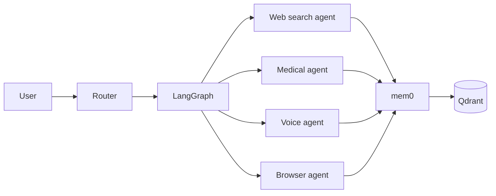

# Specialised agents

Jarvis is not a monolithic model: it is a **team of specialised agents** orchestrated by LangGraph.

## Agent types

### Desktop Agent

Lives on laptop/desktop. Exposes:

- filesystem and shell
- IDE automations
- process monitoring
- sandboxed code execution

### Mobile Agent

Native iOS/Android app.

- contextual notifications
- GPS / geofencing
- camera for visual analysis
- voice pipeline

### Watch Agent

Wear OS / WatchKit / InfiniTime / Bangle.js.

- HR, HRV, sleep tracking
- on-device wake-word
- quick notifications and gestures

### Browser Agent

Browser extension + headless web automation (Playwright).

- form filling
- data extraction
- screenshots and visual analysis
- multi-step flow execution

### Voice Agent

Unified voice pipeline.

- **Wake-word:** Porcupine, openWakeWord
- **STT:** faster-whisper, Vosk
- **TTS:** Piper, Coqui TTS
- **Intent recognition:** Pydantic AI

### Glasses Agent

Brilliant Frame, MentraOS, XREAL.

- informational overlays
- environmental awareness
- silent voice commands (sub-vocal)

### VR Agent

Quest, Valve Index, Pico, Varjo via OpenXR + Monado.

- immersive environments
- 3D conversational avatar
- gesture and gaze tracking control

### Holo Agent

Looking Glass, Voxon.

- ambient presence
- 3D data visualisations
- holographic companion

### Medical Agent

Medical wearables federation.

- ingestion via Oura, Whoop, Polar, Garmin, Withings, Dexcom
- aggregation via Open Wearables
- FHIR R4/R5 normalisation
- biometric threshold-based alerting

### Scraping Agent

Smart web scraping.

- crawling with **Crawl4AI**
- knowledge base with **Firecrawl**
- structured extraction with **ScrapeGraphAI**
- source citation

## Cross-agent communication

Agents talk to each other using two emerging open protocols:

- **MCP** (Model Context Protocol — Anthropic)
- **A2A** (Agent-to-Agent — Google, open since April 2025)

LangGraph v1.0 supports both natively.

## Orchestration stack

