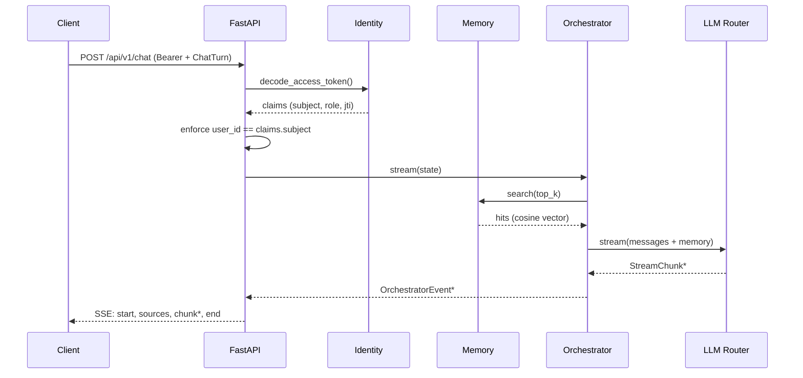

# Core runtime (Phase 1 · M1.1 → M1.5)

Open-Jarvis core runtime has five independent but cooperating layers.
Each layer lives in its own Python package (`jarvis_server.<layer>`)
and communicates with the others only via Pydantic DTOs and Protocols.

## Module map

```
jarvis_server/
├── identity/        # M1.1 — users, sessions, JWT, MFA
├── memory/          # M1.2 — per-user semantic memory
├── llm/             # M1.3 — LLM adapters + policy router
├── orchestration/   # M1.4 — state graph + tools
└── api/             # FastAPI app + routes (auth, memory, chat, llm, health)
```

## Chat request flow



## M1.2 · Memory

| Aspect | Decision |
|--------|----------|
| DB schema | `memory_items` table (FK `users.id`, kind, content, vector_id, metadata JSON, indexes user_id+kind, user_id+created_at) |
| Embedder | `Embedder` Protocol; in dev `DeterministicEmbedder` (SHA-256 hash → L2-normalised floats). Prod: BGE-M3 / OpenAI / Cohere |
| Vector store | `VectorStore` Protocol; in dev `InMemoryVectorStore` (cosine). Prod: Qdrant (HNSW + payload filters) |
| Isolation | Every vector is partitioned by `user_id`; queries are always scoped to the caller |
| RBAC | `MEMORY_READ` / `MEMORY_WRITE` enforced on the HTTP router |

REST endpoints:

| Method | Path | Description |
|--------|------|-------------|
| `POST` | `/api/v1/memory/record` | Create a memory + embedding |
| `POST` | `/api/v1/memory/search` | Top-K cosine similarity |
| `GET` | `/api/v1/memory/list` | Reverse-chronological |
| `DELETE` | `/api/v1/memory/{id}` | Remove single item |
| `DELETE` | `/api/v1/memory` | Wipe user memory |

## M1.3 · LLM Router

`Protocol`-based adapters with four shipping implementations:

| Adapter | Privacy | When |
|---------|---------|------|
| `EchoAdapter` | local-only | testing, offline demo |
| `OllamaAdapter` | local-only | local inference, default in dev |
| `OpenAIAdapter` | cloud (OpenAI-compatible) | vLLM, LocalAI, Together, Groq, OpenAI |
| `AnthropicAdapter` | cloud | Claude Messages API |

The `LLMRouter` picks the adapter using `LLMRequestPolicy`:

- `LOCAL_FIRST` (default) — privacy-first, cloud only when local
  unavailable
- `LOCAL_ONLY` / `CLOUD_ONLY` — explicit constraints
- `CLOUD_FIRST` — when cloud is preferred (e.g. complex reasoning)
- `backend_hint` — name override (e.g. `"anthropic"`)

Two REST endpoints feed the UI:

| Method | Path | Returns |
|--------|------|---------|
| `GET` | `/api/v1/llm/backends` | adapters wired in the router + default |
| `GET` | `/api/v1/llm/ollama/models` | proxy of Ollama `/api/tags` |

## M1.4 · Orchestrator

A linear, async **state graph** written in-house to avoid the heavy
LangGraph dependency. The pattern is exactly the same — pure
`State → State` nodes executed in sequence — so a future LangGraph
migration is a drop-in replacement.

### State

```python
@dataclass
class OrchestratorState:
    user_id: UUID
    messages: list[ChatMessage]
    retrieved_memories: list[str]
    final_response: str | None
    final_backend: str | None
    final_model: str | None
    metadata: dict[str, Any]
```

### Tools

- `MemorySearchTool` — fetches top-K memories and injects them as a
  system message
- `LLMTool` — chat or stream via the router (optional system prompt)
- `MemoryWriteTool` — opt-in auto-memory (flag `record_user_message`)

### Emitted events

`OrchestratorEvent` has 5 types:

| Type | When |
|------|------|
| `memory.retrieved` | after semantic search |
| `llm.delta` | for every model-generated chunk |
| `llm.final` | at end of generation, with `backend`/`model` |
| `memory.written` | after opt-in write |
| `error` | any caught exception |

## M1.5 · Chat HTTP

`/api/v1/chat` (REST SSE) and `/api/v1/chat/ws` (WebSocket) routes are
protected by ES256 JWT and route the entire conversation through the
orchestrator. The `user_id` in `ChatTurn` must match `claims.subject`:
this prevents a client from "stealing" another user's memory by
passing a different `user_id`.

```
POST /api/v1/chat
Authorization: Bearer <jwt>

{ "session_id": "...", "device_id": "...", "user_id": "...",
  "modality": "text" | "voice", "message": "...", "language": "en" }
```

`text/event-stream` reply:

```
event: start
data: {"type":"start","turn_id":"...","sequence":0,"metadata":{"modality":"text"}}

event: sources
data: {"type":"sources","sequence":1,"metadata":{"count":3}}

event: chunk
data: {"type":"chunk","sequence":2,"content":"Hello "}

…

event: end
data: {"type":"end","sequence":N,"metadata":{"status":"ok"}}
```

WebSocket: same frames as JSON + a final `ChatResponseSummary` with
latency, provider, model.

## Privacy & security

- **No audio bytes hit the backend**: voice is transcribed on-device
  by the voice agent (M2) and arrives here as plain text.
- **Per-user isolation**: SQL queries filtered by `user_id` + vector
  store partition + claims `subject` validated.
- **Local-first by default**: the router prefers Ollama always; no
  byte goes to cloud without explicit override.
- **Audit**: every login/refresh/reuse-detection logged in
  `audit_events` (M1.1).

## Tests and coverage

- 187 total tests (unit + integration), coverage ≥ 91%
- Hermetic suite: in-memory SQLite, deterministic embedder, in-memory
  vector store, LLM adapters mocked with `respx`
