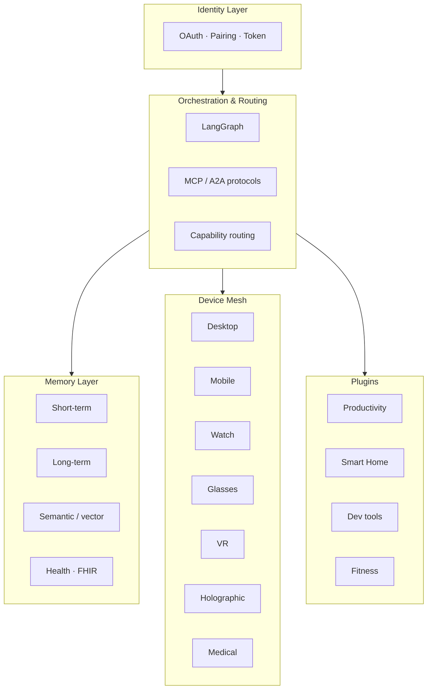

# Architecture

Jarvis is designed as a **layered personal AI infrastructure**, where each layer has well-defined responsibilities and can be replaced or extended independently.

## Big picture



## The five layers

### 1. Identity Layer

Responsibilities:

- user authentication (OAuth 2.0, passkeys)
- device registration and pairing
- token management and refresh
- per-device certificates and access scopes

Each device receives a registration like:

```json
{
  "device_id": "uuid",
  "owner_id": "user_id",
  "device_type": "watch",
  "capabilities": ["notifications", "voice", "heartrate"],
  "trust_level": "primary"
}
```

### 2. Orchestration & Routing Layer

The brain of the system. Built on **LangGraph** for:

- graph-based workflows with persistent state
- checkpointing and time travel for debugging
- specialised agents orchestrated as nodes
- cross-agent communication via **MCP** (Anthropic) and **A2A** (Google)

Routing decides which device executes a task. Example:

| Input | Context | Decision |
|---|---|---|
| "Remind me in 20 minutes" | User is running | Smartwatch (haptic + voice) |
| "Open PR #42" | User at desk | Desktop agent (IDE) |
| "Show me the way" | User driving | Mobile (TTS) + glasses (overlay) |

### 3. Memory Layer

Three memory tiers working together:

- **Short-term:** active session, immediate context (Redis)
- **Long-term:** history, preferences, profile (PostgreSQL + mem0)
- **Semantic:** search over personal docs and knowledge (Qdrant)
- **Health:** medical and biometric data (HAPI FHIR R4/R5)

Default backend is **mem0 + Qdrant**. Alternatives: **Zep** (temporal knowledge graph) or **Letta** (agent-managed paging).

### 4. Device Mesh

Every device runs a **local agent** that talks to the central server. See the [Devices](../devices/index.md) section.

### 5. Plugin & Integrations

Modular system to extend capabilities: productivity, smart home, dev tools, fitness, finance, web scraping, external APIs.

## LLM model strategy

Not a single "monolithic" model, but a **distributed hierarchy**:

| Tier | Example | Use case |
|---|---|---|
| Small | Llama 3.2 1B (Ollama), Phi-3 | Wake word, intent recognition, smartwatch |
| Medium | Llama 3.1 8B, Gemma 2 9B | Quick chats, mobile |
| Large | Claude Sonnet 4.6, GPT-4 | Complex reasoning, coding, orchestration |

Routing happens by **task complexity** + **device capability** + **privacy policy**.

## Privacy & Security

- 🔐 All data is **on-premise** by default
- 🔑 End-to-end TLS encryption between device and server
- 🪪 Short-lived JWT tokens + refresh
- 🛡️ Granular access policies per scope
- 📜 Full audit logging, retained per user policy

## Going deeper

- [Devices and device-mesh](../devices/index.md)
- [Specialised agents](../agents/index.md)
