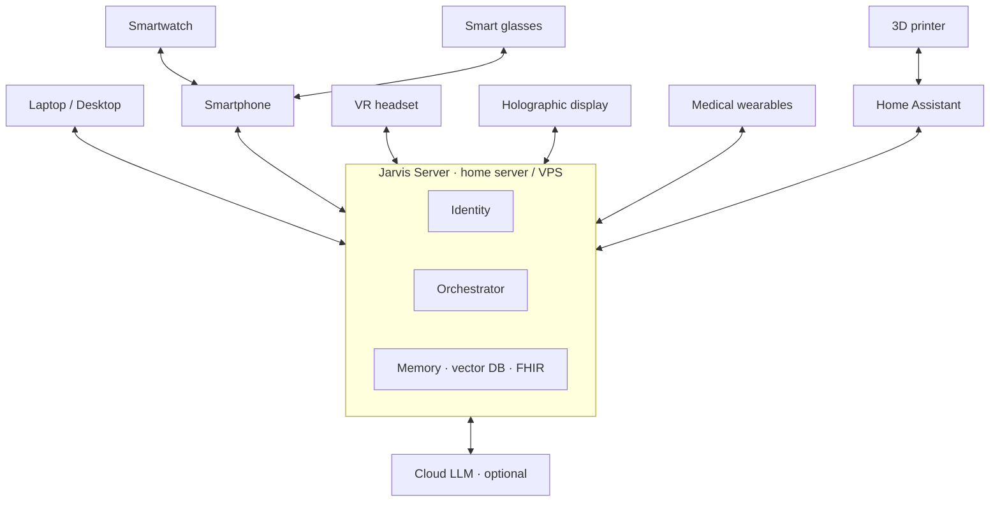
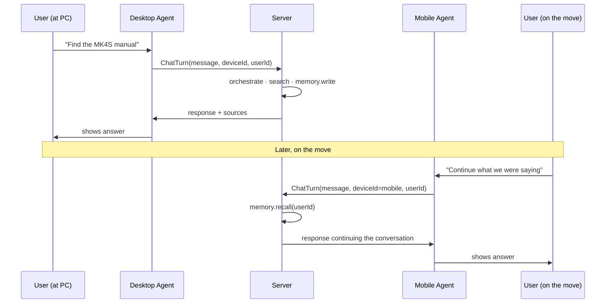

# Cross-device communication

Jarvis does not live on a single device: it lives on a **mesh** that coordinates laptops, smartphones, smartwatches, smart glasses, headsets, holographic displays, medical wearables, 3D printers and smart-home devices, **all belonging to the same person**.

This page explains how they **talk to each other**.

## Core principle

> One **AI identity**, many **device pointers**.

Identity is centralised on the Jarvis server (or a federated instance). Devices are **interaction surfaces** that run part of the work locally when they have the capability to.

## Typical topology



Low-resource devices (smartwatch, glasses) **piggyback** on a more capable device (smartphone) to reach the server.

## Smart-home interoperability standards

### Matter 1.4 / 1.5

Reference standard, developed by the **Connectivity Standards Alliance (CSA)**, distributed with open-source SDK under **Apache License**.

- **1.4** (May 2025): NFC onboarding, multi-device setup via Enhanced Multi-Admin
- **1.4.2** (Aug 2025): standardised multi-device scenes, time-based
- **1.5** (Nov 2025): cameras, soil moisture sensors, energy management
- Reference library: `connectedhomeip` (project-chip on GitHub)
- Python binding: `python-matter-server` used by Home Assistant

### Thread

**Low-power IPv6 mesh** protocol, physical transport for Matter.

- Open-source implementation: **OpenThread** (Google, BSD)
- Integrated in **ESPHome** since 2025.6 with ESP32-C6 and ESP32-H2 support
- Over 1,000 certified products at end of 2025

### Zigbee 3.0

Wide legacy coverage. Mature Python libraries: `zigpy`, coordinator via **zigbee2mqtt**. Handled in Home Assistant via ZHA.

### MQTT

**Publish-subscribe** event-driven protocol. **Eclipse Mosquitto** (EPL/EDL) is the home-lab standard broker. **EMQX** for scalable deployments. **Frigate** publishes detection events via MQTT.

## Laptop ↔ smartphone sync

| Tool | Open source | Platforms |
|---|---|---|
| **KDE Connect** | ✅ | Linux, macOS, Windows, Android, iOS |
| **GS Connect** | ✅ (GNOME port) | GNOME Shell |
| Microsoft Phone Link | ❌ | Windows + Android/iOS |
| Apple Continuity | ❌ | macOS + iOS |
| Google Quick Share | ❌ | Android + Windows |

**KDE Connect** is the natural choice for Jarvis: open protocol, excellent support for:

- 🔔 bidirectional notifications
- 📋 clipboard sync
- 📁 file transfer
- 🎵 media control
- 🖱️ remote mouse/keyboard

## Device → server communication

### Transport

- **HTTPS REST** for synchronous requests
- **WebSocket** for bidirectional streaming (voice, real-time updates)
- **gRPC** optionally for high-frequency server-side agents
- **MQTT** for IoT devices

### Authentication

- **OAuth 2.0 / OIDC** for device pairing
- **Short-lived JWT** + refresh token
- **mTLS** optional for fixed devices

### Identity

- **Authentik** or **Keycloak** as Identity Provider
- **FIDO2 / WebAuthn / passkey** for second factor

## Typical flow: cross-device message



## Smart routing

When Jarvis receives an input, it decides which device should display the response. Decision inputs:

- 🔋 available and online devices
- 📍 physical context (driving, gym, at PC)
- 🎯 device capability for the task (e.g. video → screen-only)
- 🔇 active "Do Not Disturb" modes
- ⚙️ user preferences

```python
def route_response(turn):
    if user.is_driving():
        return Device.MOBILE_TTS_ONLY
    if user.has_active_focus_mode():
        return Device.SUPPRESS
    if turn.requires_screen() and user.has(Device.DESKTOP):
        return Device.DESKTOP
    return user.most_recent_active_device()
```

## Emerging agent protocols

| Protocol | Scope |
|---|---|
| **MCP** (Anthropic, Dec 2024) | Agent → tool/resource |
| **A2A** (Google, Apr 2025, Linux Foundation) | Agent → agent |
| **AG-UI** (CopilotKit) | Agent → dynamic UI |

See [Protocols](protocols.md) for details.

## Privacy

- 🔒 End-to-end TLS between every device and the server
- 🪪 Short-lived JWT, dedicated refresh
- 🔐 At-rest encryption for the conversation log
- 🚫 Never propagate sensitive data (FHIR, finance) between devices without explicit need
