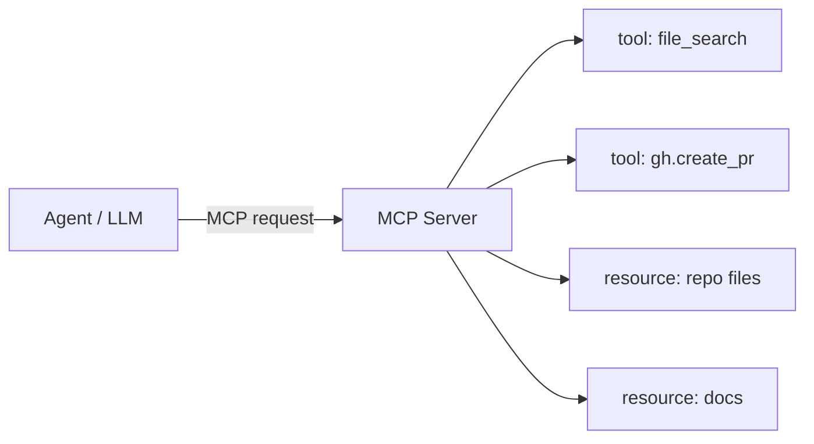
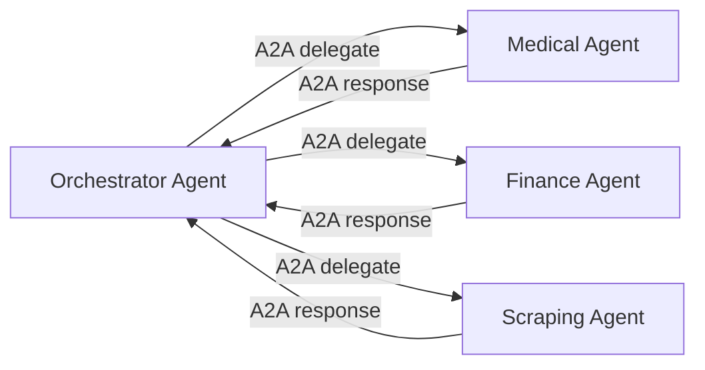

# Protocols

Jarvis adopts an **open protocol stack** to guarantee interoperability with third-party tools, agents and UIs without vendor lock-in.

## The three agent protocols

| Protocol | Origin | Purpose | Jarvis example |
|---|---|---|---|
| **MCP** | Anthropic, Dec 2024 | Agent → tool / external resources | the Dev Agent exposes `repo.search`, `gh.create_pr` |
| **A2A** | Google, Apr 2025 (now Linux Foundation) | Agent → agent | the orchestrator delegates to the Medical Agent |
| **AG-UI** | CopilotKit | Agent → reactive UI | dashboards generated on-the-fly from specs |

### Model Context Protocol (MCP)

Open standard introduced by Anthropic to let LLMs **access external tools and resources** in a structured, safe way.



In Jarvis every specialised agent exposes its **own MCP server**. Examples:

- `agents/medical-agent/mcp_server.py` → tools `oura.fetch_sleep`, `whoop.recovery`, `fhir.observation_query`
- `agents/scraping-agent/mcp_server.py` → tools `crawl.fetch`, `firecrawl.crawl`, `jina.read`
- `agents/maker-agent/mcp_server.py` → tools `printer.start`, `slicer.slice`, `blender.export_stl`

Apple at WWDC 2025 integrated MCP as the protocol for Siri/App Intents.

### Agent-to-Agent (A2A)

Standard introduced by Google and later moved under the **Linux Foundation** for neutrality. Specifies how **heterogeneous agents** can communicate and delegate tasks.



LangGraph v1.0 supports A2A natively as transport. Google ADK and Pydantic AI ship A2A SDKs.

### Agent-UI Protocol (AG-UI)

Lets agents **project reactive UIs** directly to the frontend, without pre-compiled pages.

In Jarvis: the agent can generate on-the-fly a biometric dashboard widget, a filtered transaction table, a chart — all via AG-UI.

## Layered transport stack

```text
┌──────────────────────────────────────────────────┐
│   Application protocols                          │
│   MCP · A2A · AG-UI                              │
├──────────────────────────────────────────────────┤
│   Transport                                      │
│   HTTPS · WebSocket · gRPC · MQTT                │
├──────────────────────────────────────────────────┤
│   Auth & identity                                │
│   OAuth 2.0 / OIDC · JWT · FIDO2 · passkey       │
├──────────────────────────────────────────────────┤
│   Smart-home transport                           │
│   Matter · Thread · Zigbee · BLE                 │
├──────────────────────────────────────────────────┤
│   Health interop                                 │
│   HL7 FHIR · SMART on FHIR · IEEE 11073          │
└──────────────────────────────────────────────────┘
```

## Data schemas

### Conversation turn

```json
{
  "turn_id": "uuid",
  "user_id": "uuid",
  "device_id": "uuid",
  "timestamp": "2026-05-09T12:00:00Z",
  "message": "How long did I sleep yesterday?",
  "language": "en",
  "context": {
    "location": "home",
    "modality": "voice",
    "active_focus": null
  }
}
```

### Device registration

```json
{
  "device_id": "uuid",
  "owner_id": "user_id",
  "device_type": "watch",
  "model": "PineTime",
  "capabilities": ["heartrate", "notifications", "haptic", "wakeword"],
  "trust_level": "primary",
  "paired_at": "2026-05-09T12:00:00Z"
}
```

### Memory record

```json
{
  "id": "uuid",
  "user_id": "uuid",
  "scope": "user|agent|session|org",
  "type": "fact|preference|event",
  "text": "Birthday: March 15",
  "embedding": [0.012, ...],
  "metadata": {"source": "conversation", "ttl": null}
}
```

## Federated identity

For multi-instance environments (a user with a home server + work server):

- **OIDC Federation** between instances
- **WebAuthn** as portable second factor
- **Passkeys** synced via iCloud Keychain / Google Password Manager

## Reference specifications

- [Model Context Protocol — modelcontextprotocol.io](https://modelcontextprotocol.io/)
- [A2A — agent2agent.dev](https://github.com/google/A2A)
- [AG-UI — ag-ui.com](https://ag-ui.com/)
- [Matter — csa-iot.org](https://csa-iot.org/)
- [HL7 FHIR — hl7.org/fhir](https://hl7.org/fhir/)
- [OAuth 2.0 — oauth.net/2/](https://oauth.net/2/)
- [WebAuthn — w3.org/webauthn](https://www.w3.org/TR/webauthn-3/)
