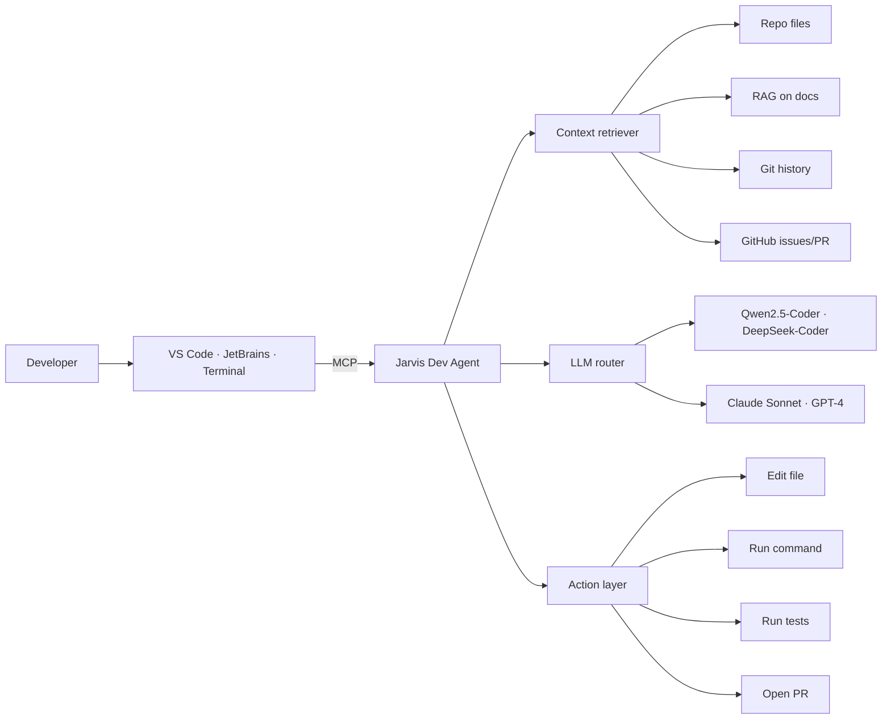

# Developer features

If you are a developer, Jarvis becomes your **AI engineering hub**: cross-IDE coding assistant, code review, repository automation, GitHub integration.

## What you can do

- 💻 **Coding assistant** integrated in VS Code, JetBrains, terminal
- 🔍 **Code review** with Jarvis as "second pair of eyes"
- 🧪 Automated **test generation** with TDD-first methodology
- 🚀 Voice **CI/CD trigger** ("Hey Jarvis, deploy staging")
- 📋 **PR automation** (changelog, description, issue links)
- 🐛 **Bug investigation** with semantic grep over the codebase
- 📦 **Dependency review** and security audit

## Stack: open-source coding assistants

| Tool | Licence | Architecture | Editor | MCP |
|---|---|---|---|---|
| **Cline** | Apache 2.0 | VS Code agentic extension | VS Code | Native |
| **Continue.dev** | Apache 2.0 | Autocomplete + chat plugin | VS Code, JetBrains | ✅ |
| **Aider** | Apache 2.0 | CLI Git-aware diff | Terminal | Partial |
| **OpenHands** | MIT | Browser UI + Docker, agentic | Web | ✅ |
| **Goose** (Block) | Apache 2.0 | CLI + desktop app | Terminal/Desktop | ✅ |
| **OpenInterpreter** | MIT | CLI REPL | Terminal | Partial |
| **Claude Code** | Proprietary | Agentic CLI | Terminal | Native |

> **Recommendation:** Cline (VS Code) + Aider (Git-focused terminal) as the main stack. Goose as fallback for tasks needing system-command execution.

## Developer Agent architecture



## Configuration

```env
# Coding model — local via Ollama
JARVIS_MODEL_CODE=ollama/qwen2.5-coder:14b

# Cloud fallback for hard tasks
ANTHROPIC_API_KEY=sk-ant-...
JARVIS_MODEL_CODE_CLOUD=anthropic/claude-sonnet-4-6

# GitHub integration
GITHUB_PAT=ghp_...
GITHUB_DEFAULT_REPO=fedcal/open-jarvis
```

## Custom MCP server

Jarvis exposes its own **MCP server** (`server/orchestration/mcp_server.py`) providing Cline, Continue, Goose, Claude Code with these tools:

- `repo.search(query)` — semantic search across the codebase
- `repo.diff()` — current diff
- `tests.run(suite)` — run specific tests
- `gh.create_pr(branch, title, body)` — open PR
- `gh.list_issues(state)` — repo issues
- `memory.recall(query)` — recall personal memory
- `docs.lookup(library, topic)` — Context7 lookup

Configuration in `.cline/mcp_settings.json` (example):

```json
{
  "mcpServers": {
    "jarvis": {
      "url": "http://localhost:8080/mcp",
      "headers": { "Authorization": "Bearer ${JARVIS_TOKEN}" }
    }
  }
}
```

## Usage examples

### Code review from chat

```
You: Take a look at PR #42 and tell me if you see issues
Jarvis: I read the 7 modified files. Three findings:
        1. validate_input in utils.py is missing a null check (line 23)
        2. The new migration creates an index without CONCURRENTLY
        3. Integration test test_user_create does not isolate the DB
        Want me to comment on the PR?
```

### TDD test generation

```
You: Create tests for calculate_tax in tax_utils.py
Jarvis: I generated 6 tests:
        - happy path
        - zero rate
        - negative rate (must raise ValueError)
        - zero amount
        - negative amount
        - decimal precision (snapshot)
        Saved in tests/test_tax_utils.py. Run them?
```

### Bug investigation

```
You: Since yesterday the deploy fails with "connection refused" to Redis
Jarvis: I checked:
        - git log last 24h: 3 commits, none touch Redis
        - docker compose ps: redis container is 'unhealthy'
        - redis log: "MISCONF Redis is configured to save RDB snapshots..."
        Cause: disk full. Free space or expand the volume.
```

### Daily standup

```
You: What did I do yesterday on project X?
Jarvis: 4 commits, 2 merged PRs, 1 closed issue.
        - feat(memory): added TTL to short-term cache
        - fix(auth): handle OAuth refresh race condition
        - PR #84: voice-agent wake word retraining
        - Issue #91 closed with user confirmation
```

## Recommended workflow

```
1. Open VS Code with Cline configured
2. Parallel terminal with Aider for Git-focused sessions
3. Jarvis Dev Agent in the background for:
   - Automatic daily standup
   - Cross-IDE persistent memory
   - Notifications on CI failures
   - Architectural decision recording
```

## Code privacy

- ✅ **100% local**: use Ollama + Qwen2.5-Coder. Not a single byte of code leaves
- ⚠️ **Hybrid**: cloud LLM only for selected tasks (architectural review, design doc generation)
- ❌ **Never** upload corporate repo code to cloud LLMs without explicit authorisation

## Roadmap

| Phase | Feature |
|---|---|
| 3.X | MCP server with repo.search, gh.* tools |
| 3.X | Cline + Continue + Aider bridge to Jarvis memory |
| 3.X | Automated daily dev standup |
| 3.X | CI failure notification routing |
| 3.X | PR description generator |
| 3.X | Architectural decision records (ADR) auto-tagging |
