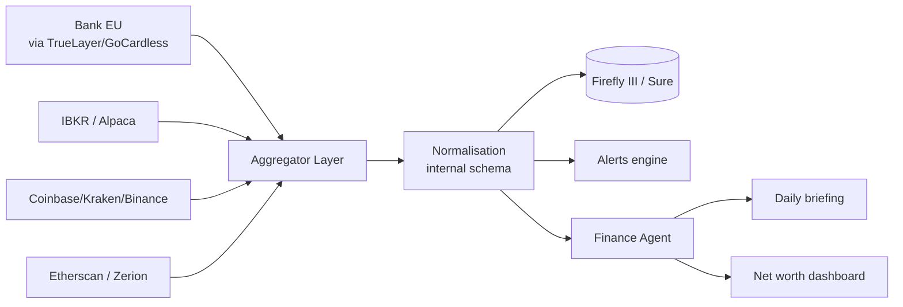

# Finance

Jarvis gives you a **unified view of your wealth**: bank accounts, investments, crypto, subscriptions — all in a single private dashboard, self-hosted, without selling your data.

## What you can do

- 💼 **Net worth dashboard** with all assets (cash, equity, crypto, real estate)
- 📈 **Investment portfolio tracking** (stocks, ETFs, funds, crypto)
- 💳 Automatic **expense analysis** by category
- 🔔 **Alerts** on significant moves, deadlines, goals
- 📊 Daily or weekly **financial briefing**
- 💸 **Recurring subscription tracker**

## Recommended stack — Europe/Italy priority

### Bank account (PSD2 AISP)

| Provider | Notes | Pricing |
|---|---|---|
| **TrueLayer** | Italy + 7 EU countries, free sandbox | Custom pricing for live |
| **GoCardless Bank Account Data** (ex-Nordigen) | 31 EEA countries, 2,300+ banks | Free tier closed to new signups in 2025; existing users keep access |
| **Tink** (Visa) | 6,000+ banks, best EU coverage | Enterprise only |

> **For indie developers in Italy:** `TrueLayer` with sandbox for development, evaluate the live contract only if needed.

### Investments

| Broker | API | Free | Coverage |
|---|---|---|---|
| **Interactive Brokers** | TWS API + Client Portal API | ✅ for IBKR clients | Global, including Italy |
| **Alpaca** | Native REST | ✅ paper + live | US equities/options only |
| **Tradier** | REST | ⚠️ live plan ~50 USD/month | US only |

> **Italian brokers (Fineco, Directa, Banca Sella):** no public official API in 2026. Only legal route: account read via PSD2 AISP (TrueLayer).

### Crypto

| Tool | Type | Use case |
|---|---|---|
| **Coinbase / Kraken / Binance API** | Read-only API key | Exchange balances and history |
| **Etherscan API** | REST | Ethereum + EVM chains history |
| **Zerion API** | Cross-chain | Aggregated portfolio (DeFi, tokens, NFTs) |
| **DeBank** | API | DeFi positions (lending, staking, farming) |
| **Bitcoin Core / Geth RPC** | Self-hosted node | Maximum sovereignty |

### Open-source self-hosted trackers

| Tracker | Stack | API | Best for |
|---|---|---|---|
| **Firefly III** | PHP + Laravel | Full REST | Power users with CSV/OFX import |
| **Maybe / Sure** | Rails + Postgres | OpenAI built-in, multi-currency | "AI-ready financial OS" |
| **Beancount** | Plain text + Python | Python API | Plain-text accounting purists |
| **Wallos** | PHP | – | Subscription tracking only |
| **Actual Budget** | JS + Electron | Limited | Envelope budgeting (zero-based) |

## Jarvis finance architecture



## Configuration

```env
# PSD2 EU
TRUELAYER_CLIENT_ID=...
TRUELAYER_CLIENT_SECRET=...

# Broker
IBKR_GATEWAY_URL=https://localhost:5000/v1/api
ALPACA_API_KEY=...
ALPACA_API_SECRET=...

# Crypto exchanges (read-only)
COINBASE_API_KEY=...
KRAKEN_API_KEY=...
BINANCE_API_KEY=...

# Cross-chain
ZERION_API_KEY=...
ETHERSCAN_API_KEY=...

# Self-hosted tracker
FIREFLY_URL=http://firefly:8080
FIREFLY_API_TOKEN=...
```

## Usage examples

### Daily financial briefing

> *"Hey Jarvis, how are markets and my portfolio doing?"*

```
Jarvis: Net worth: 142,350 € (+0.8% today)
        Equity: -1.2% (Italian BTPs down)
        Crypto: +3.4% (BTC above 95K)
        Cash flow this month: +1,250 €
        Alert: power bill €234 due on the 5th
```

### Expense analysis

> *"How much did I spend on restaurants this month?"*
> *"Any anomalous spending? Compare with the last 3 months"*

### Alerting

```yaml
finance:
  alerts:
    - name: "Anomalous spend"
      condition: "monthly_category_delta > 30%"
      action: notify
    - name: "Net worth -5%"
      condition: "net_worth_change_24h < -5%"
      action: notify_emergency
    - name: "Duplicate subscription"
      condition: "duplicate_subscription_detected"
      action: notify
```

## Privacy & security

Financial data is **extremely sensitive**:

- 🔐 Separate vault encrypted with `age` or HashiCorp Vault
- 🚫 No cleartext balances in logs
- 🪪 90-day PSD2 token expiration with automatic re-consent
- 🗝️ Broker/exchange API keys with **read-only** scope
- 📜 Never send financial data to cloud LLMs without explicit per-task opt-in

## Disclaimer

> Jarvis is not a licensed financial advisor. Information and analysis are **for personal use** and do not constitute investment advice.

## Roadmap

| Phase | Feature |
|---|---|
| 6.1 | TrueLayer / GoCardless integration |
| 6.2 | Firefly III bidirectional bridge |
| 6.3 | Coinbase + Kraken + Etherscan |
| 6.4 | Zerion cross-chain portfolio |
| 6.5 | IBKR portfolio + P&L |
| 6.6 | Alerting engine with custom rules |
| 6.7 | Automated daily/weekly briefing |
| 6.8 | Subscription tracker (Wallos integration) |
