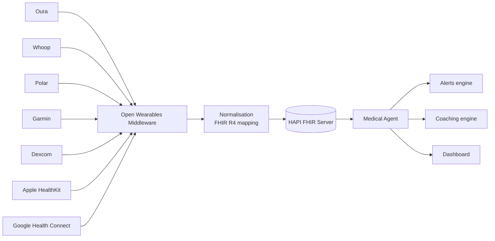

# Health

Jarvis aggregates biometric and medical data from **all your wearables** into a single private, FHIR-compatible view with longitudinal insights and personalised alerting.

## What you can do

- 📊 **Unified dashboard** of sleep, HRV, recovery, activity, weight, ECG, glucose
- 🏃 **Automated coaching** on training, sleep, recovery based on your patterns
- 🔔 **Biometric alerts** on personalised thresholds (high resting HR, falling HRV, …)
- 📈 **Longitudinal insights**: how does your recovery change with coffee/alcohol/travel?
- 🩺 **FHIR health vault** shareable with your doctor (HL7 standard export)

## Supported wearables and medical devices

| Provider | Data exposed | Auth | Free |
|---|---|---|---|
| **Oura Ring v2** | sleep, HRV, readiness, SpO2 | OAuth 2.0 | ✅ |
| **Whoop v2** | strain, recovery, sleep, HR, HRV | OAuth 2.0 + webhook | ✅ |
| **Polar AccessLink** | training, HR, sleep | OAuth 2.0 | ✅ |
| **Garmin Health API** | HRV, VO2max, stress, sleep | OAuth 1.0a | ✅ with approval (~2 days) |
| **Withings** | weight, HR, ECG, BP, sleep | OAuth 2.0 | ✅ |
| **Fitbit / Google Health API** | activity, HR, sleep | Google OAuth 2.0 | ✅ — migration September 2026 |
| **Dexcom CGM** | real-time glucose | OAuth 2.0 | ✅ Limited Access (max 5 users) |
| **Apple HealthKit** | all HealthKit types | on-device only | ✅ |
| **Google Health Connect** | Android aggregator | local | ✅ |

## Open-source aggregators

- **[Open Wearables](https://openwearables.io/)** — unified middleware for Apple, Garmin, Polar, Suunto, Whoop, Oura
- **Wearipedia** (Stanford) — research wrapper for dozens of devices

## Interoperability standards

| Standard | Use | Implementation |
|---|---|---|
| **HL7 FHIR R4 / R5** | Clinical-grade storage | **HAPI FHIR** server (Java, open source) |
| **SMART on FHIR** | OAuth for health apps | SMART Health IT toolkit |
| **Open mHealth** | Device-agnostic JSON schemas | Public schemas |

## Jarvis health architecture



## Configuration

```env
# Oura
OURA_CLIENT_ID=...
OURA_CLIENT_SECRET=...

# Whoop
WHOOP_CLIENT_ID=...
WHOOP_CLIENT_SECRET=...

# FHIR vault
FHIR_SERVER_URL=http://hapi-fhir:8081/fhir
FHIR_AUTH_TOKEN=...
```

Device pairing from the UI:

1. **Settings → Health → Connect device**
2. Choose the provider
3. Authorise via OAuth on the provider's page
4. Data starts syncing automatically (polling + webhooks)

## Usage examples

### Morning health briefing

> *"Hey Jarvis, how did I sleep last night?"*

```
Jarvis: You slept 7h 22m, but with HRV down 18% from baseline.
        Whoop recovery score: 42% (yellow zone).
        Suggestion: light training today, no coffee after 2 pm.
```

### Alerting

```yaml
# config/jarvis.yaml
health:
  alerts:
    - name: "HRV trending down"
      condition: "hrv_baseline_delta < -20%"
      window: 3d
      action: notify_mobile
    - name: "Glucose out of range"
      condition: "glucose > 180 or glucose < 70"
      window: 1h
      action: notify_watch_emergency
```

### Coaching

The `medical-agent` automatically correlates sleep, training, food (if you log meals), stress (HRV) and suggests weekly adjustments.

## Privacy & security

⚠️ Health data is **special category data** under GDPR. Jarvis enforces:

- 🔐 At-rest encryption for the FHIR collection
- 🪪 OAuth tokens stored in a secret vault, never logged
- 🚫 No health data sent to cloud LLMs without explicit consent for that single task
- 📜 Audit log on every health-data access
- 🗑️ Right to be forgotten: full deletion via UI or `jarvis health purge`

## Medical disclaimer

> Jarvis **is not a medical device** and does not replace professional medical advice. Suggestions are informational and wellness-oriented. For symptoms always consult a doctor.

## Roadmap

| Phase | Feature |
|---|---|
| 4.1 | Oura, Whoop, Polar connectors |
| 4.2 | HAPI FHIR vault + shareable PDF export |
| 4.3 | Garmin, Withings, Fitbit |
| 4.4 | Dexcom CGM real-time + glucose alerting |
| 4.5 | Coaching engine with LLM (sleep/training/recovery) |
| 4.6 | Android Health Connect + iOS HealthKit pull |
| 4.7 | Genomics and clinical data (with dedicated consent) |
