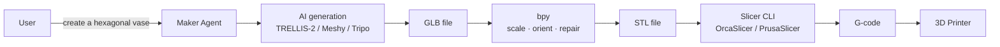

# Maker · Blender and 3D printing

If you are a maker, Jarvis connects to **Blender** to generate and edit 3D models, and to **3D printers** (Klipper/Moonraker, OctoPrint, Bambu, Prusa) to control your prints from chat or voice.

## What you can do

- 🎨 **AI 3D generation**: text-to-3D, image-to-3D directly from chat
- 📐 **Blender editing** in natural language ("scale model to 60%", "export as STL")
- 🖨️ Voice **print start**: "Hey Jarvis, print that model in PLA"
- 📊 Real-time **print monitoring** (temperature, layer, ETA)
- 🚨 Automated **alerts** (failure detection, end of print, errors)
- 🛠️ **Automated slicing** with custom presets
- 📚 **Model library** management with AI tagging

## Blender automation

### Stack

- **`bpy` on PyPI** — installable via `pip install bpy==4.3.0`, lets you use Blender as a Python library in external pipelines (server-side, headless)
- **fake-bpy-module** — IDE autocomplete without Blender installed
- Modern approach: addons as standard Python packages, testable outside Blender

### AI 3D generation in Blender

| Tool | Type | Notes |
|---|---|---|
| **Meshy for Blender** | Official addon | Local DCC bridge, cleanup tools for 3D printing |
| **Tripo 3D for Blender** | Official addon (VAST-AI) | Text/Image/Multiview-to-Model |
| **TripoSR Blender Add-on** | Open source | Cloud + local |
| **Blender AI Library Pro** | Multi-AI connector | InstantMesh, SD, TripoSR, Shap-E |
| **BlenderGPT** | NLP → bpy commands | Natural language → `bpy` instructions |

### Typical Jarvis workflow



### AI 3D generation

| Model | Open source | Quality |
|---|---|---|
| **TRELLIS-2** (Microsoft) | ✅ MIT | Highest — CVPR 2025 Spotlight, 4B parameters |
| **Spar3D** (Stability AI) | ✅ | Native GLB, point cloud conditioning |
| **TripoSR** | ✅ | Fast, rapid prototyping |
| Meshy | ❌ | REST API, cloud |
| LumaAI Genie | ❌ | API |

> **Recommendation:** TRELLIS-2 self-hosted for quality + Meshy as cloud fallback.

## 3D printing — stack

### Klipper + Moonraker

The modern flexible stack. **Moonraker** exposes Klipper APIs over REST/WebSocket on port 7125:

| Endpoint | Function |
|---|---|
| `POST /printer/print/start` | Start a print from file |
| `POST /printer/print/pause` | Pause |
| `POST /printer/print/resume` | Resume |
| `POST /printer/print/cancel` | Cancel |
| `GET /printer/objects/query` | Full state (temp, position, layer) |
| WebSocket `klippy_connection` | Real-time updates |

Recommended UIs: **Mainsail** or **Fluidd** (consume only Moonraker). **KIAUH** for installation.

### OctoPrint

Mature for Marlin. Plugins: failure detection, timelapse, **OctoEverywhere** for AI failure detection via computer vision.

### Bambu Lab

X/P series printers communicate via **local MQTT** (port 8883, TLS) and FTP for files.

### PrusaLink / Prusa Connect

REST APIs documented via OpenAPI spec. PrusaLink local, Prusa Connect cloud for remote.

### Slicer CLI (open source)

- **PrusaSlicer** — `prusa-slicer-console.exe --export-gcode model.stl`
- **OrcaSlicer** — multi-printer fork
- **Cura** — built-in CLI

### Unified printer MCP

**`mcp-3D-printer-server`** (DMontgomery40) unifies OctoPrint, Moonraker, Bambu Lab, Duet, Prusa, Creality into a single MCP interface. Jarvis can use it to control heterogeneous printers.

## Configuration

```env
# Klipper / Moonraker
MOONRAKER_URL=http://moonraker.local:7125
MOONRAKER_API_KEY=...

# OctoPrint
OCTOPRINT_URL=http://octopi.local
OCTOPRINT_API_KEY=...

# Bambu Lab
BAMBU_LOCAL_IP=192.168.1.50
BAMBU_ACCESS_CODE=...
BAMBU_SERIAL=...

# Prusa
PRUSALINK_URL=http://prusa.local
PRUSALINK_API_KEY=...

# Slicer
SLICER_BIN=/usr/local/bin/prusa-slicer-console
SLICER_CONFIG=/data/slicer/profiles/pla-0.2-std.ini

# Blender bpy
BLENDER_BPY_VERSION=4.3.0
```

## Usage examples

### Generation + print from chat

> *"Create a hexagonal pen holder, 12 cm tall, round the edges and print it in white PLA"*

```
Jarvis: Model generated with TRELLIS-2 (preview: [link])
        Imported in Blender → edge rounding (radius 2mm)
        STL exported: 84 KB, 12.3 cm height
        Sliced with PLA-0.2-standard preset: 1h 47m, 18g filament
        MK4S printer is free, start print? [Yes/No]

You: Yes
Jarvis: Print started. ETA: 19:32. I'll notify you at end of print.
```

### Monitoring

> *"How is the print going?"*

```
Jarvis: Layer 145/388 (37%), 35°C bed, 215°C hotend, 42min elapsed.
        ETA: 19:32. No issues detected.
```

### Failure detection

```yaml
maker:
  alerts:
    - name: "Print failed"
      source: "octoeverywhere.failure_detected"
      action: pause_and_notify
    - name: "Hotend overheating"
      condition: "hotend_temp > target + 15"
      action: pause_emergency
```

### Model library

> *"Show me models I printed last month"*

The agent reads OctoPrint History files or the filesystem, applies AI tagging (auto-categorisation: vase, support, gear, …) and shows you a gallery.

## Privacy

- ✅ 3D generation 100% local with TRELLIS-2
- ✅ Slicing and printing 100% local
- ❌ Meshy/Tripo cloud: the prompt and any image go to the provider

## Roadmap

| Phase | Feature |
|---|---|
| 8.1 | Moonraker bridge (start/stop/status) |
| 8.2 | OctoPrint integration |
| 8.3 | Bambu MQTT bridge |
| 8.4 | Headless bpy: scale/repair/export STL |
| 8.5 | TRELLIS-2 self-hosted (text/image-to-3D) |
| 8.6 | Slicer automation with saved presets |
| 8.7 | Failure detection via computer vision |
| 8.8 | Model library with AI tagging |
