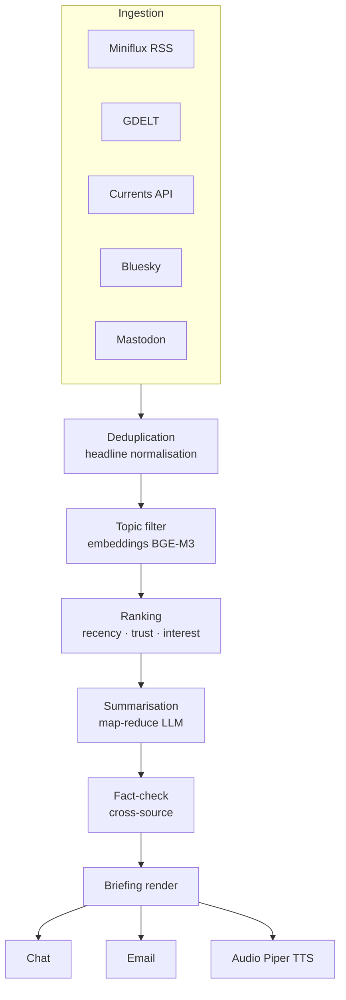

# News & daily briefing

Jarvis builds a **personalised briefing** of the day's news, deduplicated, AI-summarised, delivered via chat / email / TTS audio.

## What you can do

- 📰 **Daily briefing** AI-generated with the top stories relevant to you
- 🎯 **Topic filters** (tech, crypto, finance, health, city, hobbies)
- 🔄 **Deduplication** across different sources covering the same event
- 🌍 **Multilingual**: read in IT, get the summary in IT even if the source is in EN
- 🎙️ **Audio briefing** via TTS for car / running consumption
- ✅ Source **citations** always included

## Recommended stack

### Self-hosted RSS readers

| Tool | Stack | API |
|---|---|---|
| **Miniflux** | Go + Postgres | REST + Fever + Google Reader |
| **FreshRSS** | PHP | Community extensions |
| **NewsBlur** | Python | Full API |
| **ttrss** | PHP | Mature, RPC-style |

> Recommended: **Miniflux** — single binary, lightweight, clean REST API, perfect Jarvis backend.

### Commercial news APIs

| API | Free tier | Use case |
|---|---|---|
| **GDELT** | ✅ unlimited, no auth | Global big data, 65 languages, sentiment |
| **Currents API** | ✅ 1,000 req/day | Quick bootstrap |
| **NewsAPI.ai** | ✅ 2,000 searches/month | Semantic search last 30 days |
| **MediaStack** | ❌ ~50 USD/month | Production volume |

### Decentralised networks

- **Bluesky** (AT Protocol) — public feeds without auth
- **Mastodon** — ActivityPub REST per instance
- **Lemmy** — self-hostable Reddit alternative

### Podcasts

- **Castopod** — self-hosted podcast server
- **AntennaPod** + OPML sync

## Daily briefing architecture



### Technical pipeline

1. **Parallel pull** every N minutes from configured sources
2. **Deduplication**: title normalisation → word-overlap > 70% = duplicate
3. **Topic filter**: BGE-M3 embedding (multilingual) + cosine similarity with your interest vectors
4. **Ranking**: `score = recency × source_trust × user_interest`
5. **Summarisation**:
   - extractive (sumy / newspaper3k) → 80% reduction
   - abstractive (Mistral/Qwen via Ollama, or Claude/GPT)
   - map-reduce: summary per article → summary of summaries
6. Optional **fact-check**: cross-reference between sources, flag "unconfirmed"
7. **Render**: structured JSON → Jinja2 template → chat/email/TTS

## Configuration

```env
# Miniflux self-hosted
MINIFLUX_URL=http://miniflux:8080
MINIFLUX_API_TOKEN=...

# News API
CURRENTS_API_KEY=...

# Bluesky (public read, no auth required)
BLUESKY_FEEDS=at://did:plc:.../app.bsky.feed.generator/whats-hot

# Audio briefing TTS
PIPER_VOICE=en_US-amy-medium
```

```yaml
# config/jarvis.yaml
news:
  briefing:
    schedule: "0 7 * * *"   # every morning at 07:00
    topics:
      - tech
      - ai
      - crypto
      - markets-eu
    sources:
      - miniflux:starred
      - currents:tech
      - bluesky:whats-hot
      - gdelt:gkg-global
    output:
      - chat
      - email: your@email.com
      - audio: smartwatch
    sections:
      - top_stories: 3
      - trends: true
      - markets: true
      - calendar: true
```

## Usage examples

### Morning briefing

> *"Hey Jarvis, briefing!"*

```
Jarvis: Good morning. Three top stories:

1. ⚡ Anthropic releases Claude Sonnet 4.7 — 2x latency, same prices
   (sources: Anthropic, TheVerge, HackerNews)

2. 🇪🇺 ECB holds rates, EUR/USD at 1.085
   (sources: Reuters, FT)

3. ₿ Bitcoin stable at 95,400 USD, spot ETF inflows +1.2B

Today's trends: Python agent frameworks growing.
Markets: SPX -0.2%, FTSE 100 +0.5%.
Calendar: internal meeting at 11:00, dentist at 16:30.

Audio or text only?
```

### Follow-up questions

> *"You mentioned agent frameworks, tell me more"*
> *"What did HackerNews say about Anthropic?"*

## Ethical filtering

- 🚫 Auto-skip clickbait (titles matching "you won't believe X", "Y something")
- ⚖️ Source balancing (not a single ideological bubble)
- ⚠️ "Opinion" vs "fact" labelling when detectable
- 📊 Trust score per source (Mediabias/Factcheck)

## Privacy

- ✅ The whole pipeline can run 100% locally (Miniflux + Ollama)
- ❌ Cloud LLM: article content passes through the provider
- 🌐 GDELT, Currents, Bluesky require no user identification

## Roadmap

| Phase | Feature |
|---|---|
| 3.1 | Miniflux bridge + textual briefing |
| 3.2 | Deduplication + topic filter with BGE-M3 |
| 3.3 | Map-reduce summarisation with local LLM |
| 3.4 | TTS audio briefing on smartwatch |
| 3.5 | Cross-source fact-check |
| 3.6 | Bluesky / Mastodon ingestion |
| 3.7 | Podcast feed → transcription → summary |
