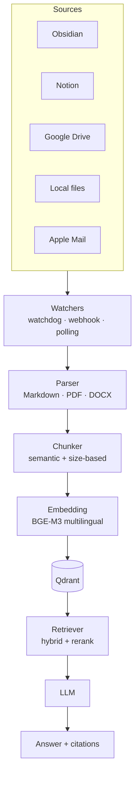

# Documents & RAG

Jarvis indexes your **personal documents** (Obsidian, Notion, Drive, email, local files, PDFs) and lets you query them in natural language, in Italian and English.

## What you can do

- 🔎 **Semantic search** over your notes and documents
- ❓ **Natural language questions** on your content
- 🔗 **Citations** always present (you know where you read it)
- 🌍 **Multilingual**: ask in English, find documents in Italian (and vice versa)
- 🖼️ **Visual RAG** on PDFs with figures, complex layouts, scans
- ⏱️ **Incremental sync** with file watchers (real-time)

## Recommended stack

### RAG framework

| Framework | Strength | Best for |
|---|---|---|
| **R2R** (RAG to Riches) | Containerised, GraphRAG, hybrid search | Complete RAG backend |
| **LlamaIndex** | Connectors for every source | Custom pipelines |
| **Khoj** | Personal AI built-in, Obsidian sync | UI ready out of the box |
| **Haystack 2.x** | Production-grade, modular | Enterprise |
| **AnythingLLM** | Workspace isolation | Non-technical users |

> **Recommendation:** R2R as backend + Khoj as application layer for UI/Obsidian sync.

### Embedding model 2026 (multilingual IT+EN)

| Model | Dim | Multilingual IT+EN | MTEB |
|---|---|---|---|
| **BGE-M3** (BAAI) | 1024 | ✅ Excellent (cross-lingual) | 72% retrieval |
| Nomic Embed v2 | 768 | Good | 57-63% |
| Jina Embeddings v3 | 1024 | Good | Top tier |
| mxbai-embed-large | 1024 | ❌ EN only | 59% |

> **Clear winner: BGE-M3** — supports 100+ languages in a single semantic space. Cross-lingual: ask in Italian, find docs in English.

```bash
docker compose exec ollama ollama pull bge-m3
```

### Vector store for <1M documents

| Store | Hybrid search | Best for |
|---|---|---|
| **Qdrant** | ✅ (v1.9+) | Complex filtering, production |
| **ChromaDB** | ❌ native | Dev, prototyping, <5M chunks |
| **LanceDB** | ✅ | Disk-efficient storage |
| **pgvector** | ❌ native | Existing Postgres, <10M vectors |

> **Jarvis default:** Qdrant (reachable at `qdrant:6333` in compose).

### Visual RAG on PDFs

- **ColPali** / **ColQwen2** — direct embedding of page images, **no OCR**, ideal for PDFs with complex graphics, presentations, scans
- Uses **Qwen2-VL-2B** as backbone

## Document watchers and ingestion

| Source | Tool |
|---|---|
| **Obsidian vault** | Khoj plugin (real-time sync) |
| **Notion** | LlamaIndex `NotionPageReader` (polling) |
| **Google Drive** | Watch API + HTTP push notifications |
| **Dropbox** | HTTP webhooks |
| **Local files** | `watchdog` (Python, cross-platform) + Linux `inotify` |
| **Apple Notes** | AppleScript export |
| **Apple Mail** | `mbox` parsing with stdlib `mailbox` |
| **Logseq** | watchdog on Markdown files |

## Jarvis RAG architecture



## Configuration

```env
# Embedding (BGE-M3 recommended for IT+EN)
EMBEDDING_MODEL=ollama/bge-m3

# Vector store
QDRANT_URL=http://qdrant:6333

# RAG framework
RAG_BACKEND=r2r              # r2r | llamaindex | khoj
R2R_URL=http://r2r:7272

# Sources
OBSIDIAN_VAULT_PATH=/vaults/personal
NOTION_TOKEN=secret_...
GOOGLE_DRIVE_CREDENTIALS=/data/google-credentials.json
DROPBOX_ACCESS_TOKEN=...
WATCHED_FOLDERS=/data/documents,/data/research
```

Connect a source:

```bash
# Obsidian
docker compose exec server jarvis rag connect obsidian \
  --vault /vaults/personal

# Notion
docker compose exec server jarvis rag connect notion --token=$NOTION_TOKEN

# Local files
docker compose exec server jarvis rag connect local \
  --path=/data/documents --watch

# Google Drive
docker compose exec server jarvis rag connect google-drive
```

## Usage examples

### Questions about your documents

> *"What did we decide about the new backend architecture?"*

```
Jarvis: In your March 12 notes (Obsidian → work/architecture.md)
        you wrote: "Going with append-only event-sourcing,
        snapshot every 100 events, async projections". Decision taken
        after discussion with Marco.
```

### Cross-lingual

> *"Find that document where I talked about prompt caching"*

```
Jarvis: Found a note in English: "anthropic-prompt-caching-cost-saving.md"
        from April 3. Want a summary?
```

### Visual RAG

> *"That PDF with the user flow diagram, show it to me"*

ColQwen2 finds the page even if the "diagram" is not OCR-readable text.

## Evaluation with Ragas

```bash
docker compose exec server jarvis rag eval --suite=ragas-default
```

Measures:

- **Faithfulness** — is the answer grounded in the documents?
- **Answer relevancy** — is the answer relevant?
- **Context recall** — did retrieval bring back the right passages?

## Privacy

- ✅ The whole pipeline can run 100% locally (Qdrant + Ollama + BGE-M3)
- ❌ Cloud LLM: retrieved passages are sent to the provider for the answer
- 🔐 At-rest encryption of `qdrant_data` volume
- 🪪 Notion/Drive tokens in a separate vault

## Roadmap

| Phase | Feature |
|---|---|
| 3.1 | Obsidian sync via Khoj |
| 3.2 | Local file watcher (watchdog) |
| 3.3 | BGE-M3 multilingual embedding |
| 3.4 | R2R backend with GraphRAG |
| 3.5 | Notion + Google Drive connectors |
| 3.6 | ColQwen2 visual RAG on PDFs |
| 3.7 | Apple Notes / Apple Mail importer |
| 3.8 | Ragas evaluation in CI |
