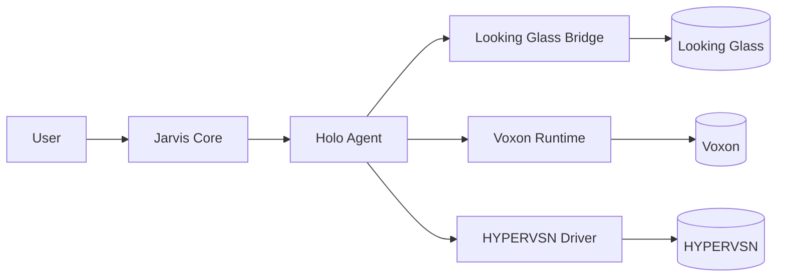

# Holographic system integration

Jarvis can project its presence through **holographic and volumetric displays**: a visual companion that lives in the user's physical space.

## Overview

Holographic displays deliver something AR/VR cannot: **shared presence** in a common space without wearing glasses. They are ideal for:

- 🤖 Always-visible AI companion on desk or living room
- 📊 3D data visualisations (portfolio, health, calendars)
- 🎬 Cinematic output for calls and meetings
- 🧬 3D model exploration (architecture, biology, engineering)

## Supported hardware

### Looking Glass Factory

**Status:** winner of SID 2026 Display of the Year. *Hololuminescent Display* (HLD) technology.

| Model | Price (USD) | Resolution | Use case |
|---|---|---|---|
| Looking Glass Go | ~600 | Portable | Demos, small office |
| Looking Glass 16" | ~2,000 | 8K HLD | Desktop, ambient presence |
| Looking Glass 32" | ~7,000 | 8K HLD | Living room, presentations |

**SDK:** [Looking Glass Core SDK](https://github.com/Looking-Glass) — open, Unity and Unreal plugins, light-field rendering.

**Jarvis use cases:**

- Animated 3D avatar (Iron Man-style Jarvis hologram)
- Floating panels with news, agenda, biometrics
- STL model preview before 3D printing

### Voxon Photonics

**Status:** true volumetric display (3D output in physical volume, not light-field).

**SDK:** C++ and Python. Load 3D models, handle rotations, hardware sync.

**Jarvis use cases:**

- Molecular and technical visualisations
- Real-time simulations (orbits, wind, trajectories)
- Output for training environments

### HYPERVSN

**Status:** "HoloMatrix" display based on rotating LEDs. Not true holography but visually striking.

**Jarvis use cases:**

- Ambient presence in entrance or showcase
- Decorative output / personal branding

## Integration architecture

The **Holo Agent** lives in `agents/holo-agent/` and exposes capabilities:

- `render_avatar(emotion, speech)` — Jarvis avatar that talks
- `show_3d_model(file)` — STL/GLB/USDZ
- `display_panel(content)` — 3D UI with data
- `ambient_presence(mode)` — "breathing" / idle mode

## Rendering pipeline

| Source | Process | Output |
|---|---|---|
| Generated avatar | Rigged 3D avatar + sync TTS voice (Lip Sync via Rhubarb or Whisper) | Looking Glass |
| AI-generated model | TripoSR / Spar3D / TRELLIS → GLB | Voxon / Looking Glass |
| Dashboard | 3D UI Three.js / Babylon.js → light-field encode | Looking Glass |
| Biometric | Animated mesh (heartbeat sync) | Voxon |

## Privacy & UX

- ⚙️ "Do Not Disturb" mode that turns off the holographic display
- 🔇 Mute avatar when guests are present
- 👁️ Presence detection for automatic activation
- 🌙 Night mode with reduced brightness

## Integration roadmap

| Phase | Goal |
|---|---|
| 1 | Static output on Looking Glass Go (3D models, dashboards) |
| 2 | Conversational avatar with lip-sync on Looking Glass 16" |
| 3 | On-demand AI 3D generation (TripoSR local) |
| 4 | Voxon volumetric for biometric/financial data visualisations |
| 5 | Multi-display orchestration (avatar + panels + ambient) |
