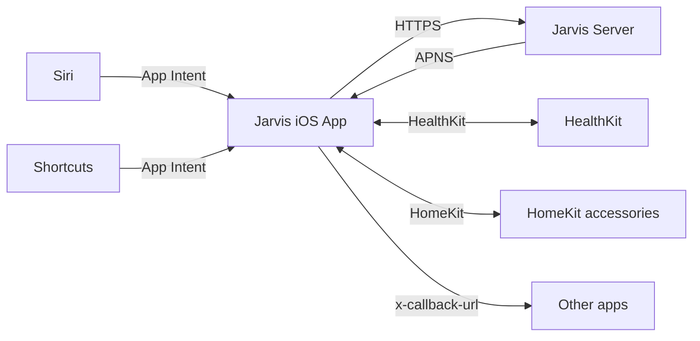
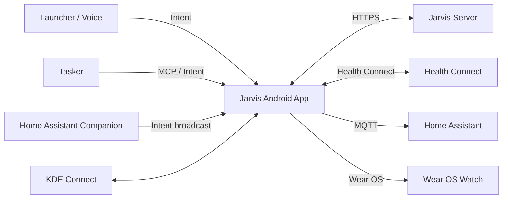

# Mobile integration · iOS · Android

The smartphone is the most relevant mesh device: portable, sensor-rich, always with you. Jarvis integrates deeply with iOS and Android, **respecting each platform's constraints**.

## iOS

### Available capabilities

| Capability | Availability | Notes |
|---|---|---|
| **App Intents** (Siri, Spotlight, Shortcuts) | ✅ iOS 16+ | Standard schema, 100+ intent types |
| **Live Activities** | ✅ iOS 16.1+ | Active calls, timers, ongoing briefings |
| **Push Notifications (APNS)** | ✅ | Server-side managed token |
| **HomeKit** (virtual device exposure) | ✅ | Home.app + Siri |
| **HealthKit** | ✅ on-device | Passive read with user consent |
| **Focus modes** | ✅ Filter API | Notifications based on active mode |
| **Visual Intelligence** (WWDC 2025) | ✅ iOS 18+ | Built-in App Intent snippets |
| **Use Model action** in Shortcuts | ✅ iOS 18+ | Invoke LLM from Shortcuts |
| **Sideloading custom assistant** | ❌ | Not possible without jailbreak |

### Integration pattern

iOS is **closed**: deep Jarvis integration requires a **companion app** distributed via the App Store (or TestFlight). The app exposes:

- App Intents for Siri/Shortcuts (`OpenBriefing`, `AskJarvis(text)`, `RecordNote`)
- **Widget** extension for home screen
- **Live Activity** extension for in-progress briefing
- **HomeKit Bridge** to expose Jarvis as an accessory
- Push notifications via APNS



### App Intents example

```swift
// Siri: "Hey Siri, Jarvis briefing"
struct OpenBriefingIntent: AppIntent {
    static var title: LocalizedStringResource = "Open Jarvis Briefing"

    func perform() async throws -> some IntentResult {
        let briefing = try await JarvisAPI.shared.fetchDailyBriefing()
        return .result(view: BriefingView(briefing: briefing))
    }
}
```

### URL scheme

The app also supports a URL scheme for integration from external automations:

```
jarvis://chat?text=Summarise+last+meeting
jarvis://briefing?type=morning
jarvis://memory/recall?topic=vacation
```

## Android

### Available capabilities

| Capability | Availability | Notes |
|---|---|---|
| **Intents / IntentFilters** | ✅ | Native inter-app communication |
| **Tasker** | ✅ | Deep automations, **Tasker MCP Server** since 2025 |
| **Termux** | ✅ | Full Linux env on Android, great for dev |
| **MacroDroid** | ✅ | Trigger and action automation |
| **KDE Connect on Android** | ✅ | Bridge with Linux desktop |
| **Home Assistant Companion App** | ✅ | Sensors → HA, commands ← HA |
| **Wear OS 6 Tiles** | ✅ | Glanceable info |
| **Wear OS Complications** | ✅ | Contextual data in watchface |
| **Gemini Nano on-device** | ✅ Android 14+ | Local inference via ML Kit GenAI APIs |
| **Android XR** (preview) | ⚙️ | 3D form factor, AI-aware UI |

### Integration pattern

Android is significantly more open than iOS:



### Tasker MCP integration

Tasker exposes an **MCP Server** that Jarvis can call for ultra-deep device control (volume, notifications, scene execution, context-aware automations).

```yaml
# Example Tasker task invocable via MCP
- task: "Drive Mode"
  trigger: "context: in_car"
  actions:
    - mute_notifications
    - launch: "Google Maps"
    - audio_route: "bluetooth"
    - announce_jarvis: "Drive mode active"
```

### Android Intent example

```kotlin
// Trigger a Jarvis action from another app or Tasker
val intent = Intent("dev.federicocalo.jarvis.ACTION_BRIEFING").apply {
    putExtra("type", "morning")
    putExtra("voice", true)
}
sendBroadcast(intent)
```

## iOS vs Android comparison

| Feature | iOS | Android |
|---|---|---|
| Always-on "Hey Jarvis" wake-word | ❌ (Siri-locked) | ✅ via AccessibilityService |
| Background task execution | ⚠️ constrained | ✅ via foreground service |
| Deep OS automation | ⚠️ via Shortcuts | ✅ via Tasker / MacroDroid / Termux |
| Custom app distribution | App Store / TestFlight | Direct APK + F-Droid |
| Health data | HealthKit on-device | Health Connect aggregator |
| Smartwatch | Apple Watch (closed) | Wear OS / Garmin / PineTime open |
| Linux terminal access | ❌ | ✅ (Termux) |

## KDE Connect

KDE Connect covers laptop ↔ Android (and now iOS too). Capabilities used by Jarvis:

- 📋 **Clipboard sync** (copy on PC, paste on phone)
- 🔔 **Bidirectional notifications** (reply to SMS from PC)
- 📂 Fast **file transfer**
- 🎵 **Media remote** (control phone stream from PC)
- 🖱️ **Mouse/keyboard remote** (for presentations)

```env
KDE_CONNECT_DEVICE_ID=...
```

## Configuration

```env
# iOS
JARVIS_IOS_APNS_KEY_ID=...
JARVIS_IOS_TEAM_ID=...
JARVIS_IOS_BUNDLE_ID=dev.federicocalo.jarvis

# Android
JARVIS_ANDROID_FCM_KEY=...
JARVIS_ANDROID_PACKAGE=dev.federicocalo.jarvis

# KDE Connect
KDE_CONNECT_ENABLED=true

# Home Assistant Companion
HOME_ASSISTANT_URL=http://hassio.local:8123
HOME_ASSISTANT_TOKEN=eyJ...
```

## Roadmap

| Phase | Feature |
|---|---|
| 1.X | Android app prototype (chat + push) |
| 1.X | iOS app prototype (chat + push) |
| 2.X | "Hey Jarvis" wake-word on Android |
| 2.X | Wear OS Tiles + Complications |
| 2.X | iOS App Intents + Shortcuts library |
| 3.X | Tasker MCP bridge |
| 3.X | Native KDE Connect bridge |
| 4.X | Health Connect / HealthKit ingestion |
