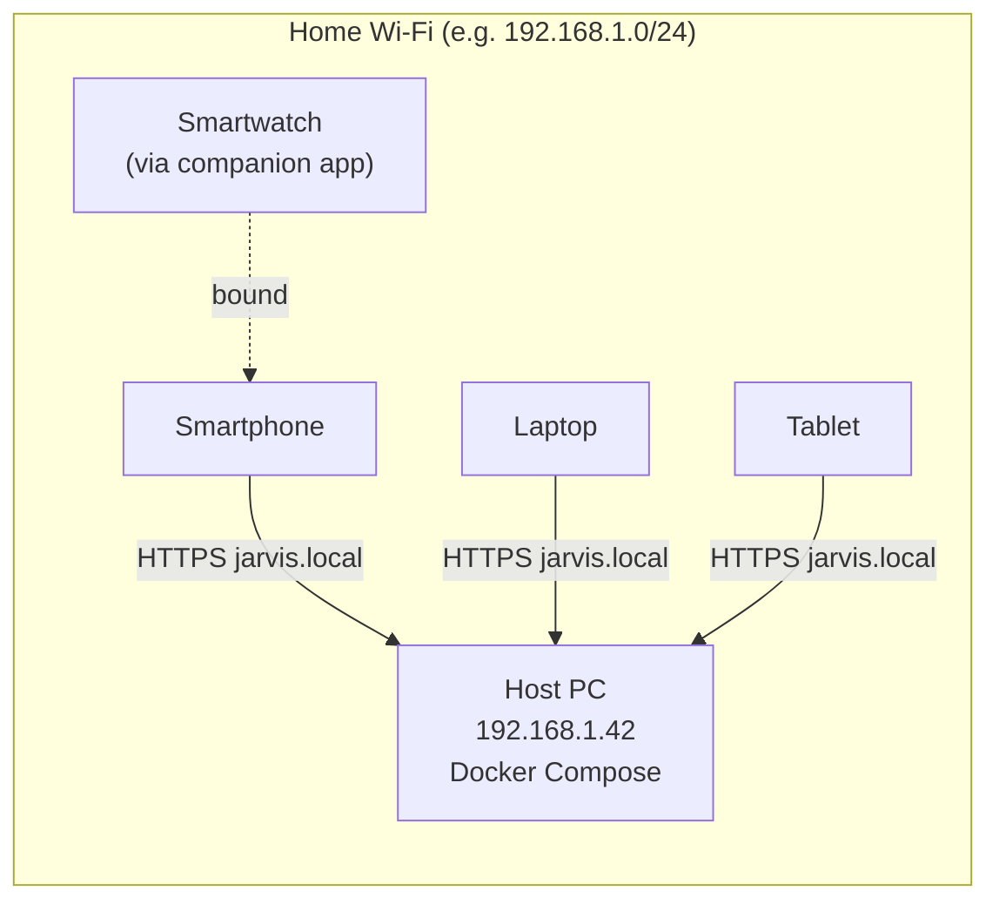

# Run Open-Jarvis entirely on your PC (home Wi-Fi, no domain)

This guide is for users who want to **try or run Open-Jarvis without
buying a domain, opening router ports or exposing the server to the
internet**. All devices (smartphone, laptop, tablet, smartwatch via
companion app) connect to the server running on your PC, all inside
the same Wi-Fi network.

!!! info "When to use this setup"
    - **Yes** — development, demo, fully local personal use, first
      experience with the project, environments without stable internet.
    - **No** — when you want to reach Jarvis outside home, when the
      hosting PC may sleep, or if you already have a VPS. Use
      [Server VPS install](server.md) instead.

## LAN-only architecture



No cloud, no DDNS, no Cloudflare. The host PC is the only "server"
node, every other device is a client.

## Requirements

- A PC with **Linux, macOS or Windows**, always on (or with sleep
  configured to keep network alive).
- **Docker Desktop** or `docker engine + compose plugin`.
- **8 GB RAM** (4 GB minimum without Ollama; 16 GB if you want a local
  LLM).
- A **home Wi-Fi router** that lets you read the PC IP and ideally
  reserve DHCP.
- Same Wi-Fi on every device that will use Jarvis.

## 1 · Find the LAN IP of the host PC

On the PC that will run the server:

=== "Linux"

    ```bash
    ip -4 addr show | grep -oP '(?<=inet\s)192\.168\.\d+\.\d+'
    # or
    hostname -I | awk '{print $1}'
    ```

=== "macOS"

    ```bash
    ipconfig getifaddr en0   # Wi-Fi
    ipconfig getifaddr en1   # Ethernet (if any)
    ```

=== "Windows (PowerShell)"

    ```powershell
    Get-NetIPAddress -AddressFamily IPv4 |
      Where-Object { $_.IPAddress -like "192.168.*" } |
      Select-Object -ExpandProperty IPAddress
    ```

Note the result — this guide uses **`192.168.1.42`** as example.

## 2 · Reserve the IP on the router (recommended)

If the IP changes, every device loses the server. Options:

- **DHCP reservation** on the router: bind the PC MAC to
  `192.168.1.42`. Router panel → *DHCP* → *Reserved addresses*. Reboot
  if asked.
- **Static IP** on the PC: same thing on the OS side (Network Manager
  on Linux, *TCP/IP* settings on macOS, *Adapter Properties* on Windows).
- **mDNS** (step 4): a stable symbolic name (`jarvis.local`) instead of
  the IP — robust even if the IP changes.

Two of three are enough. Most reliable combo: **DHCP reservation +
mDNS**.

## 3 · Configure the `.env` file

From the repo root:

```bash
git clone https://github.com/fedcal/open-jarvis.git
cd open-jarvis
cp .env.example .env
```

Open `.env` and set these keys (all start with `JARVIS_`, that's how
Pydantic Settings auto-reads them):

```bash
JARVIS_DOMAIN=jarvis.local
JARVIS_PUBLIC_URL=http://192.168.1.42:8080
JARVIS_ALLOWED_ORIGINS=http://192.168.1.42:8080,http://192.168.1.42:3000,http://jarvis.local:8080,http://jarvis.local:3000
```

Replace `192.168.1.42` with **your** IP from step 1. Leave the rest
untouched for now — defaults work for LAN.

!!! warning "If you forget `192.168.x.y` in `JARVIS_ALLOWED_ORIGINS`"
    The browser fires the request, but the **CORS response** blocks
    everything and you get a generic *"Failed to fetch"* in the console.
    Adding it is mandatory.

### Override ports if already busy

If you already run Postgres / Redis / Qdrant locally, or if `8080` is
held (Java tools or auto-deploy services), `docker compose up` fails
with `port is already allocated`. Override host ports in `.env`:

```bash
JARVIS_HOST_PORT=8090       # API server
POSTGRES_HOST_PORT=15432
REDIS_HOST_PORT=16379
QDRANT_HOST_PORT=16333
QDRANT_GRPC_HOST_PORT=16334
```

Update `JARVIS_PUBLIC_URL` and `JARVIS_ALLOWED_ORIGINS` with the new
port (`http://192.168.1.42:8090`).

To find which ports are busy:

```bash
ss -tlnp | grep -E '8080|5432|6379|6333'    # Linux
lsof -iTCP -sTCP:LISTEN | grep 8080         # macOS / BSD
```

## 4 · Enable `jarvis.local` resolution (mDNS)

mDNS lets devices on the same network find the PC by friendly name
instead of IP. Open-Jarvis defaults to the `.local` suffix.

=== "Linux (Avahi)"

    ```bash
    sudo apt install -y avahi-daemon avahi-utils
    sudo systemctl enable --now avahi-daemon
    sudo hostnamectl set-hostname jarvis
    avahi-resolve -n jarvis.local   # verify
    ```

=== "macOS"

    Bonjour is on by default. Verify:

    ```bash
    sudo scutil --set HostName jarvis
    sudo scutil --set LocalHostName jarvis
    dns-sd -B _http._tcp.
    ```

=== "Windows"

    Bonjour ships with iTunes; otherwise download
    [Bonjour Print Services for Windows](https://support.apple.com/kb/DL999).
    Set computer name:

    ```powershell
    Rename-Computer -NewName jarvis -Restart
    ```

### On the clients

- **iOS / macOS**: Bonjour is native. `jarvis.local` works out of the box.
- **Android 12+**: mDNS is native on the resolver side, but some
  routers block multicast packets between guest and main Wi-Fi —
  check the "isolation" section and disable it.
- **Windows / Linux**: Avahi/Bonjour as above.

If mDNS fails, fall back to the direct IP — less elegant but
always reliable.

## 5 · Start the stack

```bash
docker compose up -d
docker compose ps
docker compose logs -f server
```

Smoke test from the host:

```bash
curl http://localhost:8080/health
curl http://192.168.1.42:8080/health
curl http://jarvis.local:8080/health
```

All must return `{"status":"ok",...}`. From a LAN device:

```bash
curl http://192.168.1.42:8080/health
```

If timeout, jump to step 7 (firewall).

## 6 · LAN HTTPS (optional but recommended)

Three options, easiest to most robust.

### Option A — HTTP only (default)

Works, but some modern clients refuse advanced features over HTTP:

- WebAuthn / passkey require HTTPS (exception: `localhost`).
- The PWA installs but some service worker features are limited.
- iOS Safari behind strict profiles may need HTTPS.

For internal home use this is fine. Skip to step 7.

### Option B — `mkcert` (local CA, **recommended**)

`mkcert` creates a **root CA** that you install once on every device:
afterwards the host PC can present valid certs for `jarvis.local`
that browsers trust without warnings.

```bash
brew install mkcert nss            # macOS
sudo apt install mkcert libnss3-tools  # Linux Debian/Ubuntu
# Windows: scoop install mkcert (or GitHub release)

mkcert -install
mkdir -p infra/certs
mkcert -cert-file infra/certs/jarvis.local.pem \
       -key-file  infra/certs/jarvis.local-key.pem \
       jarvis.local "*.jarvis.local" 192.168.1.42 localhost 127.0.0.1
```

Add a Caddy service to `docker-compose.yml`:

```yaml
  caddy:
    image: caddy:2-alpine
    restart: unless-stopped
    ports: ["443:443"]
    volumes:
      - ./infra/Caddyfile.lan:/etc/caddy/Caddyfile:ro
      - ./infra/certs:/certs:ro
      - caddy_data:/data
    depends_on: [server]
```

`infra/Caddyfile.lan`:

```caddy
jarvis.local, 192.168.1.42 {
    tls /certs/jarvis.local.pem /certs/jarvis.local-key.pem
    reverse_proxy server:8080
}
```

On **clients**: copy the root CA (`mkcert -CAROOT` shows where) and
install it:

- **Android**: Settings → Security → User CA Certificates → Install.
- **iOS**: AirDrop or email the `.pem`, then Settings → General →
  VPN & Device Management → Profiles → Install, then *Settings →
  General → About → Certificate Trust Settings → enable full trust*.
- **Linux/macOS/Windows**: `mkcert -install` on PCs, or import the
  CA via Keychain / *certmgr.msc* / NSS.

Update `.env`:

```bash
JARVIS_PUBLIC_URL=https://jarvis.local
JARVIS_ALLOWED_ORIGINS=https://jarvis.local,https://192.168.1.42
```

Restart: `docker compose up -d`.

### Option C — Tailscale / ZeroTier

If you also want to reach Jarvis **outside home** without exposing
ports or buying a domain, Tailscale or ZeroTier create a mesh VPN
with auto HTTPS + DNS (`jarvis.tail-scale.ts.net`). Not strictly
LAN, but the simplest way to extend the setup. Tailscale deep-dive
coming soon.

## 7 · Host PC firewall

By default Docker exposes ports on every interface; some OS (Windows
strict firewall, Linux `ufw`) block inbound from Wi-Fi.

=== "Linux (ufw)"

    ```bash
    sudo ufw allow from 192.168.0.0/16 to any port 8080 proto tcp
    sudo ufw allow from 192.168.0.0/16 to any port 443 proto tcp
    sudo ufw status numbered
    ```

=== "macOS"

    ```bash
    sudo /usr/libexec/ApplicationFirewall/socketfilterfw \
         --add /usr/local/bin/com.docker.backend
    sudo /usr/libexec/ApplicationFirewall/socketfilterfw \
         --setglobalstate on
    ```

=== "Windows"

    *Windows Defender Firewall → Advanced settings → Inbound rules*:

    - New rule → Port → TCP → 8080, 443
    - Profile: only *Private* (uncheck *Public*)
    - Action: Allow

## 8 · Register the first user and pair devices

From the host PC (or any LAN client):

```bash
curl -X POST http://192.168.1.42:8080/api/v1/auth/register \
     -H "Content-Type: application/json" \
     -d '{"email":"you@example.com","password":"<min-12-char-passphrase>","display_name":"You"}'
```

!!! warning "Email validation"
    The email validator rejects reserved TLDs like `.local`, `.test`,
    `.localhost`. Use `example.com`, a real domain you own, or an
    internal LAN sub-domain if you have internal DNS (e.g. `you@home.lan`
    works if `.lan` is registered as internal TLD).

Reply: `201 Created` with the user profile. Login:

```bash
curl -X POST http://192.168.1.42:8080/api/v1/auth/login \
     -H "Content-Type: application/json" \
     -d '{"email":"you@example.com","password":"<min-12-char-passphrase>"}'
```

Save the `access_token`, then generate a pairing QR for the other
devices:

```bash
ACCESS=...   # from the login above

curl -X POST http://192.168.1.42:8080/api/v1/pairing/initiate \
     -H "Authorization: Bearer $ACCESS"
# {
#   "code": "418273",
#   "raw_token": "rTQ…abc",
#   "expires_in": 300,
#   "qr_payload": "jarvispair://v1?token=rTQ…abc&code=418273"
# }
```

On the smartphone:

1. Open the Open-Jarvis app.
2. Set *Server URL* to `http://192.168.1.42:8080` (or
   `https://jarvis.local` if you took Option B).
3. Tap *Pair this device* and scan the QR (or paste the 6-digit code).

The server creates a new `Device` row and the app receives a
device-bound JWT. From here the phone talks directly to the host PC.

## 9 · Keep the host PC awake

So that clients always reach Jarvis the host must not sleep:

=== "Linux (systemd-inhibit)"

    ```bash
    systemctl mask sleep.target suspend.target hibernate.target hybrid-sleep.target
    ```

=== "macOS"

    *System Settings → Energy → Prevent automatic sleeping when display
    is off*. Or:

    ```bash
    sudo pmset -a sleep 0
    ```

=== "Windows"

    *Settings → System → Power & battery → Screen and sleep* → set
    "Sleep" to *Never* on AC power.

The PC consumes power 24/7. For heavier use consider a NUC, Mac mini,
Raspberry Pi 5 (8 GB) — same setup.

## 10 · Minimum backups

Even a home setup deserves backups:

```bash
# Database (weekly)
docker compose exec postgres pg_dump -U jarvis jarvis | gzip > \
    ~/backups/jarvis-$(date +%F).sql.gz

# Vector volume (Qdrant)
docker run --rm -v jarvis_qdrant_data:/data -v ~/backups:/out alpine \
    tar czf /out/qdrant-$(date +%F).tar.gz -C /data .
```

Add the two to `crontab` to automate.

## Known LAN setup limitations

| Limitation | Workaround |
|------------|-----------|
| No outside-home access | Use Tailscale/ZeroTier (Option C) |
| WebAuthn requires HTTPS | Use mkcert (Option B) or `localhost` |
| iOS Safari refuses WebSocket on HTTP from public network | Same private network + mkcert HTTPS |
| Push notifications | Without Firebase/APNs cloud they don't work; arriving with M2 voice |
| Cloud LLMs need internet | OpenAI/Anthropic obviously, but Ollama is local |
| iPhone on Wi-Fi guest can't see PC | Disable "AP/client isolation" on the router |

## Update a LAN install

Same flow as [Update Open-Jarvis](../updates.md), just no domain or
TLS to touch:

```bash
cd open-jarvis
git fetch --tags && git checkout vX.Y.Z
docker compose pull
docker compose run --rm server alembic upgrade head
docker compose up -d
```

Desktop/mobile apps update from their stores.

## LAN troubleshooting

See also: [Common problems](../../troubleshooting/index.md).

| Symptom | Quick diagnosis | Fix |
|---------|----------------|-----|
| `curl http://192.168.x.y:8080/health` from another device times out | `ss -tlnp | grep 8080` on the host: bound only on `127.0.0.1`? | Check `ports: - "0.0.0.0:8080:8080"` and firewall (step 7) |
| `jarvis.local` doesn't resolve | `avahi-resolve -n jarvis.local` or `dns-sd -G v4 jarvis.local` | Reinstall Avahi/Bonjour, check Wi-Fi isolation |
| Browser CORS error | DevTools → Network → blocked origin | Add origin to `JARVIS_ALLOWED_ORIGINS`, restart |
| QR pairing won't open in app | The QR contains `jarvispair://` but app is offline | Verify same Wi-Fi as host PC |
| Login OK on PC, fails on iPhone | Often CORS; sometimes certificate trust | Re-install the mkcert CA on iOS and restart Safari |
| Container crash on PC restart | Docker doesn't auto-start | `systemctl enable docker` (Linux), Docker Desktop → *Start at login* |

## See also

- [Multi-device · overview](../multi-device.md)
- [Update Open-Jarvis](../updates.md)
- [Common problems](../../troubleshooting/index.md)
