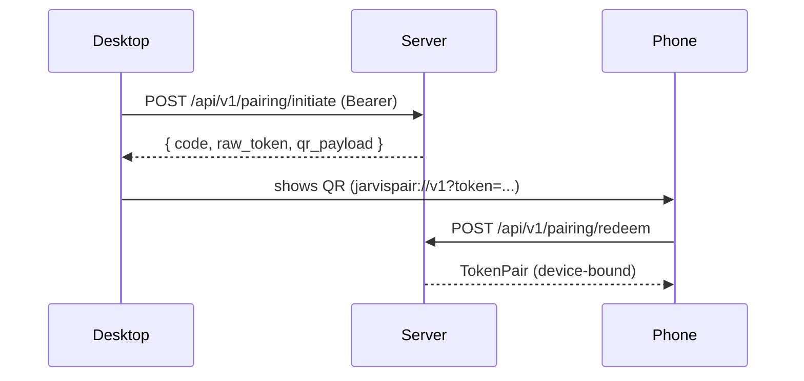

# Install Open-Jarvis on every one of your devices

Open-Jarvis is a **distributed mesh of agents**: the central server
handles identity, memory and orchestration while every device runs a
lightweight client that authenticates with a JWT and talks to the
server over WireGuard.

This page is the single starting point: **from server to wearable**,
in priority order.

## Supported device map

| Category | Devices | Repository | Status |
|----------|---------|------------|--------|
| **Server** | Linux VPS (x86_64 / ARM64), bare metal, Raspberry Pi 5 | `server/` | 🟢 Done |
| **Desktop** | macOS, Windows, Linux | `agents/desktop/` (Tauri 2) | 🟡 In progress |
| **Web (PWA)** | Any desktop & mobile browser | `frontend/web/` (Angular 18) | 🟢 Done |
| **Mobile** | iOS 17+, Android 12+ | `agents/mobile/` (Ionic + Capacitor) | 🟡 In progress |
| **Smartwatch** | Apple Watch, Wear OS, Garmin, PineTime | `agents/watch/` | ⚪ Planned (M2) |
| **AR glasses** | Meta Ray-Ban, XREAL, Brilliant Frame, MentraOS | `agents/glasses/` | ⚪ Planned (M7) |
| **VR headsets** | Meta Quest, Valve Index, generic OpenXR | `agents/vr/` | ⚪ Planned (M7) |
| **Holographic** | Looking Glass, HYPERVSN, Voxon | `agents/holo/` | ⚪ Planned (M8) |
| **Medical** | Oura, Whoop, Polar, Garmin, Withings, Dexcom | `agents/medical/` | ⚪ Planned (M4) |

## Recommended install order


You always start with the **server**: without it no client can
authenticate or fetch memory.

## 1 · Server (VPS or bare metal)

The server is the heart: runs in Docker Compose, exposes HTTPS via
Caddy with automatic TLS, the only device that has to be online.

!!! tip "Want to run everything on your PC?"
    If you don't have a domain and want everything inside your home
    Wi-Fi (PC host + smartphone + laptop on the same network), follow
    **[Local install (PC + Wi-Fi, no domain)](install/local-lan.md)**.
    You'll come back here for the pairing of the other devices.

```bash
git clone https://github.com/fedcal/open-jarvis.git
cd open-jarvis
cp .env.example .env
# Edit .env: domain, JARVIS_JWT_*, DB password
docker compose up -d

# Server health
curl https://jarvis.example.com/health
```

Full guide: **[Server VPS install](install/server.md)**.
After deploy, register the first user:

```bash
curl -X POST https://jarvis.example.com/api/v1/auth/register \
     -H "Content-Type: application/json" \
     -d '{"email":"you@example.com","password":"<min-12-char>","display_name":"You"}'
```

## 2 · Desktop (macOS / Windows / Linux)

The desktop client is the "primary" device: from here you generate
pairing codes for every following device.

```bash
# Install Rust toolchain (one-off)
curl --proto '=https' --tlsv1.2 -sSf https://sh.rustup.rs | sh

# Build / dev
pnpm install
pnpm --filter @open-jarvis/desktop dev    # native window with HMR
pnpm --filter @open-jarvis/desktop build  # signed installer
```

On first launch type the server URL and log in. Guide: **[Desktop](../../it/user-manual/install/desktop.md)** (work in progress, EN translation pending).

## 3 · Smartphone (iOS / Android) via QR pairing

You don't need to log in again: use the **device pairing** flow.

1. On the desktop open *Settings → Devices → Add device*. A **QR
   code** + 6-digit numeric code appear.
2. On the smartphone install the Ionic app (`agents/mobile/`).
3. Tap *Pair this device* and scan the QR.
4. The server creates a new `Device` row, issues a device-bound
   `TokenPair` and the app stores it in Keychain / Keystore.



The code expires after 5 minutes and is **single-use**: redeeming
marks `pairing_codes.consumed_at`. Replay = 409 with automatic family
revocation.

Mobile guide: **[agents/mobile/README.md](https://github.com/fedcal/open-jarvis/blob/main/agents/mobile/README.md)**.

## 4 · Web PWA (any browser)

Open `https://jarvis.example.com` in any browser. The Angular 18 PWA:

- offers **Add to Home Screen** on iOS/Android
- supports voice + text (Web Speech API + WebSocket)
- uses the same pairing flow (paste the QR token or scan it via
  camera, optionally via WebAuthn passkey)

## 5 · Smartwatch (M2 — roadmap)

The watch agent will offer push-to-talk + context-aware notifications.

| Watch | Tech | Note |
|-------|------|------|
| Apple Watch | watchOS WatchKit + WidgetKit | needs iPhone with the app |
| Wear OS | Compose for Wear OS | Galaxy Watch, Pixel Watch |
| Garmin | Connect IQ SDK | biometric data → memory |
| PineTime | InfiniTime + companion BLE | open hardware |

Pairing: the watch inherits the pairing from its companion smartphone.

## 6 · Medical wearables (M4)

For devices without an application chip (Oura, Whoop, …) Jarvis
authenticates as **OAuth client** to the provider and pulls data
into the `health/` module — server-side, no native agent needed.

Connector matrix:

| Device | OAuth provider | Sync rate |
|--------|---------------|-----------|
| Oura Ring | Oura API | 5 min |
| Whoop | Whoop API | 5 min |
| Polar | Polar AccessLink | 15 min |
| Garmin | Connect Health API | 15 min |
| Withings | Withings Cloud | 15 min |
| Dexcom CGM | Dexcom Share | 1 min (real-time) |

## 7 · AR, VR, Holographic (M7-M8)

For AR glasses, VR headsets and holographic displays Jarvis uses
**OpenXR** when possible (Meta Quest, Valve Index, Pico) and vendor
SDKs for closed stacks (Brilliant Frame, MentraOS, Looking Glass).
All these clients depend on a smartphone or desktop "host" already
paired to the server.

## Cross-device sanity check

From any device, after login:

```bash
curl -H "Authorization: Bearer <access_token>" \
     https://jarvis.example.com/api/v1/auth/me
```

Expected: your `UserPublic` with `role` and derived `permissions`.
If the JWT contains `device_id` (claim `did`), pairing succeeded.

## Universal troubleshooting

| Symptom | Likely cause | Fix |
|---------|--------------|-----|
| `401 invalid bearer token` | Access expired (15 min) | Call `/api/v1/auth/refresh` |
| `401 family revoked` | Refresh token replayed | Re-login; reuse-detection kicked in |
| `403 user_id mismatch` | ChatTurn `user_id` ≠ JWT subject | Client bug: use the ID from the token |
| `409 pairing already redeemed` | Code used twice | Generate a new one |
| `400 pairing expired` | TTL > 5 min | Generate a new one |
| WebSocket close 1008 | Missing/invalid token | Add `Authorization: Bearer …` or `Sec-WebSocket-Protocol: bearer.<jwt>` |

## Disconnect a device

Settings → *Devices* → ⓘ → *Revoke session* calls:

```http
POST /api/v1/auth/logout
Authorization: Bearer <access_token>
```

Every session in that `family_id` is revoked. The same device can be
re-paired later with a new code.

## See also

- [Update Open-Jarvis](updates.md)
- [Server VPS install](install/server.md)
- [Local install (PC + Wi-Fi)](install/local-lan.md)
- [Identity Layer (security)](https://fedcal.github.io/open-jarvis/security/identity-layer/)
