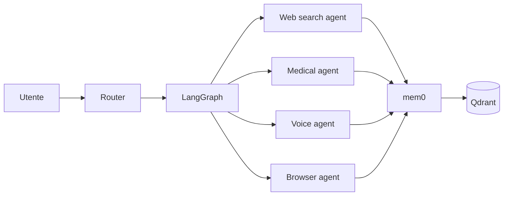

# Agenti specializzati

Jarvis non è un modello monolitico: è un **team di agenti specializzati** orchestrati da LangGraph.

## Tipi di agenti

### Desktop Agent

Vive su laptop/desktop. Espone:

- filesystem e shell
- automazioni IDE
- monitoring di processi
- esecuzione codice in sandbox

### Mobile Agent

App nativa iOS/Android.

- notifiche contestuali
- GPS / geofencing
- fotocamera per analisi visiva
- pipeline vocale

### Watch Agent

Wear OS / WatchKit / InfiniTime / Bangle.js.

- HR, HRV, sleep tracking
- wake-word on-device
- notifiche rapide e gesture

### Browser Agent

Estensione browser + automazione web headless (Playwright).

- riempimento form
- estrazione dati
- screenshot e analisi visiva
- esecuzione di flussi multi-step

### Voice Agent

Pipeline vocale unificata.

- **Wake-word:** Porcupine, openWakeWord
- **STT:** faster-whisper, Vosk
- **TTS:** Piper, Coqui TTS
- **Intent recognition:** Pydantic AI

### Glasses Agent

Brilliant Frame, MentraOS, XREAL.

- overlay informativi
- riconoscimento ambientale
- comandi vocali silenziosi (sub-vocal)

### VR Agent

Quest, Valve Index, Pico, Varjo via OpenXR + Monado.

- ambienti immersivi
- avatar conversazionale 3D
- controllo gestuale e gaze tracking

### Holo Agent

Looking Glass, Voxon.

- presenza ambientale
- visualizzazioni 3D di dati
- compagno olografico

### Medical Agent

Federazione di wearable medicali.

- ingestion via Oura, Whoop, Polar, Garmin, Withings, Dexcom
- aggregazione via Open Wearables
- normalizzazione FHIR R4/R5
- alerting basato su soglie biometriche

### Scraping Agent

Web scraping intelligente.

- crawling con **Crawl4AI**
- knowledge base con **Firecrawl**
- estrazione strutturata con **ScrapeGraphAI**
- citazione delle fonti

## Comunicazione cross-agent

Gli agenti si parlano usando due protocolli emergenti aperti:

- **MCP** (Model Context Protocol — Anthropic)
- **A2A** (Agent-to-Agent — Google, aperto da aprile 2025)

LangGraph v1.0 supporta entrambi nativamente.

## Stack di orchestrazione

