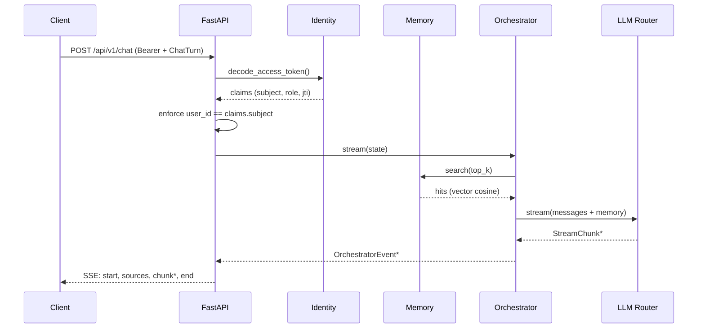

# Runtime core (Fase 1 · M1.1 → M1.5)

Il runtime core di Open-Jarvis si compone di cinque strati indipendenti
ma cooperanti. Ogni strato è isolato in un proprio package Python
(`jarvis_server.<layer>`) e comunica con gli altri solo attraverso le
DTO Pydantic e i Protocol.

## Mappa dei moduli

```
jarvis_server/
├── identity/        # M1.1 — utenti, sessioni, JWT, MFA
├── memory/          # M1.2 — memoria semantica per utente
├── llm/             # M1.3 — adapter LLM + router con policy
├── orchestration/   # M1.4 — state graph + tools
└── api/             # FastAPI app + routes (auth, memory, chat, health)
```

## Flusso di una richiesta di chat



## M1.2 · Memory

| Aspetto | Decisione |
|--------|-----------|
| Schema DB | Tabella `memory_items` (FK `users.id`, kind, content, vector_id, metadata JSON, indici user_id+kind, user_id+created_at) |
| Embedder | `Embedder` Protocol; in dev `DeterministicEmbedder` (hash SHA-256 → float L2-normalizzati). In prod: BGE-M3 / OpenAI / Cohere |
| Vector store | `VectorStore` Protocol; in dev `InMemoryVectorStore` (cosine). In prod: Qdrant (HNSW + filtri payload) |
| Isolamento | Ogni vettore è partizionato per `user_id`; le query sono sempre filtrate sullo scope del chiamante |
| RBAC | `MEMORY_READ` / `MEMORY_WRITE` enforce sul router HTTP |

Endpoint REST:

| Metodo | Path | Descrizione |
|--------|------|-------------|
| `POST` | `/api/v1/memory/record` | Crea un memory + embedding |
| `POST` | `/api/v1/memory/search` | Cosine similarity top-K |
| `GET` | `/api/v1/memory/list` | Reverse-chronological |
| `DELETE` | `/api/v1/memory/{id}` | Elimina singolo item |
| `DELETE` | `/api/v1/memory` | Elimina tutta la memoria utente |

## M1.3 · LLM Router

Adapter `Protocol`-based con quattro implementazioni out-of-the-box:

| Adapter | Privacy | Quando |
|---------|---------|--------|
| `EchoAdapter` | local-only | testing, demo offline |
| `OllamaAdapter` | local-only | inference locale, default in dev |
| `OpenAIAdapter` | cloud (compatibile OpenAI) | vLLM, LocalAI, Together, Groq, OpenAI |
| `AnthropicAdapter` | cloud | Claude Messages API |

Il `LLMRouter` seleziona l'adapter in base a `LLMRequestPolicy`:

- `LOCAL_FIRST` (default) — privacy-first, cloud solo se nessun locale è disponibile
- `LOCAL_ONLY` / `CLOUD_ONLY` — vincoli espliciti
- `CLOUD_FIRST` — quando il modello cloud è preferito (es. ragionamenti complessi)
- `backend_hint` — override per nome (es. `"anthropic"`)

## M1.4 · Orchestrator

Uno **state graph** lineare e asincrono, scritto in-house per evitare la
dipendenza pesante da LangGraph. Il pattern è esattamente lo stesso —
nodi puri `State → State` con esecuzione sequenziale — quindi una futura
migrazione a LangGraph è un drop-in replacement.

### State

```python
@dataclass
class OrchestratorState:
    user_id: UUID
    messages: list[ChatMessage]
    retrieved_memories: list[str]
    final_response: str | None
    final_backend: str | None
    final_model: str | None
    metadata: dict[str, Any]
```

### Tools

- `MemorySearchTool` — recupera top-K memorie e le inietta come system message
- `LLMTool` — chat o stream tramite il router (system prompt opzionale)
- `MemoryWriteTool` — auto-memory opt-in (flag `record_user_message`)

### Eventi emessi

`OrchestratorEvent` ha 5 type:

| Tipo | Quando |
|------|--------|
| `memory.retrieved` | dopo la ricerca semantica |
| `llm.delta` | per ogni chunk generato dal modello |
| `llm.final` | a fine generazione, con `backend`/`model` |
| `memory.written` | dopo write opt-in |
| `error` | qualunque eccezione catturata |

## M1.5 · Chat HTTP

Le route `/api/v1/chat` (REST SSE) e `/api/v1/chat/ws` (WebSocket) sono
ora protette dal token JWT ES256 e instradano l'intera conversazione
nell'orchestrator. Il `user_id` del `ChatTurn` deve coincidere con
`claims.subject`: questo previene che un client "rubi" memoria di
un altro utente passando un `user_id` differente.

```
POST /api/v1/chat
Authorization: Bearer <jwt>

{ "session_id": "...", "device_id": "...", "user_id": "...",
  "modality": "text" | "voice", "message": "...", "language": "it" }
```

Risposta in `text/event-stream`:

```
event: start
data: {"type":"start","turn_id":"...","sequence":0,"metadata":{"modality":"text"}}

event: sources
data: {"type":"sources","sequence":1,"metadata":{"count":3}}

event: chunk
data: {"type":"chunk","sequence":2,"content":"Ciao "}

…

event: end
data: {"type":"end","sequence":N,"metadata":{"status":"ok"}}
```

WebSocket: stessi frame in JSON puro + `ChatResponseSummary` finale con
latency, provider e modello.

## Privacy & sicurezza

- **Nessun byte audio attraversa il backend**: la voce è trascritta
  on-device dal voice agent (M2) e arriva qui come testo normale.
- **Isolamento per utente**: SQL queries filtrate per `user_id` +
  partition vector store + claims `subject` validati.
- **Local-first by default**: il router preferisce sempre Ollama; nessun
  byte parte verso il cloud senza override esplicito.
- **Audit**: ogni login/refresh/reuse-detection è registrato in
  `audit_events` (M1.1).

## Test e coverage

- 174 test totali (unit + integration), coverage ≥ 92 %
- Suite hermetic: SQLite in-memory, embedder deterministico, vector
  store in-memory, adapter LLM mockati con `respx`
