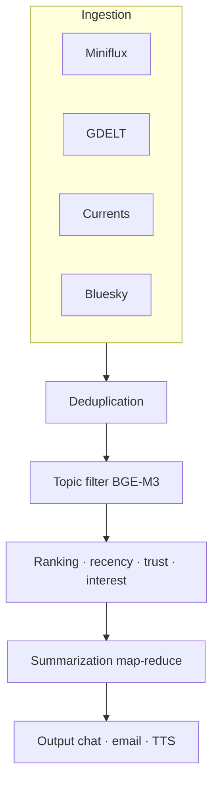

# Deep-dive · Web Search + Personal RAG

**Phase:** 3 ([tracker](https://github.com/fedcal/open-jarvis/issues/12))
**Versione:** maggio 2026

## 1. Web search agentico

### Pattern search-then-summarize con citation

```text
Query utente
  → Query expansion (sinonimi, varianti)
  → Ricerca metasearch (SearxNG self-hosted)
  → Selezione top-N URL per relevance
  → Scraping parallelo (Crawl4AI / Firecrawl)
  → Chunking + embedding
  → Recupero chunk rilevanti (hybrid search)
  → Summarization LLM con citation
  → Output: risposta + lista fonti [1][2][3]
```

### Crawl4AI — Apache 2.0

```bash
pip install crawl4ai
playwright install chromium
```

```python
import asyncio
from crawl4ai import AsyncWebCrawler
from crawl4ai.chunking_strategy import SlidingWindowChunking


async def fetch_page(url: str) -> list[str]:
    strategy = SlidingWindowChunking(window_size=500, step=400)
    async with AsyncWebCrawler(headless=True) as crawler:
        result = await crawler.arun(
            url=url,
            chunking_strategy=strategy,
            word_count_threshold=50,
            remove_overlay_elements=True,
        )
    return result.chunks
```

### Firecrawl self-hosted

`/scrape` per singola URL, `/crawl` per visita ricorsiva. Schema-based extraction via LLM:

```python
import requests

payload = {
    "url": "https://example.com/article",
    "formats": ["json"],
    "jsonOptions": {
        "schema": {
            "type": "object",
            "properties": {
                "title": {"type": "string"},
                "summary": {"type": "string"},
                "authors": {"type": "array", "items": {"type": "string"}}
            }
        }
    }
}
data = requests.post("http://localhost:3002/v1/scrape", json=payload).json()["data"]
```

### Jina Reader (zero setup)

```python
import httpx


async def jina_read(url: str) -> str:
    async with httpx.AsyncClient() as client:
        r = await client.get(
            f"https://r.jina.ai/{url}",
            headers={"X-Return-Format": "markdown", "Accept": "text/markdown"},
            timeout=30,
        )
        r.raise_for_status()
        return r.text
```

### SearxNG self-hosted (privacy meta-search)

```bash
docker run -d --name searxng -p 8888:8080 \
  -e SEARXNG_SECRET_KEY=$(openssl rand -hex 32) \
  searxng/searxng:latest
```

### Pipeline completa: query → search → scrape → cite

```python
async def web_search_pipeline(query: str, llm) -> dict:
    # 1. Search
    async with httpx.AsyncClient() as client:
        r = await client.get(
            "http://localhost:8888/search",
            params={"q": query, "format": "json"},
        )
    urls = [item["url"] for item in r.json()["results"][:8]]

    # 2. Scraping parallelo
    async with AsyncWebCrawler(headless=True) as crawler:
        pages = await asyncio.gather(*[crawler.arun(url=u) for u in urls])

    # 3. Documents con metadati citation
    from llama_index.core import Document, VectorStoreIndex
    from llama_index.embeddings.ollama import OllamaEmbedding

    docs = [
        Document(text=p.markdown[:4000], metadata={"source": u, "citation_id": i})
        for i, (p, u) in enumerate(zip(pages, urls), start=1)
        if p.markdown
    ]

    # 4. Indicizzazione + query
    embed = OllamaEmbedding(model_name="bge-m3", base_url="http://localhost:11434")
    index = VectorStoreIndex.from_documents(docs, embed_model=embed)
    response = index.as_query_engine(llm=llm, similarity_top_k=5).query(
        f"{query}\n\nCita le fonti con [N] alla fine di ogni affermazione."
    )

    return {
        "answer": str(response),
        "citations": {d.metadata["citation_id"]: d.metadata["source"] for d in docs},
    }
```

## 2. Personal RAG architecture (Phase 3)

### Ingestion incrementale con watchdog

```python
import hashlib
import json
import pathlib
from watchdog.observers import Observer
from watchdog.events import FileSystemEventHandler

SEEN = pathlib.Path(".jarvis_hashes.json")


class RAGIngestHandler(FileSystemEventHandler):
    def __init__(self, ingest_fn):
        self._ingest = ingest_fn
        self._hashes = json.loads(SEEN.read_text()) if SEEN.exists() else {}

    def _changed(self, path: str) -> bool:
        digest = hashlib.sha256(pathlib.Path(path).read_bytes()).hexdigest()
        if self._hashes.get(path) == digest:
            return False
        self._hashes[path] = digest
        SEEN.write_text(json.dumps(self._hashes))
        return True

    def on_modified(self, event):
        if not event.is_directory and self._changed(event.src_path):
            self._ingest(event.src_path)


observer = Observer()
observer.schedule(RAGIngestHandler(ingest_document), "/home/user/docs", recursive=True)
observer.start()
```

### Document parsing

| Formato | Tool | Note |
|---|---|---|
| PDF testo | marker-pdf | Markdown, tabelle e layout |
| PDF scansionato | unstructured.io + Tesseract | OCR + layout |
| Word/PPTX | pypandoc | Wraps Pandoc |
| Email mbox | stdlib `mailbox` | Header + body |
| HTML | Crawl4AI / trafilatura | Rimuove boilerplate |

### Chunking strategy

```python
from llama_index.core.node_parser import (
    MarkdownNodeParser,
    SentenceSplitter,
    SemanticSplitterNodeParser,
)
from llama_index.embeddings.ollama import OllamaEmbedding

embed = OllamaEmbedding(model_name="bge-m3", base_url="http://localhost:11434")

# Per Markdown strutturato (Obsidian, wiki)
md_parser = MarkdownNodeParser()

# Prosa generale
sentence_parser = SentenceSplitter(chunk_size=512, chunk_overlap=64)

# Massima coerenza semantica
semantic_parser = SemanticSplitterNodeParser(
    buffer_size=1, breakpoint_percentile_threshold=95, embed_model=embed
)
```

### Embedding: BGE-M3 (raccomandato per IT+EN)

| Modello | Dim | Multilingue IT+EN | MTEB |
|---|---|---|---|
| **BGE-M3** | 1024 | ✅ Eccellente cross-lingual | 72% retrieval |
| Nomic Embed v2 (MoE) | 768 | Buono | 57-63% |
| Jina v3 | 1024 | Buono | Top tier |
| mxbai-embed-large | 1024 | ❌ EN only | 59% |

```bash
ollama pull bge-m3
```

### Visual RAG con ColPali / ColQwen2

Tratta ogni pagina PDF come immagine, embedding multi-vector via VLM (Qwen2-VL backbone). **No OCR**, gestisce grafici, layout multi-colonna, scansioni.

```python
from colpali_engine.models import ColQwen2, ColQwen2Processor
from pdf2image import convert_from_path
import torch

model = ColQwen2.from_pretrained("vidore/colqwen2-v1.0", torch_dtype=torch.bfloat16)
processor = ColQwen2Processor.from_pretrained("vidore/colqwen2-v1.0")


def embed_pdf_pages(pdf_path: str) -> list[torch.Tensor]:
    images = convert_from_path(pdf_path, dpi=150)
    inputs = processor.process_images(images).to(model.device)
    with torch.no_grad():
        return model(**inputs)
```

### Hybrid search: BM25 + dense + reranker

```python
from qdrant_client import QdrantClient, models
from llama_index.vector_stores.qdrant import QdrantVectorStore
from llama_index.core import VectorStoreIndex, StorageContext

client = QdrantClient(host="localhost", port=6333)
client.create_collection(
    "jarvis_docs",
    vectors_config={"dense": models.VectorParams(size=1024, distance=models.Distance.COSINE)},
    sparse_vectors_config={"sparse": models.SparseVectorParams(
        index=models.SparseIndexParams(on_disk=False)
    )},
)

vector_store = QdrantVectorStore(
    client=client,
    collection_name="jarvis_docs",
    enable_hybrid=True,
    fastembed_sparse_model="Qdrant/bm25",
)
index = VectorStoreIndex.from_documents(
    docs,
    storage_context=StorageContext.from_defaults(vector_store=vector_store),
    embed_model=embed,
)
query_engine = index.as_query_engine(
    similarity_top_k=10,
    sparse_top_k=12,
    vector_store_query_mode="hybrid",
)
```

Reranker `BAAI/bge-reranker-v2-m3` come post-processing sui top-K.

## 3. Connettori sorgenti documenti

| Sorgente | Strumento |
|---|---|
| Obsidian vault | Khoj plugin pattern (sync real-time) |
| Notion | LlamaIndex `NotionPageReader` (polling, 3 req/s) |
| Google Drive | Watch API + push notifications HTTP |
| Dropbox | Webhooks HTTPS firma HMAC |
| File locali | watchdog + inotify Linux |
| Apple Notes | AppleScript export + watchdog |
| Apple Mail | stdlib `mailbox` per mbox |

```python
# Notion — polling incrementale
async def notion_sync(token: str, db_id: str, since: datetime) -> list[dict]:
    async with httpx.AsyncClient() as c:
        r = await c.post(
            f"https://api.notion.com/v1/databases/{db_id}/query",
            headers={"Authorization": f"Bearer {token}", "Notion-Version": "2022-06-28"},
            json={"filter": {"timestamp": "last_edited_time",
                             "last_edited_time": {"after": since.isoformat()}}},
        )
    return r.json()["results"]
```

## 4. Vector store comparison 2026

| Store | Hybrid native | Best for |
|---|---|---|
| **Qdrant** (Rust) | ✅ BM25+dense | Filtering complesso, produzione |
| **ChromaDB** (Rust 2025) | ❌ | Sviluppo, prototipazione |
| **LanceDB** | ✅ | Disk-efficient |
| **pgvector** | ❌ | Postgres esistente |

> **Default Jarvis:** Qdrant.

## 5. Evaluation con Ragas

```python
from ragas import evaluate
from ragas.metrics import faithfulness, answer_relevancy, context_recall
from datasets import Dataset

test = Dataset.from_list([{
    "question": "Qual è il modello embedding consigliato per IT?",
    "answer": response.response,
    "contexts": [n.text for n in response.source_nodes],
    "ground_truth": "BGE-M3 supporta 100+ lingue incluso italiano.",
}])

results = evaluate(test, metrics=[faithfulness, answer_relevancy, context_recall])
```

CI integration: blocca merge se `faithfulness < 0.80`.

## 6. Daily briefing pattern



```python
async def fetch_all_sources(since_hours: int = 12) -> list[dict]:
    async with httpx.AsyncClient(timeout=30) as c:
        results = await asyncio.gather(
            fetch_miniflux(c, since_hours),
            fetch_currents_api(c, since_hours),
            fetch_gdelt(c, since_hours),
            fetch_bluesky_feed(c),
            return_exceptions=True,
        )
    return [item for batch in results if isinstance(batch, list) for item in batch]


def deduplicate_articles(articles, embed_model, threshold=0.90):
    from sklearn.metrics.pairwise import cosine_similarity
    texts = [a["title"] + " " + a.get("summary", "") for a in articles]
    embs = embed_model.get_text_embedding_batch(texts)
    sim = cosine_similarity(embs)
    seen, unique = set(), []
    for i, art in enumerate(articles):
        if i not in seen:
            unique.append(art)
            for j in range(i + 1, len(articles)):
                if sim[i, j] > threshold:
                    seen.add(j)
    return unique
```

## Riferimenti

- [Crawl4AI](https://docs.crawl4ai.com/)
- [Firecrawl self-host](https://docs.firecrawl.dev/contributing/self-host)
- [BGE-M3 · HuggingFace](https://huggingface.co/BAAI/bge-m3)
- [Qdrant hybrid search](https://qdrant.tech/articles/hybrid-search/)
- [ColPali](https://github.com/illuin-tech/colpali)
- [Ragas](https://docs.ragas.io)
- [Miniflux API](https://miniflux.app/docs/api.html)
- [Zep temporal KG](https://arxiv.org/abs/2501.13956)
