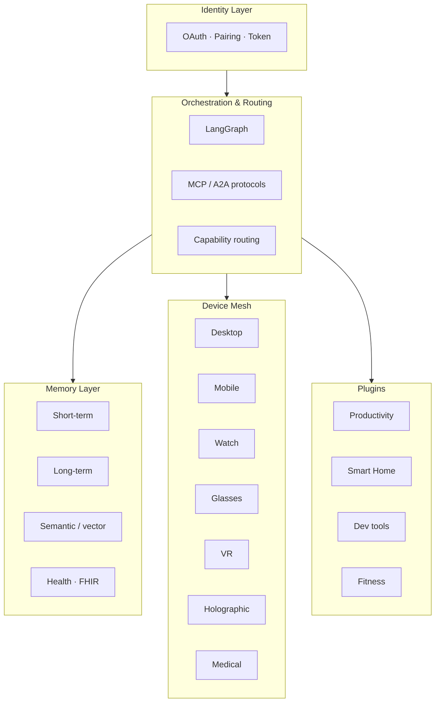

# Architettura

Jarvis è progettato come un'**infrastruttura AI personale a strati**, in cui ogni livello ha responsabilità ben definite e può essere sostituito o esteso indipendentemente.

## Vista generale



## I cinque livelli

### 1. Identity Layer

Responsabilità:

- autenticazione utente (OAuth 2.0, passkey)
- registrazione e pairing dei dispositivi
- gestione token e refresh
- certificati per device, scope di accesso

Ogni dispositivo riceve una registrazione del tipo:

```json
{
  "device_id": "uuid",
  "owner_id": "user_id",
  "device_type": "watch",
  "capabilities": ["notifications", "voice", "heartrate"],
  "trust_level": "primary"
}
```

### 2. Orchestration & Routing Layer

Il cervello del sistema. Costruito su **LangGraph** per:

- workflow a grafo con stati persistenti
- checkpointing e time travel per il debug
- agenti specializzati orchestrati come nodi
- comunicazione cross-agent via **MCP** (Anthropic) e **A2A** (Google)

Il routing decide a quale device far eseguire un task. Esempio:

| Input | Contesto | Decisione |
|---|---|---|
| "Ricordamelo tra 20 minuti" | Utente sta correndo | Smartwatch (vibrazione + voce) |
| "Apri il PR #42" | Utente al PC | Desktop agent (IDE) |
| "Mostrami la strada" | Utente alla guida | Mobile (TTS) + glasses (overlay) |

### 3. Memory Layer

Tre tipi di memoria coordinati:

- **Short-term:** sessione attiva, contesto immediato (Redis)
- **Long-term:** cronologia, preferenze, profilo (PostgreSQL + mem0)
- **Semantic:** ricerca su documenti personali e knowledge (Qdrant)
- **Health:** dati medici e biometrici (HAPI FHIR R4/R5)

Il backend di default è **mem0 + Qdrant**. Alternative: **Zep** (knowledge graph temporale) o **Letta** (paging gestito dall'agente).

### 4. Device Mesh

Ogni dispositivo esegue un **agente locale** che parla con il server centrale. Vedi la sezione [Dispositivi](../devices/index.md).

### 5. Plugin & Integrations

Sistema modulare per estendere le capacità: produttività, smart home, dev tools, fitness, finanza, web scraping, API esterne.

## Strategia di modelli LLM

Non un solo modello "monolitico", ma una **gerarchia distribuita**:

| Tier | Esempio | Use case |
|---|---|---|
| Small | Llama 3.2 1B (Ollama), Phi-3 | Wake word, intent recognition, smartwatch |
| Medium | Llama 3.1 8B, Gemma 2 9B | Conversazioni rapide, mobile |
| Large | Claude Sonnet 4.6, GPT-4 | Reasoning complesso, coding, orchestration |

Il routing avviene per **task complexity** + **device capability** + **policy di privacy**.

## Privacy & Security

- 🔐 Tutti i dati sono **on-premise** di default
- 🔑 Cifratura TLS end-to-end tra device e server
- 🪪 Token JWT short-lived + refresh
- 🛡️ Policy di accesso granulari per scope
- 📜 Logging audit completo, conservato secondo policy utente

## Approfondimenti

- [Dispositivi e device-mesh](../devices/index.md)
- [Agenti specializzati](../agents/index.md)
