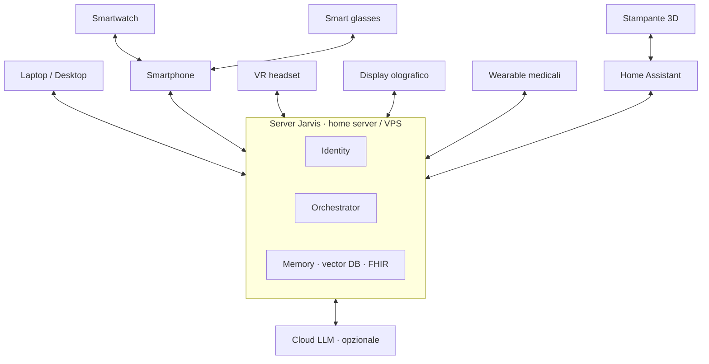
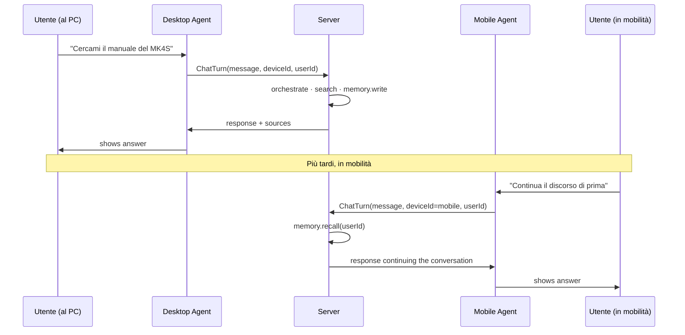

# Comunicazione cross-device

Jarvis non vive su un solo dispositivo: vive su una **mesh** che coordina laptop, smartphone, smartwatch, occhiali smart, visori, display olografici, wearable medicali, stampanti 3D e dispositivi smart-home, **tutti appartenenti alla stessa persona**.

Questa pagina spiega come **comunicano tra loro**.

## Principio fondamentale

> Una sola **identità AI**, molti **device puntatori**.

L'identità è centralizzata sul server Jarvis (o su un'istanza federata). I device sono **superfici di interazione** che eseguono parte del lavoro localmente quando hanno le capability per farlo.

## Topologia tipica



I dispositivi a basse risorse (smartwatch, occhiali) **piggyback** su un device più capace (smartphone) per raggiungere il server.

## Standard di interoperabilità smart home

### Matter 1.4 / 1.5

Standard di riferimento, sviluppato dalla **Connectivity Standards Alliance (CSA)**, distribuito con SDK open source sotto **Apache License**.

- Versione **1.4** (mag 2025): NFC onboarding, multi-device setup via Enhanced Multi-Admin
- Versione **1.4.2** (ago 2025): scene multi-device standardizzate, time-based
- Versione **1.5** (nov 2025): telecamere, sensori umidità del suolo, energy management
- Libreria di riferimento: `connectedhomeip` (project-chip su GitHub)
- Binding Python: `python-matter-server` usato da Home Assistant

### Thread

Protocollo mesh **IPv6 a bassa potenza**, trasporto fisico per Matter.

- Implementazione open source: **OpenThread** (Google, BSD)
- Integrato in **ESPHome** dalla 2025.6 con supporto ESP32-C6 ed ESP32-H2
- Oltre 1.000 prodotti certificati a fine 2025

### Zigbee 3.0

Ampia copertura legacy. Librerie Python mature: `zigpy`, coordinatore via **zigbee2mqtt**. Gestito in Home Assistant tramite ZHA.

### MQTT

Protocollo **publish-subscribe** event-driven. **Eclipse Mosquitto** (EPL/EDL) è il broker standard per home lab. **EMQX** per deployment scalabili. **Frigate** pubblica detection events via MQTT.

## Sincronizzazione laptop ↔ smartphone

| Tool | Open source | Piattaforme |
|---|---|---|
| **KDE Connect** | ✅ | Linux, macOS, Windows, Android, iOS |
| **GS Connect** | ✅ (porting GNOME) | GNOME Shell |
| Microsoft Phone Link | ❌ | Windows + Android/iOS |
| Apple Continuity | ❌ | macOS + iOS |
| Google Quick Share | ❌ | Android + Windows |

**KDE Connect** è il candidato naturale per Jarvis: protocollo aperto, supporto ottimo per:

- 🔔 notifiche bidirezionali
- 📋 clipboard sync
- 📁 trasferimento file
- 🎵 controllo media
- 🖱️ remote mouse/keyboard

## Comunicazione device → server

### Trasporto

- **HTTPS REST** per richieste sincrone
- **WebSocket** per streaming bidirezionale (voice, real-time updates)
- **gRPC** opzionale per agenti server-side ad alta frequenza
- **MQTT** per device IoT

### Autenticazione

- **OAuth 2.0 / OIDC** per device pairing
- **JWT short-lived** + refresh token
- **mTLS** opzionale per device fissi

### Identity

- **Authentik** o **Keycloak** come Identity Provider
- **FIDO2 / WebAuthn / passkey** per secondo fattore

## Flusso tipico: messaggio cross-device



## Routing intelligente

Quando Jarvis riceve un input, decide a quale device mostrare la risposta. Inputs alla decisione:

- 🔋 device disponibili e online
- 📍 contesto fisico (alla guida, in palestra, al PC)
- 🎯 capability del device per quel task (es. video → solo schermo)
- 🔇 modalità "Do Not Disturb" attive
- ⚙️ preferenze utente

```python
def route_response(turn):
    if user.is_driving():
        return Device.MOBILE_TTS_ONLY
    if user.has_active_focus_mode():
        return Device.SUPPRESS
    if turn.requires_screen() and user.has(Device.DESKTOP):
        return Device.DESKTOP
    return user.most_recent_active_device()
```

## Protocolli emergenti per agenti

| Protocollo | Scope |
|---|---|
| **MCP** (Anthropic, dic 2024) | Agent → tool/risorse |
| **A2A** (Google, apr 2025, Linux Foundation) | Agent → agent |
| **AG-UI** (CopilotKit) | Agent → UI dinamiche |

Vedi [Protocolli](protocols.md) per il dettaglio.

## Privacy

- 🔒 TLS end-to-end tra ogni device e server
- 🪪 Token JWT con scadenza breve, refresh dedicato
- 🔐 Cifratura at-rest per la conversation log
- 🚫 Mai propagare dati sensibili (FHIR, finance) tra device senza esplicito need
