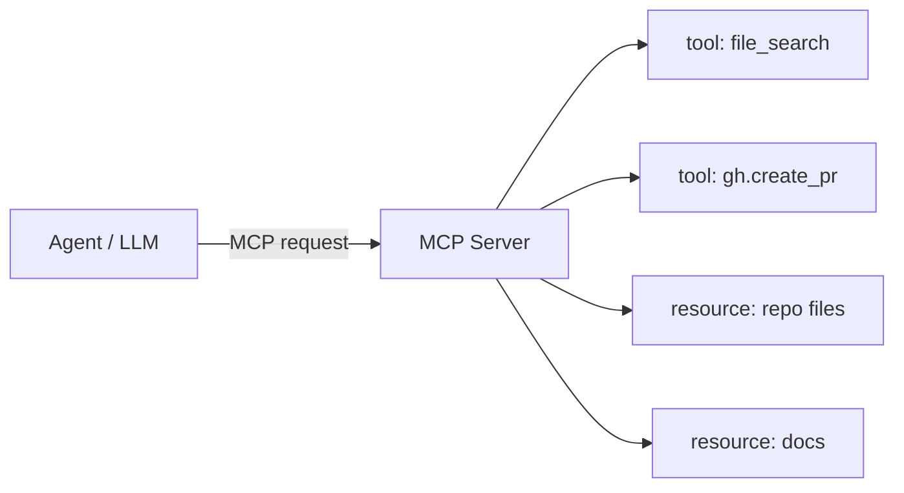
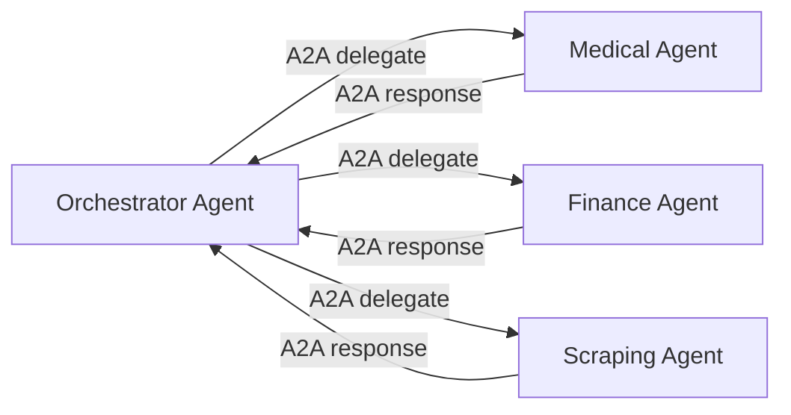

# Protocolli

Jarvis adotta una **stack di protocolli aperti** per garantire interoperabilità con strumenti, agenti e UI di terze parti senza vendor lock-in.

## I tre protocolli agentici

| Protocollo | Origine | Scopo | Esempio in Jarvis |
|---|---|---|---|
| **MCP** | Anthropic, dic 2024 | Agent → tool / risorse esterne | il Dev Agent espone `repo.search`, `gh.create_pr` |
| **A2A** | Google, apr 2025 (ora Linux Foundation) | Agent → agent | l'orchestrator delega al Medical Agent |
| **AG-UI** | CopilotKit | Agent → UI reattive | dashboard generate al volo da specifiche |

### Model Context Protocol (MCP)

Standard aperto introdotto da Anthropic per consentire agli LLM di **accedere a tool e risorse esterne** in modo strutturato e sicuro.



In Jarvis ogni agente specializzato espone un **proprio MCP server**. Esempi:

- `agents/medical-agent/mcp_server.py` → tool `oura.fetch_sleep`, `whoop.recovery`, `fhir.observation_query`
- `agents/scraping-agent/mcp_server.py` → tool `crawl.fetch`, `firecrawl.crawl`, `jina.read`
- `agents/maker-agent/mcp_server.py` → tool `printer.start`, `slicer.slice`, `blender.export_stl`

Apple a WWDC 2025 ha integrato MCP come protocollo per Siri/App Intents.

### Agent-to-Agent (A2A)

Standard introdotto da Google e successivamente migrato sotto **Linux Foundation** per garantire neutralità. Specifica come **agenti eterogenei** possono comunicare e delegare task.



LangGraph v1.0 supporta A2A nativamente come trasporto. Google ADK e Pydantic AI hanno SDK A2A.

### Agent-UI Protocol (AG-UI)

Permette agli agenti di **proiettare interfacce utente** reattive direttamente al frontend, senza pagine pre-compilate.

In Jarvis: l'agente può generare al volo un widget di dashboard biometrica, una table di transazioni filtrata, un grafico — tutto via AG-UI.

## Stack di trasporto a livelli

```text
┌──────────────────────────────────────────────────┐
│   Application protocols                          │
│   MCP · A2A · AG-UI                              │
├──────────────────────────────────────────────────┤
│   Transport                                      │
│   HTTPS · WebSocket · gRPC · MQTT                │
├──────────────────────────────────────────────────┤
│   Auth & identity                                │
│   OAuth 2.0 / OIDC · JWT · FIDO2 · passkey       │
├──────────────────────────────────────────────────┤
│   Smart-home transport                           │
│   Matter · Thread · Zigbee · BLE                 │
├──────────────────────────────────────────────────┤
│   Health interop                                 │
│   HL7 FHIR · SMART on FHIR · IEEE 11073          │
└──────────────────────────────────────────────────┘
```

## Schemi dati

### Conversation turn

```json
{
  "turn_id": "uuid",
  "user_id": "uuid",
  "device_id": "uuid",
  "timestamp": "2026-05-09T12:00:00Z",
  "message": "Quanto ho dormito ieri?",
  "language": "it",
  "context": {
    "location": "home",
    "modality": "voice",
    "active_focus": null
  }
}
```

### Device registration

```json
{
  "device_id": "uuid",
  "owner_id": "user_id",
  "device_type": "watch",
  "model": "PineTime",
  "capabilities": ["heartrate", "notifications", "haptic", "wakeword"],
  "trust_level": "primary",
  "paired_at": "2026-05-09T12:00:00Z"
}
```

### Memory record

```json
{
  "id": "uuid",
  "user_id": "uuid",
  "scope": "user|agent|session|org",
  "type": "fact|preference|event",
  "text": "Birthday: March 15",
  "embedding": [0.012, ...],
  "metadata": {"source": "conversation", "ttl": null}
}
```

## Federated identity

Per ambienti multi-istanza (un utente con server in casa + server al lavoro):

- **OIDC Federation** tra le istanze
- **WebAuthn** come secondo fattore portable
- **Passkey** sincronizzati via iCloud Keychain / Google Password Manager

## Specifiche di riferimento

- [Model Context Protocol — modelcontextprotocol.io](https://modelcontextprotocol.io/)
- [A2A — agent2agent.dev](https://github.com/google/A2A)
- [AG-UI — ag-ui.com](https://ag-ui.com/)
- [Matter — csa-iot.org](https://csa-iot.org/)
- [HL7 FHIR — hl7.org/fhir](https://hl7.org/fhir/)
- [OAuth 2.0 — oauth.net/2/](https://oauth.net/2/)
- [WebAuthn — w3.org/webauthn](https://www.w3.org/TR/webauthn-3/)
