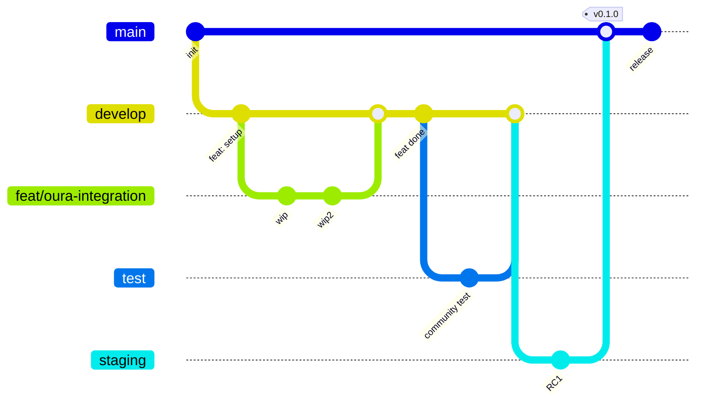

# Branching strategy & auto-deploy

## 🎯 Filosofia

Open-Jarvis adotta una strategia **multi-environment con branch dedicati**, ispirata a GitFlow ma semplificata per progetto open source community-driven.

| Branch | Ruolo | Ambiente target | Deploy |
|---|---|---|---|
| **`main`** | Stabile, production-ready | `https://jarvis.federicocalo.dev` (prod) | ⚡ Automatico |
| **`develop`** | Sviluppo attivo, sempre funzionante | `https://dev.jarvis.federicocalo.dev` | ⚡ Automatico |
| **`staging`** | Release candidate, pre-prod | `https://staging.jarvis.federicocalo.dev` | ⚡ Automatico |
| **`test`** | Test integrazione community, hardware reali | `https://test.jarvis.federicocalo.dev` | ⚡ Automatico |
| **`feat/*`** | Singole feature in sviluppo | – (solo CI lint+test) | ❌ Solo PR |
| **`fix/*`** | Bug fixes | – | ❌ Solo PR |
| **`hotfix/*`** | Fix urgenti production | Cherry-pick → main | ⚡ Diretto su main |
| **`release/*`** | Preparazione release | Merge → main + tag | ⚡ Su tag |

## 📊 Flusso lavoro



### Flusso normale di una feature

1. **Branch dal `develop`**: `git checkout -b feat/health-oura develop`
2. **Sviluppo iterativo**: commit frequenti, push regolare
3. **PR verso `develop`**: ≥ 1 review, CI verde
4. **Merge in `develop`**: deploy automatico su `dev.*`
5. **Periodicamente** (ogni 2-4 settimane): `develop` → `test` per validazione community
6. **Feedback test** → fix in `develop`
7. **Quando stabile**: `develop` → `staging` per release candidate
8. **Test finale staging** → `main` con tag versione
9. **Tag `v*`** → release production deploy

### Hotfix urgente in produzione

1. **Branch da `main`**: `git checkout -b hotfix/critical-cve-fix main`
2. **Fix minimale**, **test rigoroso**
3. **PR verso `main`** + cherry-pick verso `develop` + `staging`
4. **Tag `vX.Y.Z+1`** → deploy immediato

## 📝 Naming convention dei branch

Il naming è **strict** e validato dal CI:

```text
<type>/<scope>-<short-description>

# Esempi validi
feat/health-oura-integration
fix/voice-agent-crash-empty-buffer
docs/it-architecture-rag
refactor/memory-mem0-wrapper
test/integration-llm-router
chore/deps-anthropic-0-50
hotfix/security-cve-2026-1234
release/v0-2-0
```

### Type allowed

| Type | Quando usare | Branch base |
|---|---|---|
| `feat/` | Nuova feature | `develop` |
| `fix/` | Bug fix non urgente | `develop` |
| `hotfix/` | Bug fix urgente prod | `main` |
| `docs/` | Solo documentazione | `develop` |
| `refactor/` | Refactor senza cambio comportamento | `develop` |
| `perf/` | Miglioramento performance | `develop` |
| `test/` | Aggiunta/modifica test | `develop` |
| `chore/` | Manutenzione, deps update | `develop` |
| `ci/` | Solo CI/CD changes | `develop` |
| `style/` | Format, lint, no code changes | `develop` |
| `build/` | Sistema di build, Dockerfile | `develop` |
| `release/` | Preparazione release branch | `develop` → `staging` → `main` |

### Regole nel nome

- ✅ Solo lowercase ASCII
- ✅ Word separator: `-` (kebab-case)
- ✅ Component separator: `/`
- ✅ Massimo 60 caratteri totali
- ✅ Riferimento issue opzionale: `feat/health-oura-#42`
- ❌ No spazi
- ❌ No caratteri speciali (no `_`, `.`, `:`, `@`)
- ❌ No nomi personali (`feat/marco-test` ❌ → `feat/scope-purpose` ✅)

### Validation regex (CI)

```regex
^(feat|fix|hotfix|docs|refactor|perf|test|chore|ci|style|build|release)\/[a-z0-9]+(-[a-z0-9]+)*(-#\d+)?$
```

## 🔄 Conventional Commits

Anche i **commit message** seguono [Conventional Commits](https://www.conventionalcommits.org/) **in inglese**:

```text
<type>(<scope>): <subject>

[body]

[footer]
```

Esempi validi:

```text
feat(health): add Oura Ring v2 OAuth flow
fix(voice): handle empty audio buffer in STT pipeline
docs(it): translate architecture overview
refactor(memory): extract vector store interface
chore(deps): bump anthropic to 0.50.0
ci(release): add SLSA Level 3 provenance generator
```

Type `BREAKING CHANGE:` nel footer per major version bump:

```text
feat(api)!: replace JWT HS256 with ES256

BREAKING CHANGE: All existing tokens are invalidated.
Users must re-authenticate after deploy.
```

## 🚀 Auto-deploy CI/CD

Il sistema `auto-deploy.yml` gestisce il deploy automatico in base al branch:

```yaml
# .github/workflows/deploy.yml
on:
  push:
    branches: [main, develop, staging, test]
    tags: ["v*"]
```

| Trigger | Target | URL | Action |
|---|---|---|---|
| Push `main` (con CI green) | Production VPS | `jarvis.federicocalo.dev` | Blue/green deploy |
| Push `develop` | Dev VPS | `dev.jarvis.federicocalo.dev` | Rolling update |
| Push `staging` | Staging VPS | `staging.jarvis.federicocalo.dev` | Rolling update |
| Push `test` | Test VPS | `test.jarvis.federicocalo.dev` | Rolling update |
| Tag `v*` (semver) | Production + GitHub Release | – | Tag release + changelog |

### Architettura ambienti

| Ambiente | RAM | Storage | LLM | DB | Backup |
|---|---|---|---|---|---|
| **Production** | 16 GB | 200 GB SSD | Cloud + Ollama | PostgreSQL HA | Daily age-encrypted |
| **Staging** | 8 GB | 80 GB SSD | Cloud only | PostgreSQL single | Weekly |
| **Test** | 4 GB | 40 GB SSD | Mock LLM | PostgreSQL ephemeral | Nessuno |
| **Dev** | 4 GB | 40 GB SSD | Cloud + Ollama mini | PostgreSQL single | Nessuno |

### Schema URL

```text
production: https://jarvis.federicocalo.dev
staging:    https://staging.jarvis.federicocalo.dev
test:       https://test.jarvis.federicocalo.dev
dev:        https://dev.jarvis.federicocalo.dev
preview:    https://pr-{N}.jarvis.federicocalo.dev  (per ogni PR aperta)
```

## 🛡️ Branch protection (GitHub Rulesets)

### `main` — il più protetto

- ✅ Required PR review (≥ 1 approving)
- ✅ Required CODEOWNERS review (`@fedcal`)
- ✅ Required status check `CI success`
- ✅ Required conversation resolution
- ✅ Linear history obbligatoria
- ✅ Block force push
- ✅ Block deletion
- 🔓 Bypass: solo Repo Admin (`@fedcal`)

### `staging` — produzione-like

- ✅ Required PR review (≥ 1)
- ✅ Required `CI success`
- ✅ Block force push, no delete
- 🔓 Bypass: Maintainer

### `develop` — sviluppo attivo

- ✅ Required `CI success` (lint + test verde)
- ✅ Block force push, no delete
- ⚠️ PR review consigliata ma non obbligatoria

### `test` — test community

- ⚠️ Block force push, no delete
- 🔓 Push diretto consentito ai contributor approvati

### `feat/*`, `fix/*`, `hotfix/*` — feature branches

- 🔓 Push libero al proprietario
- ⚠️ Auto-delete dopo merge

## 📦 Versioning (Semantic Versioning)

Il versioning segue [SemVer 2.0](https://semver.org/):

```text
MAJOR.MINOR.PATCH

Esempi:
0.1.0  — primo MVP
0.2.0  — aggiunta voice pipeline
0.2.1  — bug fix voice
1.0.0  — prima release stabile
1.1.0  — nuova feature health
2.0.0  — breaking change API
```

| Cambiamento | Bump |
|---|---|
| Bug fix retrocompatibile | PATCH (`0.1.0` → `0.1.1`) |
| Feature retrocompatibile | MINOR (`0.1.0` → `0.2.0`) |
| Breaking change | MAJOR (`0.x` → `1.0`) |

### Pre-release tags

```text
v1.0.0-alpha.1  — primissime build sperimentali
v1.0.0-beta.3   — beta pubblica
v1.0.0-rc.1     — release candidate
v1.0.0          — stable
```

## 📋 Onboarding nuovo contributor

```bash
# 1. Fork del repo + clone
git clone git@github.com:TUO_USERNAME/open-jarvis.git
cd open-jarvis

# 2. Setup remote upstream per sync
git remote add upstream git@github.com:fedcal/open-jarvis.git

# 3. Sempre allineato con upstream
git fetch upstream
git checkout develop
git merge upstream/develop

# 4. Crea branch dalla develop
git checkout -b feat/awesome-feature develop

# 5. Lavora con commit frequenti
git add .
git commit -m "feat(scope): add awesome behavior"

# 6. Push sul tuo fork
git push -u origin feat/awesome-feature

# 7. Apri PR su github.com → develop branch del repo upstream
# 8. Aspetta CI verde + review
# 9. Merge → auto-deploy su dev.*
```

## ✅ Workflow consigliato per maintainer

### Settimanale

```bash
# Lunedì mattina: status check
git fetch --all
git checkout develop && git pull
git log --oneline develop..main  # cosa manca da promuovere?

# Martedì: review PR e merge in develop
# Mercoledì-Giovedì: integration test, manual QA
# Venerdì: se develop stabile → merge in test per community check
```

### Mensile (release cycle)

```bash
# 1. Promote develop → staging
git checkout staging
git merge --ff-only develop  # solo se fast-forward
git push

# 2. Test 3-5 giorni in staging
# 3. Se OK: staging → main
git checkout main
git merge --ff-only staging
git tag -a v0.2.0 -m "Release v0.2.0"
git push origin main --tags

# 4. Auto-deploy in produzione + GitHub Release con changelog
```

## 🔧 Tooling

### Pre-commit per validare branch name

```yaml
# .pre-commit-config.yaml — aggiungi
- repo: local
  hooks:
    - id: check-branch-name
      name: Validate branch name
      entry: scripts/check-branch-name.sh
      language: script
      stages: [commit]
      always_run: true
```

```bash
# scripts/check-branch-name.sh
#!/bin/bash
BRANCH=$(git rev-parse --abbrev-ref HEAD)
PROTECTED_REGEX="^(main|develop|staging|test)$"
FEATURE_REGEX="^(feat|fix|hotfix|docs|refactor|perf|test|chore|ci|style|build|release)\/[a-z0-9]+(-[a-z0-9]+)*(-#[0-9]+)?$"

if [[ "$BRANCH" =~ $PROTECTED_REGEX ]] || [[ "$BRANCH" =~ $FEATURE_REGEX ]]; then
  exit 0
fi

echo "❌ Nome branch non valido: $BRANCH"
echo "Usare: <type>/<scope>-<purpose>"
echo "Esempio: feat/health-oura-integration"
exit 1
```

### Commitlint per Conventional Commits

```yaml
# .github/workflows/commit-lint.yml
name: Commit lint
on: [pull_request]
jobs:
  lint:
    runs-on: ubuntu-latest
    steps:
      - uses: actions/checkout@v4
        with: { fetch-depth: 0 }
      - uses: wagoid/commitlint-github-action@v6
```

```js
// commitlint.config.cjs
module.exports = {
  extends: ["@commitlint/config-conventional"],
  rules: {
    "type-enum": [2, "always", [
      "feat", "fix", "hotfix", "docs", "refactor",
      "perf", "test", "chore", "ci", "style", "build", "release"
    ]],
    "scope-empty": [2, "never"],
    "subject-max-length": [2, "always", 100]
  }
};
```

## 📚 Risorse

- [Conventional Commits](https://www.conventionalcommits.org/)
- [Semantic Versioning](https://semver.org/)
- [GitHub Flow](https://docs.github.com/get-started/quickstart/github-flow)
- [GitFlow](https://nvie.com/posts/a-successful-git-branching-model/)
- [Trunk-based development](https://trunkbaseddevelopment.com/)
- [Conventional Branch](https://conventional-branch.github.io/)
