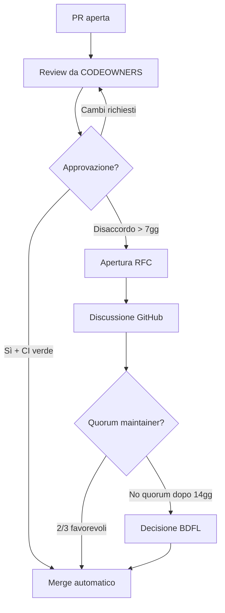

# Governance

Come decisiamo, come collaboriamo, come ci assicuriamo che il progetto resti **affidabile, sempre aggiornato e community-friendly** nel tempo.

## 🎭 Ruoli

| Ruolo | Diritti | Responsabilità |
|---|---|---|
| **BDFL / Lead maintainer** | Veto finale su scelte strategiche, merge in `main`, release | Visione, qualità, sicurezza, community health |
| **Core maintainer** | Merge in `develop`, `test`, `staging` · review PR | Mantenere area assegnata, mentoring |
| **Domain maintainer** | Merge nelle aree CODEOWNERS specifiche (es. `medical-agent`) | Ownership tecnica della propria area |
| **Trusted contributor** | Push diretto su `feat/*`, `test/*` · review PR avanzata | Contributi continui, standard qualità |
| **Contributor** | Apertura PR, partecipazione discussioni, segnalazione bug | Singolo contributo o serie |
| **User** | Uso del software, feedback via issue/discussion | Adozione, segnalazione |

Lead maintainer attuale: **[Federico Calò](https://federicocalo.dev)**.

## 📊 Modello decisionale

Il modello è **lazy consensus** con escalation strutturata:



### RFC (Request for Comments)

Per cambiamenti **architetturali**, **breaking changes**, **modifiche governance**, si usa il processo RFC:

1. Apertura issue con label `rfc` + titolo `RFC-NNN: titolo`
2. Documento markdown in `/docs/rfcs/NNN-titolo.md` via PR
3. Discussione **minimum 14 giorni** in pubblico
4. Final Comment Period (FCP) di 7 giorni
5. Decisione: accepted / rejected / postponed
6. Tracciamento implementazione

Template RFC in `/docs/rfcs/_template.md`.

### Tipologie di decisione

| Tipo | Decisore | Tempo |
|---|---|---|
| Bug fix routine | Qualsiasi maintainer | < 24h se urgente |
| Nuova feature minore | Domain maintainer + 1 review | 3-7 giorni |
| Feature major | RFC + 2 maintainer | 14-30 giorni |
| Breaking change API | RFC + lead maintainer | 30+ giorni |
| Cambio governance | RFC + 2/3 maintainer | 30+ giorni |
| Sicurezza critica | Lead maintainer (privato) | < 72h |

## 🔄 Maintainer rotation

Per evitare il **bus factor di 1**, la community ruota le responsabilità:

### Promotion path

```text
User → Contributor → Trusted Contributor → Domain Maintainer → Core Maintainer → Lead
```

**Trusted Contributor** (criteri):

- ≥ 5 PR mergeate negli ultimi 6 mesi
- Almeno 1 area di expertise dimostrata
- Comportamento coerente con CODE_OF_CONDUCT
- Sponsor da 1 maintainer esistente

**Domain Maintainer** (criteri aggiuntivi):

- ≥ 15 PR sostanziali nell'area
- Deep understanding tecnica documentata
- 2 sponsor da maintainer
- Disponibilità a fare review per ≥ 6 mesi

**Core Maintainer**:

- ≥ 6 mesi come Domain Maintainer
- Contributi cross-area
- Voto da 2/3 dei core maintainer attuali

### Maintainer inattivi

Se un maintainer è inattivo per **6 mesi consecutivi**:

1. Notifica via email + GitHub
2. Se nessuna risposta dopo 30 giorni → status passa a **emeritus**
3. Diritti di merge revocati
4. Mantiene il ringraziamento permanente

## 🔐 Sicurezza dei privilegi

| Privilegio | Chi |
|---|---|
| Push diretto `main` | Lead (in emergenza) |
| Merge PR `main` | Lead + 1 Core |
| Merge PR `staging` | Core |
| Merge PR `develop` | Core + Domain |
| Merge PR su area CODEOWNERS | Domain area |
| Tag release | Lead |
| Modifiche `.github/workflows/*` | Lead + 1 Core |
| Modifiche `CODEOWNERS` | Lead |
| Gestione secrets repo | Lead |
| Access ai server prod | Lead |

## 💬 Canali di comunicazione

| Canale | Uso | Asincronia |
|---|---|---|
| **GitHub Issues** | Bug, feature request | ✅ async |
| **GitHub Discussions** | Domande, idee, brainstorming | ✅ async |
| **GitHub PR comments** | Code review | ✅ async |
| **GitHub Wiki** | Knowledge base community | ✅ async |
| **Email** (security@) | Vulnerabilità sicurezza | ⚠️ privato |
| **Matrix #open-jarvis:matrix.org** | Chat real-time community | ⚠️ pianificato |
| **Discord (community-run)** | Chat informale | ⚠️ pianificato |

**Default async**: ogni decisione importante deve avere traccia scritta su GitHub. Le chat real-time non sono mai source-of-truth.

### Galateo

- 📝 Scrivere in inglese su issue/PR/RFC (anche se la doc è bilingue)
- 🚫 No discussioni private su decisioni che riguardano la community
- ⏱️ Maintainer si impegnano a rispondere entro **7 giorni** (anche solo per dire "lo guardo entro X")
- 🤝 Critica costruttiva sempre, attacchi personali mai (vedi [CODE_OF_CONDUCT](https://github.com/fedcal/open-jarvis/blob/main/CODE_OF_CONDUCT.md))

## 📅 Cadenza release

Vedi [Release cycle](release-cycle.md) per il dettaglio.

| Cadenza | Tipo |
|---|---|
| Settimanale | Push `develop`, build automatica |
| Bi-settimanale | Promote `develop` → `test` per community feedback |
| Mensile | Promote `staging` → `main`, tag `vX.Y.Z` |
| Trimestrale | Major release con changelog completo |

## 📜 Changelog

Generato automaticamente da [conventional-changelog-action](https://github.com/TriPSs/conventional-changelog-action) ad ogni tag. File `CHANGELOG.md` aggiornato e committato.

Linee guida:

- Ogni release ha changelog con `### Added / Changed / Fixed / Deprecated / Removed / Security`
- Riferimento a issue/PR
- Mention contributor per ogni change

## 🎓 Mentoring & onboarding

I nuovi contributor ricevono:

1. **Welcome bot** alla prima PR aperta
2. **Sponsor** assegnato (un Trusted Contributor o Maintainer disponibile)
3. **Good first issue** suggerite via [label dedicato](https://github.com/fedcal/open-jarvis/labels/good%20first%20issue)
4. **Mentoring 1:1** opzionale via Discussions per le prime 3 PR

Il maintainer-sponsor è responsabile di:

- Guidare nel workflow Git
- Code review pedagogico (no nitpicking, focus su comprensione)
- Indicare risorse e documentazione

## 🚨 Conflict resolution

Quando emerge un disaccordo tra contributor:

1. **Step 1 — Dialogo diretto** sul thread PR/issue (24-48h)
2. **Step 2 — Maintainer mediation** (un maintainer non coinvolto media)
3. **Step 3 — Lead maintainer arbitra** se il dialogo non sblocca
4. **Step 4 — Code of Conduct enforcement** se viene rotta la civiltà

Tutto in pubblico, tutto tracciabile.

## 🔍 Trasparenza

Tutti gli atti di governance sono pubblici:

- 📋 [GitHub Project board](https://github.com/users/fedcal/projects)
- 📜 RFC archiviate in `/docs/rfcs/`
- 💼 Decisioni maintainer pubbliche in [Discussions/Governance](https://github.com/fedcal/open-jarvis/discussions/categories/governance)
- 🗳️ Voti maintainer documentati nelle PR di policy
- 💰 Sponsorship tracking via [GitHub Sponsors](https://github.com/sponsors/fedcal)

## 🛡️ Anti-abandonment guarantees

Cosa succede se il **lead maintainer non è più disponibile**?

1. Mailing list `governance@open-jarvis` (gestita da 3 trusted) viene avvisata
2. Dopo 60 giorni di silenzio → core maintainer eleggono nuovo lead
3. Procedura documentata e versionata in questo file
4. Ownership repo passa al nuovo lead via GitHub support
5. Domini DNS coperti da un trust (planning futuro)

## 🏆 Recognition

Ogni contribuzione è **riconosciuta**:

- 📛 Nome nel `CONTRIBUTORS.md` (auto-generato da [all-contributors](https://allcontributors.org/))
- 🏅 Badge GitHub Profile per contributi sostanziali
- 📣 Social shoutout sulla pagina del progetto
- 💸 Bounty tramite GitHub Sponsors (per issue tagged `bounty`, quando disponibile)
- 🎤 Speaker priority a eventi community

## ❓ Domande?

Per chiarimenti sulla governance:

- Apri una [Discussion in categoria Governance](https://github.com/fedcal/open-jarvis/discussions/categories/governance)
- Tag `@fedcal` se serve attenzione del lead

> Questo documento è esso stesso modificabile via RFC. Le regole evolvono con la community.
