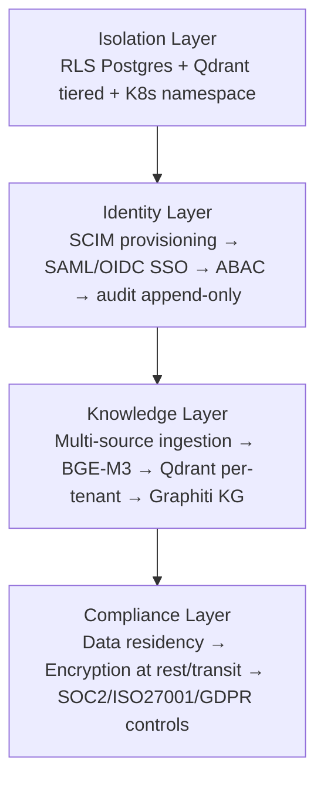

# Modulo Enterprise

> Open-Jarvis Enterprise è **lo stesso codice AGPL-3.0 dell'edizione personale**, configurato diversamente. Nessuna feature gating, nessun "paid tier" del software. Sempre **gratis e self-hostable** — vedi [License rationale](../legal/license-rationale.md).

## 🎯 Quando serve l'edizione enterprise

| Indicatore | Personal | Enterprise |
|---|---|---|
| Numero utenti | 1-20 | 20+ |
| Compliance richiesta | GDPR base | SOC2, ISO 27001, HIPAA, PCI |
| Identity Provider | OIDC base | SAML enterprise + SCIM |
| Isolamento dati | Single tenant | Multi-tenant strict |
| Audit log | Light | 7+ anni retention |
| Air-gapped | No | Sì |
| Hardware | VPS singolo | Cluster K8s HA |

## 1. Multi-tenancy strict

Tre paradigmi di isolamento, scelta in base a scala e compliance:

| Modello | Scala | Sicurezza | Costo |
|---|---|---|---|
| **Silo** (DB-per-tenant) | Banche, sanità, difesa | Massima | Alto |
| **Pool** (RLS Postgres) | < 100 dipendenti | Buona se RLS corretto | Basso |
| **Bridge** (ibrido tiered) | Promozione SMB → enterprise | Adattiva | Variabile |

**Raccomandazione Jarvis:**

| Segmento | Modello DB | Vector Store |
|---|---|---|
| < 100 dipendenti | RLS pool | Qdrant payload-filter |
| 100–1.000 | Schema-per-tenant | Qdrant named shard |
| > 1.000 | Database-per-tenant | Qdrant cluster dedicato |

```python
# Set tenant context con session variable Postgres
def set_tenant_context(conn, tenant_id: str) -> None:
    """Le policy RLS filtrano automaticamente le query successive."""
    with conn.cursor() as cur:
        cur.execute(
            "SELECT set_config('app.current_tenant', %s, TRUE)",
            (tenant_id,)
        )
```

```sql
-- Policy RLS in migrazione
ALTER TABLE documents ENABLE ROW LEVEL SECURITY;
CREATE POLICY tenant_isolation ON documents
    USING (tenant_id = current_setting('app.current_tenant')::uuid);
```

**Qdrant 1.16 (apr 2026)** introduce "Tiered Multitenancy": tenant SMB in pool condiviso, promozione automatica a shard dedicato sopra 20K vettori.

## 2. Air-gapped deployment

Banche, difesa, sanità senza connettività internet (SCIFs, reti classificate, banking isolati).

**Stack air-gapped:**

| Componente | Tool | Note |
|---|---|---|
| Inference | **vLLM** self-hosted | Llama 3.3 70B, Mistral Large, Qwen 2.5 72B |
| Embedding | **BGE-M3** locale | Self-hosted, multilingue |
| Vector store | **Qdrant** cluster | On-prem |
| Database | **CloudNativePG** | K8s nativo |
| Identity | **Keycloak** | SAML/OIDC senza dipendenze cloud |

DoD USA (2026) richiede deploy modelli più recenti entro 30 giorni dal rilascio pubblico — l'ecosistema air-gapped è maturo.

## 3. Bring Your Own LLM

```python
from abc import ABC, abstractmethod
from dataclasses import dataclass


@dataclass(frozen=True)
class LLMConfig:
    provider: str          # azure_openai | aws_bedrock | gcp_vertex | ollama
    model_id: str
    endpoint: str
    api_key_env_var: str
    max_tokens: int = 4096


class LLMProvider(ABC):
    @abstractmethod
    async def complete(self, prompt: str, config: LLMConfig) -> str: ...


class AzureOpenAIProvider(LLMProvider):
    async def complete(self, prompt, config):
        # Azure OpenAI on Your Data: dati nel tenant Azure
        ...


class AWSBedrockProvider(LLMProvider):
    async def complete(self, prompt, config):
        # AWS Bedrock include GPT-4.1 da apr 2026 (fine esclusiva Microsoft)
        ...
```

## 4. RAG su corpus aziendale

### Ingestion multi-sorgente

```yaml
# jarvis/config/ingestion_sources.yaml
tenant_id: "acme-corp"
sources:
  - type: sharepoint
    site_url: "https://acme.sharepoint.com/sites/knowledge"
    library: "Documenti"
    incremental: true
    schedule: "0 2 * * *"

  - type: confluence
    base_url: "https://acme.atlassian.net/wiki"
    spaces: ["ENG", "PRODUCT", "HR"]
    schedule: "0 3 * * *"

  - type: slack_export
    export_path: "/mnt/nas/slack-exports/"
    channels: ["general", "engineering"]

embedding:
  model: "BAAI/bge-m3"     # self-hosted, mai cloud
  backend: "vllm"
  endpoint: "http://embedding-svc:8000"

vector_store:
  provider: "qdrant"
  collection: "acme-corp-knowledge"
  shard_strategy: "tiered"
  host: "qdrant-svc.jarvis-enterprise.svc.cluster.local"
```

LlamaIndex 0.12+ supporta 100+ connector enterprise: SharePoint, Confluence, Notion, Slack, Microsoft 365, Box, NetApp.

### Data governance

Chunk nel vector store portano metadati di governance:

- `visibility_scope` (org-wide / department / personal)
- `owner_department`
- `classification_level` (public / internal / confidential / restricted)

Il retriever filtra **prima** che l'LLM veda il testo.

### Knowledge graph aziendale

**Graphiti** (libreria Zep open) costruisce knowledge graph temporali per relazioni org → team → progetti → documenti, con aggiornamento incrementale.

## 5. RBAC + ABAC + SCIM

### Gerarchia

```text
Organisation
└── Department (Eng, Finance, HR, Legal)
    └── Team (Backend, Frontend, DevOps)
        └── Member
            ├── Role: owner | admin | contributor | viewer
            └── Attributes: clearance_level, data_region, mfa_verified
```

ABAC valuta attributi contestuali: `mfa_verified=false` → no accesso a `classification_level=confidential` anche se il role lo permetterebbe.

### SCIM 2.0 endpoint

```python
from fastapi import APIRouter, Depends
from pydantic import BaseModel, Field

router = APIRouter(prefix="/scim/v2", tags=["scim"])


class ScimUser(BaseModel):
    schemas: list[str] = ["urn:ietf:params:scim:schemas:core:2.0:User"]
    user_name: str = Field(alias="userName")
    active: bool = True
    display_name: str = Field(alias="displayName", default="")
    emails: list[dict] = []
    groups: list[dict] = []  # popolato dall'IdP


@router.post("/Users", status_code=201)
async def provision_user(payload: ScimUser, tenant_id=Depends(get_tenant)):
    """JIT provisioning: crea utente al primo accesso SSO."""
    new_user = create_user_from_scim(tenant_id, payload)
    await audit_log.append(ScimProvisioningEvent(
        operation="CREATE", tenant_id=tenant_id, user_id=new_user.id,
        idp_source=extract_idp_source(payload),
        changed_attributes=payload.model_dump(by_alias=True),
        actor="scim_provisioner",
    ))
    return scim_response(new_user)
```

### Audit append-only

```sql
CREATE TABLE audit_events (
    event_id    UUID        PRIMARY KEY DEFAULT gen_random_uuid(),
    tenant_id   UUID        NOT NULL,
    timestamp   TIMESTAMPTZ NOT NULL DEFAULT now(),
    actor_id    UUID,
    actor_type  TEXT        NOT NULL,
    action      TEXT        NOT NULL,
    resource_id TEXT,
    outcome     TEXT        NOT NULL CHECK (outcome IN ('success','failure','denied')),
    metadata    JSONB       NOT NULL DEFAULT '{}'
) PARTITION BY RANGE (timestamp);

REVOKE DELETE, UPDATE ON audit_events FROM jarvis_app;
```

Retention minima: **7 anni** (SOC 2), 10 per finance.

## 6. Compliance & certifications

| Framework | Applicabilità |
|---|---|
| **SOC 2 Type II** | Cliente enterprise US — 64+ controlli, audit annuale |
| **ISO 27001/27017/27018** | EU + internazionale |
| **ISO 42001** | AI governance specifica (2023, richiesta da grandi enterprise nel 2026) |
| **GDPR + DPA** | Cittadini UE, DPA con ogni tenant |
| **HIPAA** | Healthcare USA |
| **PCI DSS 4.0.1** | Fintech (51 requisiti future-dated obbligatori da mar 2025) |
| **FedRAMP** | US Government, FedRAMP 20x pilota 2026 |

### Schrems II / Data Privacy Framework

Data residency **EU resta in EU**. SCC come fallback. On-prem elimina il problema alla radice.

## 7. Identity providers enterprise

| Provider | Protocolli | Note |
|---|---|---|
| **Microsoft Entra ID** | SAML, OIDC, SCIM 2.0 | Più diffuso EU/US, Conditional Access |
| **Okta** | SAML, OIDC, SCIM 2.0 | Standard startup/mid-market |
| **Google Workspace** | OIDC, SAML | Google-native |
| **JumpCloud** | SAML, LDAP, SCIM | PMI |
| **Keycloak** | SAML, OIDC, SCIM | Self-hosted air-gapped |

## 8. Topologie deployment

| Topologia | Scala | Stack |
|---|---|---|
| Single-instance per tenant | < 100 | Docker Compose 2 repliche |
| Multi-tenant SaaS shared | 100-1000 | Kubernetes + RLS Postgres + Qdrant tiered |
| Multi-region active-active | > 1000 | CloudNativePG cross-region + Tailscale mesh |
| Hybrid on-prem + cloud | regulated | Tenant data on-prem, AI compute private cloud |

```yaml
# K8s overlay per single-tenant small
apiVersion: kustomize.config.k8s.io/v1beta1
kind: Kustomization
bases:
  - ../../base
patches:
  - target:
      kind: Deployment
      name: jarvis-api
    patch: |
      - op: replace
        path: /spec/replicas
        value: 2
  - target:
      kind: CloudNativePG/Cluster
      name: jarvis-db
    patch: |
      - op: replace
        path: /spec/instances
        value: 2

---
# HPA scaling
apiVersion: autoscaling/v2
kind: HorizontalPodAutoscaler
metadata:
  name: jarvis-api-hpa
spec:
  scaleTargetRef:
    apiVersion: apps/v1
    kind: Deployment
    name: jarvis-api
  minReplicas: 2
  maxReplicas: 20
  metrics:
    - type: Resource
      resource:
        name: cpu
        target: { type: Utilization, averageUtilization: 65 }
    - type: Pods
      pods:
        metric: { name: llm_requests_per_second }
        target: { type: AverageValue, averageValue: "10" }
```

## 9. HA scaling stack

| Componente | Tool |
|---|---|
| **Database HA** | CloudNativePG (KubeCon 2026 standard data sovereignty) |
| **Cache** | Redis Cluster (3 master + 3 replica, OpenTelemetry SDK) |
| **Vector store** | Qdrant cluster mode (3 nodi, replication 2) |
| **Tracing** | OpenTelemetry + Jaeger v2 (KubeCon 2026) |
| **Metriche** | Prometheus + Grafana |
| **Logs** | Loki + Promtail |

Soglia di promozione 20K vettori per shard dedicato (Qdrant 1.16) mantiene performance.

## 10. Pricing model open source-friendly

> Open-Jarvis è **AGPL-3.0**: sempre gratis, sempre open. Nessuna "Enterprise Edition" proprietaria.

### Modelli di sostenibilità

| Revenue stream | Esempi di riferimento |
|---|---|
| **Managed hosting** opzionale (jarvis.cloud futuro) | Mastodon hosting, Plausible Cloud |
| **Paid support tier** | Nextcloud Enterprise: SLA, hotfix prioritari, consulenza compliance |
| **Compliance bundles** | Documentazione pre-compilata SOC 2 / ISO 27001 |
| **Consulenza & integrazione** | Implementazioni custom |
| **GitHub Sponsors / Open Collective** | Donazioni community |
| **Workshops & corsi** | Formazione e certificazioni |

### Caso study di progetti AGPL enterprise sani

| Progetto | Modello | Lezione |
|---|---|---|
| **Nextcloud** | Subscription enterprise (support + extra) | Self-host completo gratis, paghi supporto |
| **Mastodon** | Donations + managed hosting | Sociale federato sostenibile senza tier |
| **Plausible** | Managed SaaS opzionale | AGPL evita competitor che fork senza dare back |
| **Bitwarden** | Enterprise plan (SSO+SCIM advanced) | Self-host gratuito, premium su support |
| **MinIO** | Cautionary tale | Transizione troppo aggressiva ha alienato community |

> **Regola Jarvis**: nessuna feature è dietro paywall del software. Tutto il codice è AGPL. Si paga eventualmente per **servizio**, mai per il codice stesso.

## 11. Architettura a 4 layer



Stratificazione che permette **stessa codebase** dal singolo utente VPS 10€/mese ai 10.000 dipendenti air-gapped.

## Riferimenti

- [Multi-Tenant RAG 2026](https://www.maviklabs.com/blog/multi-tenant-rag-2026)
- [Qdrant Tiered Multitenancy](https://qdrant.tech/blog/qdrant-1.16.x/)
- [CloudNativePG](https://cloudnative-pg.io/)
- [Graphiti (Zep)](https://github.com/getzep/graphiti)
- [Air-Gapped AI 2026](https://blog.premai.io/air-gapped-ai-solutions-7-platforms-for-disconnected-enterprise-deployment-2026/)
- [OpenAI cloud exclusivity end](https://windowsnews.ai/article/openai-breaks-cloud-exclusivity-microsoft-and-aws-reshape-enterprise-ai-leverage.415898)
- [SCIM provisioning Microsoft](https://learn.microsoft.com/en-us/entra/identity/app-provisioning/use-scim-to-provision-users-and-groups)
- [SOC 2 changes 2026](https://www.konfirmity.com/blog/soc-2-what-changed-in-2026)
- [Comp AI compliance](https://www.helpnetsecurity.com/2026/04/07/comp-ai-open-source-compliance-platform/)
