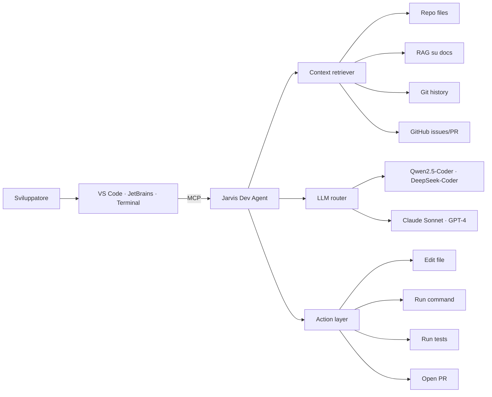

# Funzionalità per sviluppatori

Se sei uno sviluppatore, Jarvis diventa il tuo **AI engineering hub**: coding assistant cross-IDE, code review, automazione repository, integrazione GitHub.

## Cosa puoi fare

- 💻 **Coding assistant** integrato in VS Code, JetBrains, terminale
- 🔍 **Code review** con Jarvis come "second pair of eyes"
- 🧪 **Generazione test** automatica con TDD-first methodology
- 🚀 **CI/CD trigger** vocale ("Hey Jarvis, deploy staging")
- 📋 **PR automation** (changelog, descrizione, link a issue)
- 🐛 **Bug investigation** con grep semantico nel codebase
- 📦 **Dependency review** e security audit

## Stack: coding assistant open source

| Tool | Licenza | Architettura | Editor | MCP |
|---|---|---|---|---|
| **Cline** | Apache 2.0 | VS Code extension agentico | VS Code | Nativo |
| **Continue.dev** | Apache 2.0 | Plugin autocomplete + chat | VS Code, JetBrains | ✅ |
| **Aider** | Apache 2.0 | CLI Git-aware diff | Terminal | Parziale |
| **OpenHands** | MIT | Browser UI + Docker, agentico | Web | ✅ |
| **Goose** (Block) | Apache 2.0 | CLI + desktop app | Terminal/Desktop | ✅ |
| **OpenInterpreter** | MIT | CLI REPL | Terminal | Parziale |
| **Claude Code** | Proprietario | CLI agentico | Terminal | Nativo |

> **Raccomandazione:** Cline (VS Code) + Aider (terminale Git) come stack principale. Goose come fallback per task con esecuzione comandi sistema.

## Architettura del Developer Agent



## Configurazione

```env
# Coding model — locale via Ollama
JARVIS_MODEL_CODE=ollama/qwen2.5-coder:14b

# Cloud fallback per task complessi
ANTHROPIC_API_KEY=sk-ant-...
JARVIS_MODEL_CODE_CLOUD=anthropic/claude-sonnet-4-6

# GitHub integration
GITHUB_PAT=ghp_...
GITHUB_DEFAULT_REPO=fedcal/open-jarvis
```

## MCP server custom

Jarvis espone un proprio **MCP server** (`server/orchestration/mcp_server.py`) che fornisce a Cline, Continue, Goose, Claude Code i tool:

- `repo.search(query)` — ricerca semantica nel codebase
- `repo.diff()` — diff corrente
- `tests.run(suite)` — esegue test specifici
- `gh.create_pr(branch, title, body)` — apre PR
- `gh.list_issues(state)` — issue del repo
- `memory.recall(query)` — richiamo memoria personale
- `docs.lookup(library, topic)` — lookup tramite Context7

Configurazione in `.cline/mcp_settings.json` (esempio):

```json
{
  "mcpServers": {
    "jarvis": {
      "url": "http://localhost:8080/mcp",
      "headers": { "Authorization": "Bearer ${JARVIS_TOKEN}" }
    }
  }
}
```

## Esempi d'uso

### Code review da chat

```
Tu: Dai un'occhiata alla PR #42 e dimmi se vedi problemi
Jarvis: Ho letto i 7 file modificati. Tre rilievi:
        1. validate_input in utils.py manca un null check (line 23)
        2. La nuova migration crea un indice senza CONCURRENTLY
        3. Il test integration test_user_create non isola il DB
        Vuoi che apra commenti sulla PR?
```

### Generazione test TDD

```
Tu: Crea test per la funzione calculate_tax in tax_utils.py
Jarvis: Ho generato 6 test:
        - happy path
        - tasso zero
        - tasso negativo (deve sollevare ValueError)
        - importo zero
        - importo negativo
        - precisione decimale (snapshot)
        Salvati in tests/test_tax_utils.py. Eseguo?
```

### Bug investigation

```
Tu: Da ieri il deploy fallisce con "connection refused" verso Redis
Jarvis: Ho controllato:
        - git log ultime 24h: 3 commit, nessuno tocca Redis
        - docker compose ps: il container redis è 'unhealthy'
        - log redis: "MISCONF Redis is configured to save RDB snapshots..."
        Causa: disco pieno. Liberare spazio o aumentare il volume.
```

### Daily standup

```
Tu: Cosa ho fatto ieri sul progetto X?
Jarvis: 4 commit, 2 PR mergiate, 1 issue chiusa.
        - feat(memory): aggiunta TTL su short-term cache
        - fix(auth): handle OAuth refresh race condition
        - PR #84: voice-agent wake word retraining
        - Issue #91 chiusa con confirmazione utente
```

## Workflow consigliato

```
1. Apri VS Code con Cline configurato
2. Apri terminale parallelo con Aider per sessioni Git-focused
3. Jarvis Dev Agent in background per:
   - Daily standup automatico
   - Memoria persistente cross-IDE
   - Notifiche su CI failures
   - Memorizzazione decisioni architetturali
```

## Privacy del codice

- ✅ **100% locale**: usa Ollama + Qwen2.5-Coder. Nessun byte di codice esce
- ⚠️ **Hybrid**: cloud LLM solo per task selezionati (review architetturale, generazione design doc)
- ❌ **Mai** caricare codice di repo aziendali su LLM cloud senza autorizzazione esplicita

## Roadmap

| Fase | Funzionalità |
|---|---|
| 3.X | MCP server con tool repo.search, gh.* |
| 3.X | Bridge Cline + Continue + Aider verso Jarvis memory |
| 3.X | Daily dev standup automatico |
| 3.X | CI failure notification routing |
| 3.X | PR description generator |
| 3.X | Architectural decision records (ADR) auto-tagging |
