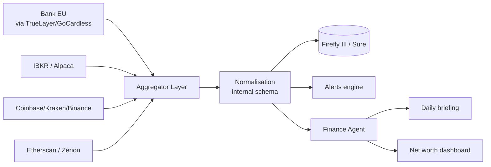

# Finanza

Jarvis ti dà una **vista unificata del tuo patrimonio**: conti correnti, investimenti, crypto, abbonamenti — tutto in un'unica dashboard privata, self-hosted, senza vendere i tuoi dati.

## Cosa puoi fare

- 💼 **Net worth dashboard** con tutti gli asset (cash, equity, crypto, immobili)
- 📈 **Tracking portafoglio investimenti** (azioni, ETF, fondi, crypto)
- 💳 **Analisi spese** automatica per categoria
- 🔔 **Alert** su movimenti significativi, scadenze, obiettivi
- 📊 **Briefing finanziario** giornaliero o settimanale
- 💸 **Tracker abbonamenti** ricorrenti

## Stack consigliato — priorità Europa/Italia

### Conto corrente (PSD2 AISP)

| Provider | Note | Prezzo |
|---|---|---|
| **TrueLayer** | Italia + 7 paesi EU, sandbox gratuita | Pricing su misura per live |
| **GoCardless Bank Account Data** (ex-Nordigen) | 31 paesi EEA, 2.300+ banche | Free tier chiuso a nuove registrazioni nel 2025; chi ha accesso lo mantiene |
| **Tink** (Visa) | 6.000+ banche, copertura migliore in EU | Solo enterprise |

> **Per indie developer in Italia:** `TrueLayer` con sandbox per sviluppo, valutazione contratto live solo se necessario.

### Investimenti

| Broker | API | Free | Copertura |
|---|---|---|---|
| **Interactive Brokers** | TWS API + Client Portal API | ✅ per clienti IBKR | Globale, inclusa Italia |
| **Alpaca** | REST nativa | ✅ paper + live | Solo US equities/options |
| **Tradier** | REST | ⚠️ piano live ~50 USD/mese | Solo US |

> **Broker italiani (Fineco, Directa, Banca Sella):** nessuna API ufficiale pubblica nel 2026. Unica via legale: lettura del conto via PSD2 AISP (TrueLayer).

### Crypto

| Tool | Tipo | Use case |
|---|---|---|
| **Coinbase / Kraken / Binance API** | Read-only API key | Saldi e storico exchange |
| **Etherscan API** | REST | Storico Ethereum + EVM chains |
| **Zerion API** | Cross-chain | Portfolio aggregato (DeFi, token, NFT) |
| **DeBank** | API | DeFi positions (lending, staking, farming) |
| **Bitcoin Core / Geth RPC** | Self-hosted node | Massima sovranità |

### Tracker open source self-hosted

| Tracker | Stack | API | Adatto a |
|---|---|---|---|
| **Firefly III** | PHP + Laravel | REST completa | Power users con import CSV/OFX |
| **Maybe / Sure** | Rails + Postgres | OpenAI integrata, multi-currency | "AI-ready financial OS" |
| **Beancount** | Plain text + Python | Python API | Plain-text accounting purists |
| **Wallos** | PHP | – | Solo subscription tracking |
| **Actual Budget** | JS + Electron | Limitata | Envelope budgeting (zero-based) |

## Architettura finance di Jarvis



## Configurazione

```env
# PSD2 EU
TRUELAYER_CLIENT_ID=...
TRUELAYER_CLIENT_SECRET=...

# Broker
IBKR_GATEWAY_URL=https://localhost:5000/v1/api
ALPACA_API_KEY=...
ALPACA_API_SECRET=...

# Exchange crypto (read-only)
COINBASE_API_KEY=...
KRAKEN_API_KEY=...
BINANCE_API_KEY=...

# Cross-chain
ZERION_API_KEY=...
ETHERSCAN_API_KEY=...

# Tracker self-hosted
FIREFLY_URL=http://firefly:8080
FIREFLY_API_TOKEN=...
```

## Esempi d'uso

### Briefing finanziario quotidiano

> *"Hey Jarvis, come stanno andando i mercati e il mio portafoglio?"*

```
Jarvis: Net worth: 142.350 € (+0.8% oggi)
        Equity: -1.2% (BTP italiani in calo)
        Crypto: +3.4% (BTC sopra 95K)
        Cash flow mese: +1.250 €
        Alert: bolletta luce €234 in scadenza il 5
```

### Analisi spese

> *"Quanto ho speso per ristoranti questo mese?"*
> *"Ho una spesa anomala? Compara con i 3 mesi precedenti"*

### Alerting

```yaml
finance:
  alerts:
    - name: "Spesa anomala"
      condition: "monthly_category_delta > 30%"
      action: notify
    - name: "Net worth -5%"
      condition: "net_worth_change_24h < -5%"
      action: notify_emergency
    - name: "Subscription doppia"
      condition: "duplicate_subscription_detected"
      action: notify
```

## Privacy & sicurezza

I dati finanziari sono **estremamente sensibili**:

- 🔐 Vault separato cifrato con `age` o HashiCorp Vault
- 🚫 Nessun saldo in chiaro nei log
- 🪪 Token PSD2 a scadenza 90 giorni con re-consent automatico
- 🗝️ API key broker/exchange con scope **read-only**
- 📜 Mai inviare dati finanziari a LLM cloud senza esplicita opt-in per task

## Disclaimer

> Jarvis non è un consulente finanziario abilitato. Le informazioni e analisi sono **a scopo personale** e non costituiscono consulenza in materia di investimenti.

## Roadmap

| Fase | Funzionalità |
|---|---|
| 6.1 | TrueLayer / GoCardless integration |
| 6.2 | Firefly III bridge bidirezionale |
| 6.3 | Coinbase + Kraken + Etherscan |
| 6.4 | Zerion cross-chain portfolio |
| 6.5 | IBKR portfolio + P&L |
| 6.6 | Alerting engine con regole custom |
| 6.7 | Daily/weekly briefing automatico |
| 6.8 | Subscription tracker (Wallos integration) |
