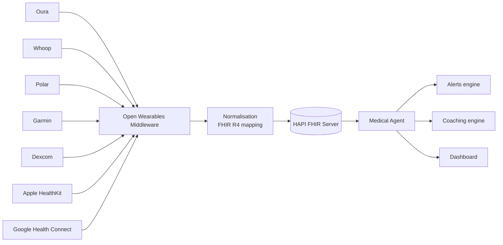

# Salute

Jarvis aggrega dati biometrici e medici da **tutti i tuoi wearable** in un'unica vista privata, FHIR-compatibile, con insight longitudinali e alerting personalizzato.

## Cosa puoi fare

- 📊 **Dashboard unificato** di sleep, HRV, recovery, attività, peso, ECG, glucosio
- 🏃 **Coaching automatico** su training, sleep, recovery basato sui tuoi pattern
- 🔔 **Alert biometrici** su soglie personalizzate (HR a riposo elevato, HRV in calo, ecc.)
- 📈 **Insight longitudinali**: come cambia il tuo recovery con caffè/alcol/viaggi?
- 🩺 **Health vault FHIR** condivisibile con il medico (export standard HL7)

## Wearable e dispositivi medicali supportati

| Provider | Dati esposti | Auth | Free |
|---|---|---|---|
| **Oura Ring v2** | sleep, HRV, readiness, SpO2 | OAuth 2.0 | ✅ |
| **Whoop v2** | strain, recovery, sleep, HR, HRV | OAuth 2.0 + webhook | ✅ |
| **Polar AccessLink** | training, HR, sleep | OAuth 2.0 | ✅ |
| **Garmin Health API** | HRV, VO2max, stress, sleep | OAuth 1.0a | ✅ con approvazione (~2 giorni) |
| **Withings** | peso, HR, ECG, PA, sleep | OAuth 2.0 | ✅ |
| **Fitbit / Google Health API** | activity, HR, sleep | Google OAuth 2.0 | ✅ — migrazione settembre 2026 |
| **Dexcom CGM** | glucosio in real-time | OAuth 2.0 | ✅ Limited Access (max 5 utenti) |
| **Apple HealthKit** | tutti i tipi HealthKit | on-device only | ✅ |
| **Google Health Connect** | aggregatore Android | locale | ✅ |

## Aggregatori open source

- **[Open Wearables](https://openwearables.io/)** — middleware unificato per Apple, Garmin, Polar, Suunto, Whoop, Oura
- **Wearipedia** (Stanford) — wrapper di ricerca per decine di device

## Standard di interoperabilità

| Standard | Uso | Implementazione |
|---|---|---|
| **HL7 FHIR R4 / R5** | Storage clinico-grade | **HAPI FHIR** server (Java, open source) |
| **SMART on FHIR** | OAuth per app sanitarie | SMART Health IT toolkit |
| **Open mHealth** | Schema JSON device-agnostic | Schema pubblici |

## Architettura health di Jarvis



## Configurazione

```env
# Oura
OURA_CLIENT_ID=...
OURA_CLIENT_SECRET=...

# Whoop
WHOOP_CLIENT_ID=...
WHOOP_CLIENT_SECRET=...

# FHIR vault
FHIR_SERVER_URL=http://hapi-fhir:8081/fhir
FHIR_AUTH_TOKEN=...
```

Pairing dei device dall'UI:

1. **Impostazioni → Salute → Connetti dispositivo**
2. Scegli il provider
3. Autorizza tramite OAuth nella pagina del provider
4. I dati iniziano a sincronizzarsi automaticamente (polling + webhook)

## Esempi d'uso

### Briefing di salute mattutino

> *"Hey Jarvis, come ho dormito stanotte?"*

```
Jarvis: Hai dormito 7h 22m, ma con HRV in calo del 18% rispetto alla baseline.
        Recovery score Whoop: 42% (zona gialla).
        Suggerimento: oggi allenamento leggero, niente caffè dopo le 14.
```

### Alerting

```yaml
# config/jarvis.yaml
health:
  alerts:
    - name: "HRV in calo"
      condition: "hrv_baseline_delta < -20%"
      window: 3d
      action: notify_mobile
    - name: "Glucosio fuori range"
      condition: "glucose > 180 or glucose < 70"
      window: 1h
      action: notify_watch_emergency
```

### Coaching

L'agente `medical-agent` correla automaticamente sleep, training, alimentazione (se logghi cibi), stress (HRV) e suggerisce aggiustamenti settimanali.

## Privacy & sicurezza

⚠️ I dati sanitari sono **dati particolari** ai sensi del GDPR. Jarvis adotta:

- 🔐 Cifratura at-rest per la collection FHIR
- 🪪 Token OAuth conservati in secret vault, mai loggati
- 🚫 Nessun dato sanitario inviato a LLM cloud senza consenso esplicito per quel singolo task
- 📜 Log audit di ogni accesso ai dati sanitari
- 🗑️ Diritto all'oblio: cancellazione completa via UI o `jarvis health purge`

## Disclaimer medico

> Jarvis **non è un dispositivo medico** e non sostituisce il parere di un professionista sanitario. Le suggerenze sono di tipo informativo e wellness. In caso di sintomi rivolgiti sempre a un medico.

## Roadmap

| Fase | Funzionalità |
|---|---|
| 4.1 | Connettori Oura, Whoop, Polar |
| 4.2 | HAPI FHIR vault + export PDF condivisibile |
| 4.3 | Garmin, Withings, Fitbit |
| 4.4 | Dexcom CGM real-time + alerting glucosio |
| 4.5 | Coaching engine con LLM (sleep/training/recovery) |
| 4.6 | Health Connect Android + HealthKit iOS pull |
| 4.7 | Genomica e dati clinici (con consenso dedicato) |
