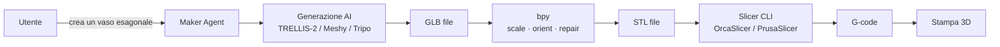

# Maker · Blender e stampa 3D

Se sei un maker, Jarvis si collega a **Blender** per generare e modificare modelli 3D, e a **stampanti 3D** (Klipper/Moonraker, OctoPrint, Bambu, Prusa) per controllare le tue stampe da chat o voce.

## Cosa puoi fare

- 🎨 **Generazione 3D AI**: text-to-3D, image-to-3D direttamente da chat
- 📐 **Editing Blender** in linguaggio naturale ("scala il modello al 60%", "esporta in STL")
- 🖨️ **Avvio stampa** vocale: "Hey Jarvis, stampa quel modello con PLA"
- 📊 **Monitoraggio stampe** in tempo reale (temperatura, layer, ETA)
- 🚨 **Alert** automatici (failure detection, fine stampa, errori)
- 🛠️ **Slicing automatico** con preset personalizzati
- 📚 **Gestione libreria** modelli con tagging AI

## Blender automation

### Stack

- **`bpy` su PyPI** — installabile via `pip install bpy==4.3.0`, permette di usare Blender come libreria Python in pipeline esterne (server-side, headless)
- **fake-bpy-module** — autocompletamento IDE senza Blender installato
- Approccio moderno: addon come package Python standard, testabili fuori da Blender

### Generazione 3D AI in Blender

| Tool | Tipo | Note |
|---|---|---|
| **Meshy for Blender** | Addon ufficiale | DCC Bridge locale, cleanup tools per stampa 3D |
| **Tripo 3D for Blender** | Addon ufficiale (VAST-AI) | Text/Image/Multiview-to-Model |
| **TripoSR Blender Add-on** | Open source | Cloud + locale |
| **Blender AI Library Pro** | Connettore multi-AI | InstantMesh, SD, TripoSR, Shap-E |
| **BlenderGPT** | NLP → bpy commands | Linguaggio naturale → istruzioni `bpy` |

### Workflow tipico Jarvis



### Generazione 3D AI

| Modello | Open source | Quality |
|---|---|---|
| **TRELLIS-2** (Microsoft) | ✅ MIT | Massima — CVPR 2025 Spotlight, 4B parameters |
| **Spar3D** (Stability AI) | ✅ | GLB nativo, point cloud conditioning |
| **TripoSR** | ✅ | Veloce, prototipazione rapida |
| Meshy | ❌ | API REST, cloud |
| LumaAI Genie | ❌ | API |

> **Raccomandazione:** TRELLIS-2 self-hosted per qualità + Meshy come fallback cloud.

## Stampa 3D — stack

### Klipper + Moonraker

Lo stack moderno e flessibile. **Moonraker** espone le API di Klipper su REST/WebSocket porta 7125:

| Endpoint | Funzione |
|---|---|
| `POST /printer/print/start` | Avvia stampa da file |
| `POST /printer/print/pause` | Pausa |
| `POST /printer/print/resume` | Resume |
| `POST /printer/print/cancel` | Annulla |
| `GET /printer/objects/query` | Stato completo (temp, posizione, layer) |
| WebSocket `klippy_connection` | Updates real-time |

UI consigliate: **Mainsail** o **Fluidd** (consumano solo Moonraker). **KIAUH** per installazione.

### OctoPrint

Maturo per Marlin. Plugin: failure detection, timelapse, **OctoEverywhere** per AI failure detection via computer vision.

### Bambu Lab

I printer X/P series comunicano via **MQTT locale** (porta 8883, TLS) e FTP per i file.

### PrusaLink / Prusa Connect

API REST documentate via OpenAPI spec. PrusaLink locale, Prusa Connect cloud per remote.

### Slicer CLI (open source)

- **PrusaSlicer** — `prusa-slicer-console.exe --export-gcode model.stl`
- **OrcaSlicer** — fork orientato multi-printer
- **Cura** — CLI integrata

### MCP unificato per stampanti

**`mcp-3D-printer-server`** (DMontgomery40) unifica OctoPrint, Moonraker, Bambu Lab, Duet, Prusa, Creality in un'unica interfaccia MCP. Jarvis può usarlo per controllare stampanti eterogenee.

## Configurazione

```env
# Klipper / Moonraker
MOONRAKER_URL=http://moonraker.local:7125
MOONRAKER_API_KEY=...

# OctoPrint
OCTOPRINT_URL=http://octopi.local
OCTOPRINT_API_KEY=...

# Bambu Lab
BAMBU_LOCAL_IP=192.168.1.50
BAMBU_ACCESS_CODE=...
BAMBU_SERIAL=...

# Prusa
PRUSALINK_URL=http://prusa.local
PRUSALINK_API_KEY=...

# Slicer
SLICER_BIN=/usr/local/bin/prusa-slicer-console
SLICER_CONFIG=/data/slicer/profiles/pla-0.2-std.ini

# Blender bpy
BLENDER_BPY_VERSION=4.3.0
```

## Esempi d'uso

### Generazione e stampa da chat

> *"Crea un porta-penne esagonale alto 12 cm, arrotonda gli spigoli e stampalo in PLA bianco"*

```
Jarvis: Generato modello con TRELLIS-2 (anteprima: [link])
        Importato in Blender → arrotondamento spigoli (radius 2mm)
        Esportato STL: 84 KB, 12.3 cm di altezza
        Slicing con preset PLA-0.2-standard: 1h 47m, 18g filamento
        Stampante MK4S libera, avvio stampa? [Sì/No]

Tu: Sì
Jarvis: Stampa avviata. ETA: 19:32. Ti notifico a fine stampa.
```

### Monitoraggio

> *"A che punto è la stampa?"*

```
Jarvis: Layer 145/388 (37%), 35°C bed, 215°C hotend, 42min trascorsi.
        ETA: 19:32. Nessun problema rilevato.
```

### Failure detection

```yaml
maker:
  alerts:
    - name: "Stampa fallita"
      source: "octoeverywhere.failure_detected"
      action: pause_and_notify
    - name: "Hotend eccessivo"
      condition: "hotend_temp > target + 15"
      action: pause_emergency
```

### Libreria modelli

> *"Mostrami i modelli stampati il mese scorso"*

L'agente legge i file dell'OctoPrint History o filesystem, applica AI tagging (auto-categorizzazione: vaso, supporto, gear, ...) e ti mostra una galleria.

## Privacy

- ✅ Generazione 3D 100% locale con TRELLIS-2
- ✅ Slicer e stampa 100% locali
- ❌ Meshy/Tripo cloud: il prompt e l'eventuale immagine vanno al provider

## Roadmap

| Fase | Funzionalità |
|---|---|
| 8.1 | Bridge Moonraker (start/stop/status) |
| 8.2 | OctoPrint integration |
| 8.3 | Bambu MQTT bridge |
| 8.4 | bpy headless: scale/repair/export STL |
| 8.5 | TRELLIS-2 self-hosted (text/image-to-3D) |
| 8.6 | Slicer automation con preset salvati |
| 8.7 | Failure detection via computer vision |
| 8.8 | Libreria modelli con AI tagging |
