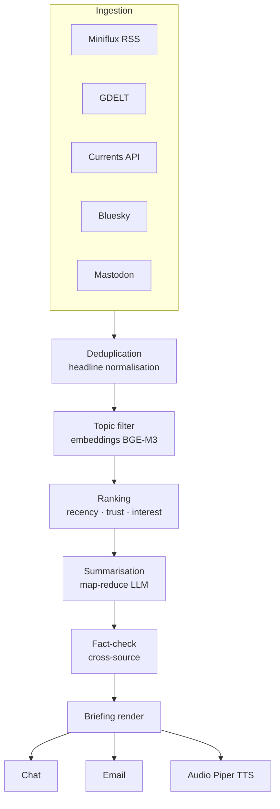

# News & briefing quotidiano

Jarvis costruisce per te un **briefing personalizzato** delle notizie del giorno, deduplicato, riassunto da AI, consegnato via chat / email / TTS audio.

## Cosa puoi fare

- 📰 **Daily briefing** generato AI con le top story rilevanti per te
- 🎯 **Filtri per topic** (tech, crypto, finanza, salute, città, hobby)
- 🔄 **Deduplicazione** tra fonti diverse sullo stesso evento
- 🌍 **Multilingue**: leggi in IT, ti faccio un riassunto in IT anche se la fonte è in EN
- 🎙️ **Audio briefing** via TTS per ascolto in auto / corsa
- ✅ **Citazione delle fonti** sempre presente

## Stack consigliato

### Lettori RSS self-hosted

| Tool | Stack | API |
|---|---|---|
| **Miniflux** | Go + Postgres | REST + Fever + Google Reader |
| **FreshRSS** | PHP | Estensioni community |
| **NewsBlur** | Python | API completa |
| **ttrss** | PHP | Mature, RPC-style |

> Raccomandato: **Miniflux** — singolo binario, leggero, API REST pulita, perfetto come backend per Jarvis.

### News API commerciali

| API | Free tier | Use case |
|---|---|---|
| **GDELT** | ✅ illimitato, no auth | Big data globale, 65 lingue, sentiment |
| **Currents API** | ✅ 1.000 req/giorno | Bootstrap rapido |
| **NewsAPI.ai** | ✅ 2.000 ricerche/mese | Semantic search ultimi 30 giorni |
| **MediaStack** | ❌ ~50 USD/mese | Volume produzione |

### Reti decentralizzate

- **Bluesky** (AT Protocol) — feed pubblici senza auth
- **Mastodon** — ActivityPub REST per istanza
- **Lemmy** — alternativa Reddit self-hostable

### Podcast

- **Castopod** — server podcast self-hosted
- **AntennaPod** + sync OPML

## Architettura del daily briefing



### Pipeline tecnica

1. **Pull parallelo** ogni N minuti dalle fonti configurate
2. **Deduplication**: normalizzazione titolo → word-overlap > 70% = duplicato
3. **Topic filter**: embedding BGE-M3 (multilingue) + cosine similarity con i tuoi vettori d'interesse
4. **Ranking**: `score = recency × source_trust × user_interest`
5. **Summarisation**:
   - estrattiva (sumy / newspaper3k) → riduzione 80%
   - abstractive (Mistral/Qwen via Ollama, oppure Claude/GPT)
   - tecnica map-reduce: summary per articolo → summary dei summary
6. **Fact-check** opzionale: cross-reference tra fonti, flag "non confermato"
7. **Render**: JSON strutturato → template Jinja2 → chat/email/TTS

## Configurazione

```env
# Miniflux self-hosted
MINIFLUX_URL=http://miniflux:8080
MINIFLUX_API_TOKEN=...

# News API
CURRENTS_API_KEY=...

# Bluesky (lettura pubblica, no auth richiesta)
BLUESKY_FEEDS=at://did:plc:.../app.bsky.feed.generator/whats-hot

# TTS audio briefing
PIPER_VOICE=it_IT-paola-medium
```

```yaml
# config/jarvis.yaml
news:
  briefing:
    schedule: "0 7 * * *"   # ogni mattina alle 07:00
    topics:
      - tech
      - ai
      - crypto
      - finanza-italia
    sources:
      - miniflux:starred
      - currents:tech
      - bluesky:whats-hot
      - gdelt:gkg-italy
    output:
      - chat
      - email: tua@email.com
      - audio: smartwatch
    sections:
      - top_stories: 3
      - trends: true
      - markets: true
      - calendar: true
```

## Esempi d'uso

### Briefing mattutino

> *"Hey Jarvis, briefing!"*

```
Jarvis: Buongiorno. Tre titoli principali:

1. ⚡ Anthropic rilascia Claude Sonnet 4.7 — 2x latenza, prezzi invariati
   (fonti: Anthropic, TheVerge, HackerNews)

2. 🇮🇹 BTP a 10 anni in calo dello 0,3%, spread in restringimento
   (fonti: Reuters, Il Sole 24 Ore)

3. ₿ Bitcoin stabile a 95.400 USD, ETF spot inflows +1,2 mld

Tendenze del giorno: framework agentici Python in crescita.
Mercati: SPX -0,2%, FTSE MIB +0,5%.
Calendario: meeting interno alle 11:00, dentista alle 16:30.

Vuoi audio o solo testo?
```

### Domande follow-up

> *"Hai detto framework agentici, dimmi di più"*
> *"Che hanno detto su Anthropic su HackerNews?"*

## Filtraggio etico

- 🚫 Skip automatico clickbait (titoli con pattern "X non ci crederai", "Y qualcosa")
- ⚖️ Bilanciamento fonti (non solo una bolla ideologica)
- ⚠️ Etichetta "opinione" vs "fatto" quando rilevabile
- 📊 Trust score per fonte (Mediabias/Factcheck)

## Privacy

- ✅ Tutta la pipeline può girare 100% locale (Miniflux + Ollama)
- ❌ Cloud LLM: i contenuti degli articoli passano dal provider
- 🌐 GDELT, Currents, Bluesky non richiedono identificazione utente

## Roadmap

| Fase | Funzionalità |
|---|---|
| 3.1 | Miniflux bridge + briefing testuale |
| 3.2 | Deduplication + topic filter con BGE-M3 |
| 3.3 | Map-reduce summarisation con LLM locale |
| 3.4 | TTS audio briefing su smartwatch |
| 3.5 | Fact-check cross-source |
| 3.6 | Bluesky / Mastodon ingestion |
| 3.7 | Podcast feed → trascrizione → riassunto |
