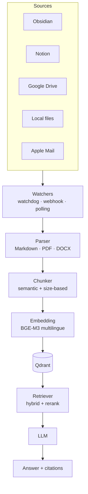

# Documenti & RAG

Jarvis indicizza i tuoi **documenti personali** (Obsidian, Notion, Drive, email, file locali, PDF) e ti permette di interrogarli in linguaggio naturale, in italiano e inglese.

## Cosa puoi fare

- 🔎 **Ricerca semantica** sui tuoi appunti e documenti
- ❓ **Domande in linguaggio naturale** sui tuoi contenuti
- 🔗 **Citazione** sempre presente (so dove ho letto)
- 🌍 **Multilingue**: chiedi in italiano, trova documenti in inglese (e viceversa)
- 🖼️ **Visual RAG** su PDF con figure, layout complesso, scansioni
- ⏱️ **Sync incrementale** con file watcher (real-time)

## Stack consigliato

### Framework RAG

| Framework | Punto di forza | Adatto a |
|---|---|---|
| **R2R** (RAG to Riches) | Containerized, GraphRAG, hybrid search | Backend RAG completo |
| **LlamaIndex** | Connettori per ogni sorgente | Pipeline custom |
| **Khoj** | Personal AI built-in, Obsidian sync | UI già pronta |
| **Haystack 2.x** | Production-grade, modulare | Enterprise |
| **AnythingLLM** | Workspace isolation | Utenti non tecnici |

> **Raccomandazione:** R2R come backend + Khoj come layer applicativo per UI/Obsidian sync.

### Embedding model 2026 (multilingue IT+EN)

| Modello | Dimensione | Multilingue IT+EN | MTEB |
|---|---|---|---|
| **BGE-M3** (BAAI) | 1024 | ✅ Eccellente (cross-lingual) | 72% retrieval |
| Nomic Embed v2 | 768 | Buono | 57-63% |
| Jina Embeddings v3 | 1024 | Buono | Top tier |
| mxbai-embed-large | 1024 | ❌ Solo EN | 59% |

> **Vincitore chiaro: BGE-M3** — supporta 100+ lingue in un unico spazio semantico. Cross-lingual: chiedi in italiano, trovi documenti in inglese.

```bash
docker compose exec ollama ollama pull bge-m3
```

### Vector store per <1M documenti

| Store | Hybrid search | Ottimale per |
|---|---|---|
| **Qdrant** | ✅ (v1.9+) | Filtering complesso, produzione |
| **ChromaDB** | ❌ nativo | Sviluppo, prototipazione, <5M chunks |
| **LanceDB** | ✅ | Storage disk-efficient |
| **pgvector** | ❌ nativo | Postgres già esistente, <10M vettori |

> **Default Jarvis:** Qdrant (raggiungibile da `qdrant:6333` nel compose).

### Visual RAG su PDF

- **ColPali** / **ColQwen2** — embedding diretto delle immagini di pagina, **niente OCR**, ideale per PDF con grafica complessa, presentazioni, scansioni
- Usa **Qwen2-VL-2B** come backbone

## Document watchers e ingestion

| Sorgente | Strumento |
|---|---|
| **Obsidian vault** | Khoj plugin (sync real-time) |
| **Notion** | LlamaIndex `NotionPageReader` (polling) |
| **Google Drive** | Watch API + push notifications HTTP |
| **Dropbox** | Webhooks HTTP |
| **File locali** | `watchdog` (Python, cross-platform) + `inotify` Linux |
| **Apple Notes** | AppleScript export |
| **Apple Mail** | parsing `mbox` con stdlib `mailbox` |
| **Logseq** | watchdog su file Markdown |

## Architettura RAG di Jarvis



## Configurazione

```env
# Embedding (raccomandato BGE-M3 per IT+EN)
EMBEDDING_MODEL=ollama/bge-m3

# Vector store
QDRANT_URL=http://qdrant:6333

# RAG framework
RAG_BACKEND=r2r              # r2r | llamaindex | khoj
R2R_URL=http://r2r:7272

# Sorgenti
OBSIDIAN_VAULT_PATH=/vaults/personal
NOTION_TOKEN=secret_...
GOOGLE_DRIVE_CREDENTIALS=/data/google-credentials.json
DROPBOX_ACCESS_TOKEN=...
WATCHED_FOLDERS=/data/documents,/data/research
```

Connettere una sorgente:

```bash
# Obsidian
docker compose exec server jarvis rag connect obsidian \
  --vault /vaults/personal

# Notion
docker compose exec server jarvis rag connect notion --token=$NOTION_TOKEN

# Local files
docker compose exec server jarvis rag connect local \
  --path=/data/documents --watch

# Google Drive
docker compose exec server jarvis rag connect google-drive
```

## Esempi d'uso

### Domande sui tuoi documenti

> *"Cosa avevo deciso sull'architettura del nuovo backend?"*

```
Jarvis: Nei tuoi appunti del 12 marzo (Obsidian → work/architettura.md)
        hai scritto: "Andiamo con event-sourcing in append-only,
        snapshot ogni 100 eventi, proiezioni async". Decisione presa
        dopo discussione con Marco.
```

### Cross-lingual

> *"Trova quel documento in cui parlavo di prompt caching"*

```
Jarvis: Trovata una nota in inglese: "anthropic-prompt-caching-cost-saving.md"
        del 3 aprile. Vuoi un riassunto?
```

### Visual RAG

> *"Quel PDF con il diagramma del flusso utente, mostramelo"*

ColQwen2 trova la pagina anche se il "diagramma" non è testo OCR-leggibile.

## Evaluation con Ragas

```bash
docker compose exec server jarvis rag eval --suite=ragas-default
```

Misura:

- **Faithfulness** — la risposta è ancorata ai documenti?
- **Answer relevancy** — la risposta è pertinente?
- **Context recall** — il retrieval ha portato i passaggi giusti?

## Privacy

- ✅ Tutta la pipeline può girare 100% locale (Qdrant + Ollama + BGE-M3)
- ❌ Cloud LLM: i passaggi recuperati vengono inviati al provider per la risposta
- 🔐 Cifratura at-rest del volume `qdrant_data`
- 🪪 Token Notion/Drive in vault separato

## Roadmap

| Fase | Funzionalità |
|---|---|
| 3.1 | Obsidian sync via Khoj |
| 3.2 | Local file watcher (watchdog) |
| 3.3 | BGE-M3 embedding multilingue |
| 3.4 | R2R backend con GraphRAG |
| 3.5 | Notion + Google Drive connectors |
| 3.6 | ColQwen2 visual RAG su PDF |
| 3.7 | Apple Notes / Apple Mail importer |
| 3.8 | Ragas evaluation in CI |
