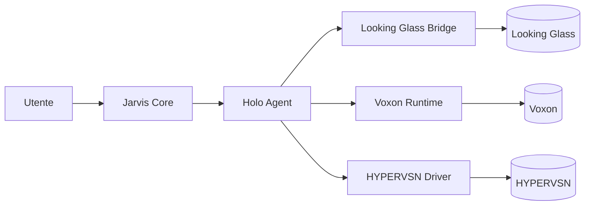

# Integrazione con sistemi olografici

Jarvis può proiettare la propria presenza tramite **display olografici e volumetrici**: un compagno visivo che vive nello spazio fisico dell'utente.

## Panoramica

I display olografici offrono qualcosa che AR/VR non possono: **presenza condivisa** in uno spazio comune senza occhiali. Sono ideali per:

- 🤖 Compagno AI sempre visibile su scrivania o salotto
- 📊 Visualizzazioni 3D di dati (portafoglio, salute, calendari)
- 🎬 Output cinematografico per call e meeting
- 🧬 Esplorazione di modelli 3D (architettura, biologia, ingegneria)

## Hardware supportato

### Looking Glass Factory

**Stato:** vincitore SID 2026 Display of the Year. Tecnologia *Hololuminescent Display* (HLD).

| Modello | Prezzo (USD) | Risoluzione | Use case |
|---|---|---|---|
| Looking Glass Go | ~600 | Portatile | Dimostrazione, ufficio piccolo |
| Looking Glass 16" | ~2.000 | 8K HLD | Scrivania, presenza ambient |
| Looking Glass 32" | ~7.000 | 8K HLD | Salotto, presentazioni |

**SDK:** [Looking Glass Core SDK](https://github.com/Looking-Glass) — open, plugin Unity e Unreal, light-field rendering.

**Use case Jarvis:**

- Avatar 3D animato (es. tipo Iron Man Jarvis hologram)
- Pannelli flottanti con news, agenda, biometrica
- Visualizzazione di modelli STL prima della stampa 3D

### Voxon Photonics

**Stato:** display volumetrico vero (output 3D in volume fisico, non light-field).

**SDK:** C++ e Python. Carica modelli 3D, gestisce rotazioni, sincronizza con hardware.

**Use case Jarvis:**

- Visualizzazione molecolare e tecnica
- Simulazioni in tempo reale (orbite, vento, traiettorie)
- Output per ambienti di formazione

### HYPERVSN

**Stato:** display "HoloMatrix" basato su LED rotanti. Non vero olografo, ma effetto suggestivo.

**Use case Jarvis:**

- Presenza ambientale in ingresso o vetrina
- Output decorativo / branding personale

## Architettura di integrazione

L'**Holo Agent** vive in `agents/holo-agent/` ed espone le capability:

- `render_avatar(emotion, speech)` — avatar Jarvis che parla
- `show_3d_model(file)` — STL/GLB/USDZ
- `display_panel(content)` — UI 3D con dati
- `ambient_presence(mode)` — modalità "respiratoria" / idle

## Pipeline di rendering

| Sorgente | Processo | Output |
|---|---|---|
| Avatar generato | Avatar 3D rigged + voce TTS sincronizzata (Lip Sync via Rhubarb o Whisper) | Looking Glass |
| Modello generato AI | TripoSR / Spar3D / TRELLIS → GLB | Voxon / Looking Glass |
| Dashboard | UI 3D Three.js / Babylon.js → light-field encode | Looking Glass |
| Biometrica | Mesh animata (cuore che batte sincronizzato) | Voxon |

## Privacy & UX

- ⚙️ Modalità "Do Not Disturb" che spegne il display olografico
- 🔇 Avatar in modalità muta quando ci sono ospiti
- 👁️ Detezione presenza per attivazione automatica
- 🌙 Modalità notte con luminosità ridotta

## Roadmap di integrazione

| Fase | Obiettivo |
|---|---|
| 1 | Output statico su Looking Glass Go (modelli 3D, dashboard) |
| 2 | Avatar conversazionale con lip-sync su Looking Glass 16" |
| 3 | Generazione 3D AI on-demand (TripoSR locale) |
| 4 | Voxon volumetric per visualizzazioni dati biometrici/finanziari |
| 5 | Multi-display orchestration (avatar + pannelli + ambient) |
