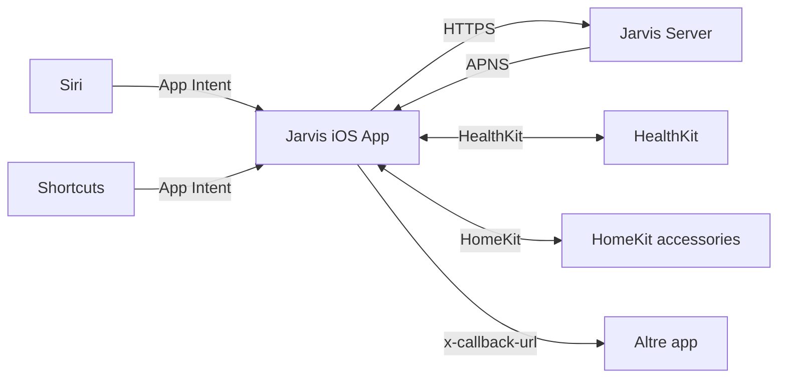
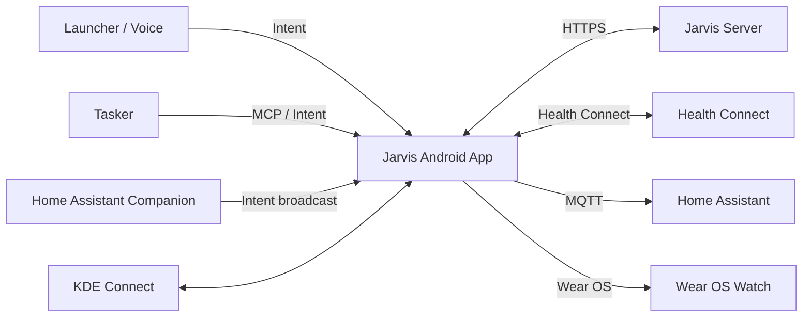

# Integrazione mobile · iOS · Android

Lo smartphone è il device più rilevante della mesh: portatile, sensori ricchi, sempre con te. Jarvis si integra in modo profondo con iOS e Android, **rispettando i vincoli di ciascuna piattaforma**.

## iOS

### Capability disponibili

| Capability | Disponibilità | Note |
|---|---|---|
| **App Intents** (Siri, Spotlight, Shortcuts) | ✅ iOS 16+ | Schema standard, oltre 100 intent type |
| **Live Activities** | ✅ iOS 16.1+ | Per call attive, timer, briefing in corso |
| **Push Notifications (APNS)** | ✅ | Token gestito server-side |
| **HomeKit** (esposizione device virtuali) | ✅ | Casa.app + Siri |
| **HealthKit** | ✅ on-device | Lettura passiva con consenso utente |
| **Focus modes** | ✅ Filter API | Notifiche basate su modalità attiva |
| **Visual Intelligence** (WWDC 2025) | ✅ iOS 18+ | App Intent snippet integrati |
| **Use Model action** in Shortcuts | ✅ iOS 18+ | Invoca LLM da Shortcuts |
| **Sideloading custom assistant** | ❌ | Non possibile senza jailbreak |

### Pattern di integrazione

iOS è **chiuso**: per integrare profondamente Jarvis serve **un'app companion** distribuita tramite App Store (o TestFlight). L'app espone:

- App Intents per Siri/Shortcuts (`ApriBriefing`, `ChiediAJarvis(testo)`, `RegistraNota`)
- Estensione **Widget** per home screen
- Estensione **Live Activity** per il briefing in corso
- **HomeKit Bridge** per esporre Jarvis come accessorio
- Push notifications via APNS



### Esempi App Intents

```swift
// Siri: "Hey Siri, briefing di Jarvis"
struct OpenBriefingIntent: AppIntent {
    static var title: LocalizedStringResource = "Apri il briefing di Jarvis"

    func perform() async throws -> some IntentResult {
        let briefing = try await JarvisAPI.shared.fetchDailyBriefing()
        return .result(view: BriefingView(briefing: briefing))
    }
}
```

### URL scheme

L'app supporta anche un URL scheme per integrazione da automazioni esterne:

```
jarvis://chat?text=Riassumi+l'ultima+riunione
jarvis://briefing?type=morning
jarvis://memory/recall?topic=ferie
```

## Android

### Capability disponibili

| Capability | Disponibilità | Note |
|---|---|---|
| **Intents / IntentFilters** | ✅ | Comunicazione inter-app nativa |
| **Tasker** | ✅ | Automazioni profonde, **Tasker MCP Server** dal 2025 |
| **Termux** | ✅ | Linux env completo su Android, ottimo per dev |
| **MacroDroid** | ✅ | Trigger e action automation |
| **KDE Connect su Android** | ✅ | Bridge con desktop Linux |
| **Home Assistant Companion App** | ✅ | Sensori → HA, comandi ← HA |
| **Wear OS 6 Tiles** | ✅ | Glanceable info |
| **Wear OS Complications** | ✅ | Dati contestuali in watchface |
| **Gemini Nano on-device** | ✅ Android 14+ | Inferenza locale via ML Kit GenAI APIs |
| **Android XR** (preview) | ⚙️ | Form factor 3D, AI-aware UI |

### Pattern di integrazione

Android è significativamente più aperto di iOS:



### Tasker MCP integration

Tasker espone un **MCP Server** che Jarvis può invocare per controllo ultra-profondo del device (volume, notifiche, esecuzione di scene, automazioni context-aware).

```yaml
# Esempio task Tasker invocabile via MCP
- task: "Drive Mode"
  trigger: "context: in_car"
  actions:
    - mute_notifications
    - launch: "Google Maps"
    - audio_route: "bluetooth"
    - announce_jarvis: "Modalità auto attiva"
```

### Esempi Intent Android

```kotlin
// Trigger un'azione Jarvis da app esterna o Tasker
val intent = Intent("dev.federicocalo.jarvis.ACTION_BRIEFING").apply {
    putExtra("type", "morning")
    putExtra("voice", true)
}
sendBroadcast(intent)
```

## Confronto iOS vs Android

| Caratteristica | iOS | Android |
|---|---|---|
| Wake-word "Hey Jarvis" sempre attivo | ❌ (Siri-locked) | ✅ con AccessibilityService |
| Esecuzione task in background | ⚠️ vincolata | ✅ con foreground service |
| Automazione profonda OS | ⚠️ via Shortcuts | ✅ via Tasker / MacroDroid / Termux |
| Distribuzione app custom | App Store / TestFlight | APK direct + F-Droid |
| Health data | HealthKit on-device | Health Connect aggregator |
| Smartwatch | Apple Watch (chiuso) | Wear OS / Garmin / PineTime aperti |
| Accesso da terminale Linux | ❌ | ✅ (Termux) |

## KDE Connect

KDE Connect copre laptop ↔ Android (e ora anche iOS). Funzionalità sfruttate da Jarvis:

- 📋 **Clipboard sync** (copio sul PC, incollo sul telefono)
- 🔔 **Notifiche bidirezionali** (rispondo a SMS dal PC)
- 📂 **File transfer** rapido
- 🎵 **Media remote** (controllo lo stream sul telefono dal PC)
- 🖱️ **Mouse/keyboard remote** (per presentazioni)

```env
KDE_CONNECT_DEVICE_ID=...
```

## Configurazione

```env
# iOS
JARVIS_IOS_APNS_KEY_ID=...
JARVIS_IOS_TEAM_ID=...
JARVIS_IOS_BUNDLE_ID=dev.federicocalo.jarvis

# Android
JARVIS_ANDROID_FCM_KEY=...
JARVIS_ANDROID_PACKAGE=dev.federicocalo.jarvis

# KDE Connect
KDE_CONNECT_ENABLED=true

# Home Assistant Companion
HOME_ASSISTANT_URL=http://hassio.local:8123
HOME_ASSISTANT_TOKEN=eyJ...
```

## Roadmap

| Fase | Funzionalità |
|---|---|
| 1.X | Android app prototipo (chat + push) |
| 1.X | iOS app prototipo (chat + push) |
| 2.X | Wake-word "Hey Jarvis" su Android |
| 2.X | Wear OS Tiles + Complications |
| 2.X | App Intents iOS + Shortcuts library |
| 3.X | Tasker MCP bridge |
| 3.X | KDE Connect bridge nativo |
| 4.X | Health Connect / HealthKit ingestion |
