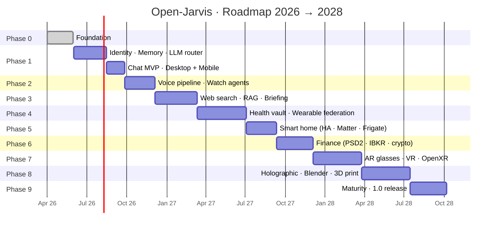

# Timeline e milestone

Questa pagina è la **roadmap operativa dettagliata** di Open-Jarvis: fasi, date stimate, criteri di accettazione e dipendenze.

!!! warning "Dichiarazione di intenti, non promessa di rilascio"
    Open-Jarvis è un progetto **community-driven**. Le date qui riportate sono **indicative** e dipendono dal numero di contributori, dalla disponibilità di hardware reale per i test e dall'evoluzione dell'ecosistema (LLM, wearable, AR/VR). La [pagina di stato live](../status.md) è la fonte di verità più aggiornata.

## 📅 Timeline d'insieme

## 🎯 Phase 0 · Foundation 🌱

**Stato:** 🟢 Completata · Maggio 2026

**Obiettivo:** rendere il progetto pubblicabile e contribuibile dalla community.

### Definition of Done

- [x] Repo pubblico su GitHub con MIT License
- [x] Documentazione bilingue (IT + EN) live su GitHub Pages
- [x] CI verde con lint + typecheck + test
- [x] Server FastAPI con `/health` testato
- [x] Branch protection + secret scanning + Dependabot
- [x] CODEOWNERS, CONTRIBUTING, CODE_OF_CONDUCT, SECURITY
- [x] Issue tracker per ogni fase futura
- [x] Wiki community e Project board

### KPI raggiunti

- 📚 **52+ pagine** di documentazione bilingue
- ✅ **22 test** con coverage 92%
- 🔒 **2 ruleset di protezione** attivi (main + tag versione)

---

## 🏗️ Phase 1 · Core MVP

**Periodo stimato:** Q3 2026 (giugno → settembre)
**Tracker GitHub:** [#10](https://github.com/fedcal/open-jarvis/issues/10)

**Obiettivo:** una conversazione persistente e cross-device tra **due dispositivi**.

### Milestone

| Milestone | Data target | Definition of Done |
|---|---|---|
| **M1.1 — Identity layer** | metà giugno '26 | OAuth 2.0/OIDC, JWT, device pairing via QR, schema Postgres con Alembic |
| **M1.2 — Memory layer base** | fine giugno '26 | mem0 + Qdrant integrati, REST `/memory/{add,search,recall}` |
| **M1.3 — LLM router** | metà luglio '26 | Provider abstraction Ollama/Anthropic/OpenAI, fallback policy |
| **M1.4 — LangGraph orchestrator** | fine luglio '26 | Workflow base con checkpointing PostgreSQL |
| **M1.5 — Chat REST + WebSocket** | metà agosto '26 | Streaming SSE/WS, conversation continuation cross-device |
| **M1.6 — Desktop agent (Tauri)** | fine agosto '26 | Linux/macOS/Windows, system tray, hotkey |
| **M1.7 — Mobile agent (RN)** | metà settembre '26 | Android prototype |
| **M1.8 — Web frontend** | fine settembre '26 | Next.js/Angular UI base con auth |

### Definition of Done — Phase 1

- [ ] Conversazione iniziata su desktop continua su mobile mantenendo contesto
- [ ] Test E2E cross-device verde in CI
- [ ] Coverage server ≥ 85%
- [ ] Deploy con `docker compose up` funzionante out-of-the-box
- [ ] Documentazione utente per setup MVP completa

### Dipendenze

✅ Phase 0

### Rischi

| Rischio | Probabilità | Mitigazione |
|---|---|---|
| LLM cloud cost esplosivo | Media | Ollama fallback obbligatorio, prompt caching |
| OAuth complexity | Media | Usare Authentik pre-configurato |
| Memory consistency cross-device | Alta | Test E2E robusti, eventual consistency esplicita |

---

## 🎙️ Phase 2 · Voice & Watch

**Periodo stimato:** Q4 2026 (ottobre → dicembre)
**Tracker GitHub:** [#11](https://github.com/fedcal/open-jarvis/issues/11)

**Obiettivo:** input vocale "Hey Jarvis" cross-device + integrazione smartwatch.

### Milestone

| Milestone | Data target | DoD |
|---|---|---|
| **M2.1 — Wake-word custom** | fine ottobre | Porcupine + openWakeWord, accuracy > 95% |
| **M2.2 — STT streaming** | metà novembre | faster-whisper su server con < 400ms latency |
| **M2.3 — TTS naturale** | fine novembre | Piper voice IT + EN, streaming chunked |
| **M2.4 — Watch agent Wear OS** | metà dicembre | Pixel/Galaxy Watch, Tile + Complication |
| **M2.5 — Watch agent WatchKit** | fine dicembre | Apple Watch passive (HealthKit lettura) |

### Definition of Done — Phase 2

- [ ] Latency end-to-end (wake → response audio) < 1.5s
- [ ] Wake-word funziona su mobile in background
- [ ] Conversazione vocale completa su smartphone con bluetooth headset
- [ ] Watch riceve notifiche con vibrazione contestuali

### KPI

- 🎯 < 50ms wake-word detection
- 🎯 < 400ms STT (95° percentile)
- 🎯 ≥ 95% accuracy wake-word custom
- 🎯 18+ ore batteria PineTime con InfiniTime + agent attivo

### Dipendenze

✅ Phase 1 (chat backbone)

---

## 🌐 Phase 3 · Web & Knowledge

**Periodo stimato:** Q1 2027 (gennaio → marzo)
**Tracker GitHub:** [#12](https://github.com/fedcal/open-jarvis/issues/12)

**Obiettivo:** ricerca web autonoma + RAG personale + daily briefing.

### Milestone

| Milestone | Data target | DoD |
|---|---|---|
| **M3.1 — Web scraping agent** | fine gennaio | Crawl4AI + Firecrawl + Jina, citation always |
| **M3.2 — RAG su documenti** | metà febbraio | LlamaIndex + Qdrant + BGE-M3 multilingual |
| **M3.3 — Sync Obsidian + Notion** | fine febbraio | Watchdog + delta sync incrementale |
| **M3.4 — Visual RAG (ColQwen2)** | metà marzo | PDF complessi, layout-aware |
| **M3.5 — Daily briefing engine** | fine marzo | News + agenda + finance, output chat/email/audio |

### Definition of Done — Phase 3

- [ ] Risposta su documenti personali con citation (link al file + numero pagina)
- [ ] Cross-lingual: query IT trova doc EN
- [ ] Briefing mattutino consegnato puntuale ogni giorno
- [ ] Ragas faithfulness ≥ 0.85 su test set

### KPI

- 🎯 Recall@10 retrieval ≥ 85%
- 🎯 Citation correctness ≥ 95% (manual eval su 100 query)
- 🎯 Briefing latency < 30s per generazione

### Dipendenze

✅ Phase 1 (memory layer), Phase 2 (audio briefing)

---

## 🏃 Phase 4 · Health

**Periodo stimato:** Q2 2027 (aprile → luglio)
**Tracker GitHub:** [#13](https://github.com/fedcal/open-jarvis/issues/13)

**Obiettivo:** federazione wearable medicali con health vault FHIR-compatibile.

### Milestone

| Milestone | Data target | DoD |
|---|---|---|
| **M4.1 — Oura + Whoop + Polar** | fine aprile | OAuth + sync giornaliero + storico |
| **M4.2 — HAPI FHIR vault** | fine maggio | Mapping FHIR R4, encryption-at-rest |
| **M4.3 — Garmin + Withings + Fitbit** | metà giugno | Migration Fitbit → Google Health entro sept '26 |
| **M4.4 — Dexcom CGM real-time** | fine giugno | Glucosio < 60s di latenza con alerting |
| **M4.5 — Coaching engine** | metà luglio | Sleep / training / recovery suggestions |
| **M4.6 — HealthKit + Health Connect** | fine luglio | App companion ingestion |

### Definition of Done — Phase 4

- [ ] Briefing salute mattutino "come ho dormito" funzionante
- [ ] Alert biometrici personalizzati (HRV, glucosio)
- [ ] Export FHIR PDF condivisibile con medico
- [ ] Audit log completo per ogni accesso a health data
- [ ] Encryption-at-rest verificata da terzo

### KPI

- 🎯 Sync delay < 15 min dalla misurazione wearable
- 🎯 Zero data leakage in audit (test red-team)
- 🎯 Coaching adoption rate ≥ 40% sui test users

### Dipendenze

✅ Phase 1 (auth, memory), Phase 3 (RAG per coaching)

### Rischi specifici

| Rischio | Mitigazione |
|---|---|
| Scadenza/revoca token OAuth | Re-consent flow automatico |
| Dexcom limit a 5 utenti | Acquisire Full Access via partnership |
| GDPR special category | Vault separato, encryption per-user |

---

## 🏠 Phase 5 · Smart home

**Periodo stimato:** Q3 2027 (agosto → ottobre)
**Tracker GitHub:** [#14](https://github.com/fedcal/open-jarvis/issues/14)

**Obiettivo:** integrazione domotica completa via Home Assistant.

### Milestone

| Milestone | Data target | DoD |
|---|---|---|
| **M5.1 — Bridge Home Assistant** | fine agosto | REST + WebSocket, state streaming |
| **M5.2 — Matter via HA** | metà settembre | Commissioning, control, scene |
| **M5.3 — Frigate event ingestion** | fine settembre | MQTT events, AI summary "chi è alla porta" |
| **M5.4 — ESPHome custom** | metà ottobre | Esempio device DIY documentato |
| **M5.5 — Routine context-aware** | fine ottobre | Presence + biometric + time triggers |

### Definition of Done — Phase 5

- [ ] "Hey Jarvis, accendi il salotto al 30%" funziona
- [ ] Routine "buongiorno" (luci + caffè + briefing) testata
- [ ] Frigate detection event triggers Jarvis announcement

### Dipendenze

✅ Phase 1, Phase 2 (voice), Phase 4 (biometric triggers)

---

## 💰 Phase 6 · Finance

**Periodo stimato:** Q4 2027 (novembre → gennaio 2028)
**Tracker GitHub:** [#15](https://github.com/fedcal/open-jarvis/issues/15)

**Obiettivo:** vista unificata del patrimonio + briefing finanziario.

### Milestone

| Milestone | Data target | DoD |
|---|---|---|
| **M6.1 — TrueLayer/GoCardless** | fine novembre | Conto bancario IT via PSD2 |
| **M6.2 — IBKR portfolio** | metà dicembre | Read-only positions + P&L |
| **M6.3 — Crypto multi-chain** | fine dicembre | Coinbase, Etherscan, Zerion |
| **M6.4 — Firefly III bridge** | metà gennaio '28 | Sync bidirezionale |
| **M6.5 — Briefing finanziario** | fine gennaio '28 | Daily/weekly con alert anomalie |

### Definition of Done — Phase 6

- [ ] Net worth dashboard con cash + equity + crypto
- [ ] Alert su movimenti > 5% net worth
- [ ] Tutti i token in vault separato cifrato

### Dipendenze

✅ Phase 1, Phase 3 (briefing engine)

### Rischi

| Rischio | Mitigazione |
|---|---|
| TrueLayer free tier insufficient | Considerare GoCardless residual access |
| Broker italiani senza API | Restare su PSD2 + IBKR |

---

## 👓 Phase 7 · AR & XR

**Periodo stimato:** Q1-Q2 2028 (febbraio → maggio)
**Tracker GitHub:** [#16](https://github.com/fedcal/open-jarvis/issues/16)

**Obiettivo:** smart glasses (Brilliant Frame, MentraOS) + VR (OpenXR).

### Milestone

| Milestone | Data target | DoD |
|---|---|---|
| **M7.1 — Brilliant Frame agent** | fine febbraio | BLE bridge, overlay testo |
| **M7.2 — MentraOS app** | fine marzo | Mach1, Vuzix, G1 supportati |
| **M7.3 — VR avatar (OpenXR)** | fine aprile | Quest + Index, avatar 3D conversazionale |
| **M7.4 — Sub-vocal commands** | fine maggio | Silent voice via gesture + EMG |

### Dipendenze

✅ Phase 2 (voice), Phase 3 (knowledge per overlay informativi)

---

## 🎬 Phase 8 · Holographic & Maker

**Periodo stimato:** Q3-Q4 2028 (giugno → settembre)
**Tracker GitHub:** [#17](https://github.com/fedcal/open-jarvis/issues/17)

**Obiettivo:** display olografici + Blender + 3D printing end-to-end.

### Milestone

| Milestone | Data target | DoD |
|---|---|---|
| **M8.1 — Looking Glass output** | fine giugno | Avatar 3D animato |
| **M8.2 — Lip-sync TTS** | fine luglio | Sincronizzato con audio Piper |
| **M8.3 — Blender bpy automation** | metà agosto | Headless: import GLB → STL |
| **M8.4 — Moonraker + OctoPrint + Bambu** | fine agosto | Universal printer control via MCP |
| **M8.5 — TRELLIS-2 self-hosted** | metà settembre | Text-to-3D < 30s |
| **M8.6 — End-to-end pipeline** | fine settembre | "Stampa un porta-penne" → done |

### Dipendenze

✅ Phase 1, Phase 2 (TTS)

---

## 🏆 Phase 9 · Maturity

**Periodo stimato:** 2029
**Tracker:** _da aprire_

**Obiettivo:** stabilità, sicurezza certificata, ecosistema plugin maturo.

### Milestone

| Milestone | DoD |
|---|---|
| Plugin marketplace pubblico | Almeno 50 plugin community |
| Audit di sicurezza terzo | Report pubblico, zero critical findings |
| Localizzazione completa | IT, EN, ES, FR, DE, PT, JA |
| Multi-tenant managed hosting | SaaS opt-in opzionale |
| Release stabile 1.0 | Semantic versioning, LTS branch |

---

## 📊 KPI cumulativi del progetto

Aggiornati a ogni release:

| KPI | Target 2026 | Target 2027 | Target 2028 |
|---|---|---|---|
| ⭐ GitHub Stars | 100 | 1.000 | 10.000 |
| 👥 Contributors | 5 | 25 | 100 |
| 📦 Plugin community | 0 | 5 | 25 |
| 🌍 Lingue documentate | 2 | 4 | 7 |
| 🧪 Test coverage server | 85% | 90% | 92% |
| 🚀 Deploy attivi (telemetry opt-in) | 50 | 500 | 5.000 |

---

## 🤝 Contribuire ad accelerare

Vuoi accelerare una fase o anticipare una milestone?

1. Apri il **tracker della fase** corrispondente (vedi [Stato implementazione](../status.md))
2. Commenta indicando quale milestone/sub-task vuoi prendere
3. Il maintainer valuta priorità + dipendenze
4. Apri una **draft PR** appena hai qualcosa di funzionante

➡️ Guida completa in [Contribuire](../contributing/index.md).

---

## 📜 Storico revisioni della roadmap

| Data | Cambiamento |
|---|---|
| 2026-05-09 | Roadmap iniziale pubblicata con timeline trimestrale |

_La roadmap è un documento vivo: ogni cambio sostanziale aggiunge una riga in questa tabella e crea un commit dedicato._
