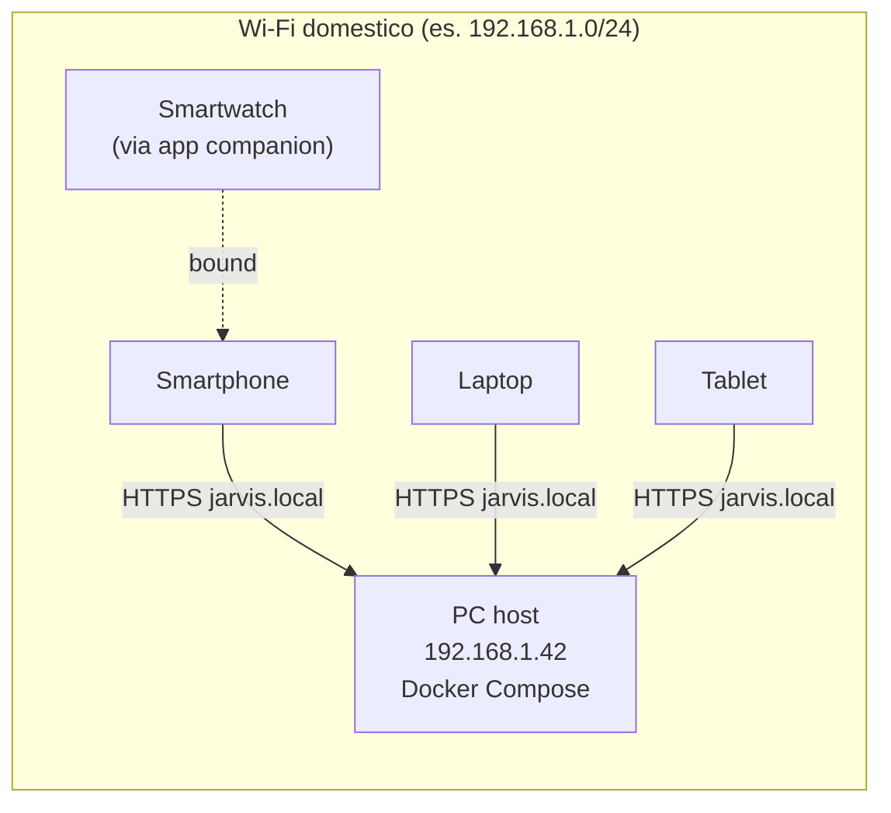

# Avviare Jarvis interamente sul tuo PC (Wi-Fi domestico, senza dominio)

Questa guida è per chi vuole **provare o usare Open-Jarvis senza
acquistare un dominio, senza aprire porte sul router e senza esporre
il server a internet**. Tutti i dispositivi (smartphone, laptop,
tablet, smartwatch via app companion) si collegano al server che gira
sul tuo PC, restando dentro la stessa rete Wi-Fi.

!!! info "Quando usare questo setup"
    - **Sì** — sviluppo, demo, uso personale al 100% locale, prima
      esperienza con il progetto, ambienti senza connessione internet
      stabile.
    - **No** — quando vuoi raggiungere Jarvis fuori casa, quando il PC
      che ospita il server può andare in standby, o se hai già una VPS.
      In quei casi vedi [Installazione server VPS](server.md).

## Architettura del setup LAN-only



Niente cloud, niente DDNS, niente Cloudflare. Il PC host è l'unico
nodo "server", tutti gli altri sono client.

## Requisiti

- Un PC con **Linux, macOS o Windows** sempre acceso (o con sleep
  configurato per non spegnere la rete).
- **Docker Desktop** o `docker engine + compose plugin` installati.
- **8 GB di RAM** (4 GB minimi senza Ollama; 16 GB se usi LLM locale).
- Un **router Wi-Fi domestico** con possibilità di:
    - leggere l'IP del PC host,
    - assegnare DHCP reservation (consigliato).
- Lo stesso Wi-Fi su tutti i dispositivi che useranno Jarvis.

## 1 · Trova l'indirizzo IP locale del PC host

Sul PC che farà da server:

=== "Linux"

    ```bash
    ip -4 addr show | grep -oP '(?<=inet\s)192\.168\.\d+\.\d+'
    # oppure
    hostname -I | awk '{print $1}'
    ```

=== "macOS"

    ```bash
    ipconfig getifaddr en0   # Wi-Fi
    ipconfig getifaddr en1   # Ethernet (se presente)
    ```

=== "Windows (PowerShell)"

    ```powershell
    Get-NetIPAddress -AddressFamily IPv4 |
      Where-Object { $_.IPAddress -like "192.168.*" } |
      Select-Object -ExpandProperty IPAddress
    ```

Annotati il risultato — in questa guida useremo come esempio
**`192.168.1.42`**.

## 2 · Riserva l'IP sul router (consigliato)

Se l'IP cambia, tutti i dispositivi smettono di trovare il server.
Soluzioni:

- **DHCP reservation** sul router: associa l'indirizzo MAC del PC
  all'IP `192.168.1.42`. Pannello del router → *DHCP* → *Reserved
  addresses*. Riavvia il router se richiesto.
- **IP statico** sul PC: stessa cosa ma fatta lato sistema operativo
  (Network Manager su Linux, *Network Settings → TCP/IP* su macOS,
  *Adapter Properties* su Windows).
- **mDNS** (passo 4): un nome simbolico stabile (`jarvis.local`)
  invece dell'IP — robusto anche se l'IP cambia.

Bastano due delle tre. La combinazione più solida è **DHCP reservation
+ mDNS**.

## 3 · Configura il file `.env`

Dalla root del repository:

```bash
git clone https://github.com/fedcal/open-jarvis.git
cd open-jarvis
cp .env.example .env
```

Apri `.env` e modifica queste chiavi (tutte iniziano con `JARVIS_`,
così Pydantic Settings le legge automaticamente):

```bash
JARVIS_DOMAIN=jarvis.local
JARVIS_PUBLIC_URL=http://192.168.1.42:8080
JARVIS_ALLOWED_ORIGINS=http://192.168.1.42:8080,http://192.168.1.42:3000,http://jarvis.local:8080,http://jarvis.local:3000
```

Sostituisci `192.168.1.42` con il **tuo** IP del passo 1. Lascia il
resto invariato per ora — i default funzionano per la LAN.

!!! warning "Se non aggiungi `192.168.x.y` a `JARVIS_ALLOWED_ORIGINS`"
    Il browser farà partire la chiamata, ma la **risposta CORS**
    bloccherà tutto e vedrai un errore generico tipo *"Failed to fetch"*
    nella console. Aggiungerlo è obbligatorio.

### Cambia le porte se sono già occupate

Se sul tuo PC giri già un Postgres locale, Redis, Qdrant, oppure se la
porta 8080 è in uso (capita con tool Java come JetBrains o servizi
auto-deploy), `docker compose up` fallirà con `port is already
allocated`. Sovrascrivi le porte host nel `.env`:

```bash
JARVIS_HOST_PORT=8090       # API server
POSTGRES_HOST_PORT=15432
REDIS_HOST_PORT=16379
QDRANT_HOST_PORT=16333
QDRANT_GRPC_HOST_PORT=16334
```

Aggiorna anche `JARVIS_PUBLIC_URL` e `JARVIS_ALLOWED_ORIGINS` con la
nuova porta (`http://192.168.1.42:8090`).

Per scoprire quali porte sono occupate:

```bash
ss -tlnp | grep -E '8080|5432|6379|6333'   # Linux
lsof -iTCP -sTCP:LISTEN | grep -E '8080|5432'   # macOS

## 4 · Abilita la risoluzione `jarvis.local` (mDNS)

mDNS permette ai dispositivi sulla stessa rete di trovare il PC con
un nome amichevole invece dell'IP. Open-Jarvis usa di default il
suffisso `.local`.

=== "Linux (Avahi)"

    ```bash
    sudo apt install -y avahi-daemon avahi-utils
    sudo systemctl enable --now avahi-daemon

    # Pubblica l'host con il nome 'jarvis'
    sudo hostnamectl set-hostname jarvis
    # Verifica:
    avahi-resolve -n jarvis.local
    ```

=== "macOS"

    Già attivo di default (Bonjour). Verifica:

    ```bash
    sudo scutil --set HostName jarvis
    sudo scutil --set LocalHostName jarvis
    dns-sd -B _http._tcp.   # vede gli host che pubblicizzano HTTP
    ```

=== "Windows"

    Bonjour è incluso con iTunes; in alternativa scarica
    [Bonjour Print Services per Windows](https://support.apple.com/kb/DL999).
    Imposta il nome computer:

    ```powershell
    Rename-Computer -NewName jarvis -Restart
    ```

### Sui client (smartphone, laptop, …)

- **iOS / macOS**: Bonjour è nativo. `jarvis.local` funziona subito.
- **Android 12+**: mDNS è nativo dal lato risolver, ma alcuni router
  bloccano i pacchetti multicast tra Wi-Fi guest e principale —
  controlla la sezione "isolation" del router e disabilitala.
- **Windows / Linux**: Avahi/Bonjour come sopra.

Se mDNS non funziona, ripiega sull'IP diretto (`192.168.1.42`): è meno
elegante ma sempre affidabile.

## 5 · Avvia lo stack

```bash
docker compose up -d
docker compose ps
docker compose logs -f server   # CTRL+C per uscire
```

Smoke-test dal PC host:

```bash
curl http://localhost:8080/health
curl http://192.168.1.42:8080/health
curl http://jarvis.local:8080/health
```

Tutti devono restituire `{"status":"ok",...}`. Da un altro dispositivo
sul Wi-Fi:

```bash
curl http://192.168.1.42:8080/health
```

Se non passa, vai al passo 7 (firewall).

## 6 · HTTPS in LAN (opzionale ma raccomandato)

Tre opzioni, dalla più semplice alla più robusta.

### Opzione A — Solo HTTP (default)

Funziona, ma alcuni client moderni rifiutano feature avanzate su HTTP:

- WebAuthn / passkey richiedono HTTPS (eccezione: `localhost`).
- L'app PWA può essere installata, ma alcuni service worker sono
  limitati.
- WebSocket funzionano, ma su Safari iOS dietro a profili "stretti"
  potrebbero richiedere HTTPS.

Per uso domestico interno è sufficiente. Skip al passo 7.

### Opzione B — `mkcert` (CA locale, **raccomandato**)

`mkcert` crea una **CA root** che installi una sola volta sui tuoi
dispositivi: dopo, il PC host può presentare certificati validi per
`jarvis.local` riconosciuti dai browser senza warning.

```bash
# Sul PC host
brew install mkcert nss            # macOS
sudo apt install mkcert libnss3-tools  # Linux Debian/Ubuntu
# Windows: scoop install mkcert (oppure release GitHub)

# Crea e installa la CA root
mkcert -install

# Genera il certificato per jarvis.local + IP
mkdir -p infra/certs
mkcert -cert-file infra/certs/jarvis.local.pem \
       -key-file  infra/certs/jarvis.local-key.pem \
       jarvis.local "*.jarvis.local" 192.168.1.42 localhost 127.0.0.1
```

Aggiungi un servizio Caddy al `docker-compose.yml` (o usa il file
`infra/docker-compose.lan-tls.yml` quando arriverà):

```yaml
  caddy:
    image: caddy:2-alpine
    restart: unless-stopped
    ports:
      - "443:443"
    volumes:
      - ./infra/Caddyfile.lan:/etc/caddy/Caddyfile:ro
      - ./infra/certs:/certs:ro
      - caddy_data:/data
    depends_on: [server]
```

Crea `infra/Caddyfile.lan`:

```caddy
jarvis.local, 192.168.1.42 {
    tls /certs/jarvis.local.pem /certs/jarvis.local-key.pem
    reverse_proxy server:8080
}
```

Sui **client**: copia la CA root su ogni dispositivo (`mkcert
-CAROOT` ti dice dove sta) e installala:

- **Android**: Impostazioni → Sicurezza → Certificati CA utente →
  Installa.
- **iOS**: AirDrop o email del file `.pem`, poi Impostazioni →
  Generale → VPN e gestione dispositivi → Profili → Installa, poi
  *Impostazioni → Generale → Info → Impostazioni certificato →
  Affidabilità completa per la CA root mkcert*.
- **Linux/macOS/Windows**: `mkcert -install` sui PC, oppure
  importa la CA tramite Keychain / *certmgr.msc* / NSS.

Aggiorna `.env`:

```bash
JARVIS_PUBLIC_URL=https://jarvis.local
ALLOWED_ORIGINS=https://jarvis.local,https://192.168.1.42
```

Restart: `docker compose up -d`.

### Opzione C — Tailscale / ZeroTier

Se vuoi accedere a Jarvis **anche fuori casa** senza esporre porte sul
router e senza un dominio, Tailscale o ZeroTier creano una VPN mesh
con HTTPS e DNS automatici (`jarvis.tail-scale.ts.net`). Tecnicamente
non è "puro LAN" ma è la via più semplice per estendere il setup. Vedi
la sezione *Multi-device* della documentazione (in arrivo: deep-dive
Tailscale).

## 7 · Firewall del PC host

Per default Docker pubblica le porte su tutte le interfacce; alcuni OS
(Windows con firewall stretto, Linux con `ufw`) bloccano le connessioni
in arrivo dal Wi-Fi.

=== "Linux (ufw)"

    ```bash
    # Solo dalla LAN, mai da internet
    sudo ufw allow from 192.168.0.0/16 to any port 8080 proto tcp
    sudo ufw allow from 192.168.0.0/16 to any port 443 proto tcp
    sudo ufw status numbered
    ```

=== "macOS"

    ```bash
    sudo /usr/libexec/ApplicationFirewall/socketfilterfw \
         --add /usr/local/bin/com.docker.backend
    sudo /usr/libexec/ApplicationFirewall/socketfilterfw \
         --setglobalstate on
    ```

=== "Windows"

    *Windows Defender Firewall → Advanced settings → Inbound rules*:

    - Nuova regola → Port → TCP → 8080, 443
    - Profilo: solo *Private* (lascia *Public* deselezionato)
    - Azione: Allow

## 8 · Registra il primo utente e fai pairing dei dispositivi

Dal PC host (o da qualsiasi client sulla LAN):

```bash
curl -X POST http://192.168.1.42:8080/api/v1/auth/register \
     -H "Content-Type: application/json" \
     -d '{"email":"tu@example.com","password":"<min-12-char-passphrase>","display_name":"Tu"}'
```

!!! warning "Email validation"
    Il validator email rifiuta i TLD riservati come `.local`, `.test`,
    `.localhost`. Usa `example.com`, un dominio reale che possiedi, o
    un sotto-dominio della tua LAN se hai DNS interno (es. `tu@home.lan`
    funziona se `.lan` è registrato come TLD interno).

Risposta: `201 Created` con il profilo utente. Login:

```bash
curl -X POST http://192.168.1.42:8080/api/v1/auth/login \
     -H "Content-Type: application/json" \
     -d '{"email":"tu@example.com","password":"<min-12-char-passphrase>"}'
```

Salva l'`access_token`, poi genera il QR di pairing per gli altri
dispositivi:

```bash
ACCESS=...   # dal login sopra

curl -X POST http://192.168.1.42:8080/api/v1/pairing/initiate \
     -H "Authorization: Bearer $ACCESS"
# {
#   "code": "418273",
#   "raw_token": "rTQ…abc",
#   "expires_in": 300,
#   "qr_payload": "jarvispair://v1?token=rTQ…abc&code=418273"
# }
```

Sullo smartphone:

1. Apri l'app Open-Jarvis.
2. Inserisci come *Server URL* `http://192.168.1.42:8080` (o
   `https://jarvis.local` se hai fatto Opzione B).
3. Premi *Pair this device* e scansiona il QR (oppure incolla il
   codice 6-cifre).

Il server crea un nuovo `Device` row e l'app riceve un JWT
device-bound. Da qui in poi lo smartphone parla diretto con il PC
host.

## 9 · Mantieni il PC host attivo

Affinché i client possano sempre raggiungere Jarvis, il PC host non
deve andare in sleep:

=== "Linux (systemd-inhibit)"

    ```bash
    systemctl mask sleep.target suspend.target hibernate.target hybrid-sleep.target
    ```

=== "macOS"

    *System Settings → Energy → Prevent automatic sleeping when display
    is off*. Oppure:

    ```bash
    sudo pmset -a sleep 0
    ```

=== "Windows"

    *Settings → System → Power & battery → Screen and sleep* → imposta
    "Sleep" su *Never* quando connesso all'alimentazione.

Ricorda: il PC consuma energia 24/7. Per uso intensivo valuta una
piccola NUC, un Mac mini, una Raspberry Pi 5 (8 GB) — il setup è
identico.

## 10 · Backup minimi

Anche un setup casalingo merita backup:

```bash
# Database (settimanale)
docker compose exec postgres pg_dump -U jarvis jarvis | gzip > \
    ~/backups/jarvis-$(date +%F).sql.gz

# Volume vettoriale (Qdrant)
docker run --rm -v jarvis_qdrant_data:/data -v ~/backups:/out alpine \
    tar czf /out/qdrant-$(date +%F).tar.gz -C /data .
```

Aggiungi le due righe al `crontab` se vuoi che sia automatico.

## Limitazioni conosciute del setup LAN

| Limitazione | Workaround |
|-------------|-----------|
| Niente accesso fuori casa | Usa Tailscale/ZeroTier (Opzione C) |
| WebAuthn richiede HTTPS | Usa mkcert (Opzione B) o `localhost` |
| iOS Safari rifiuta WebSocket su HTTP da rete pubblica | Stessa rete privata + HTTPS via mkcert |
| Push notifications mobile | Senza Firebase/APNs cloud non funzionano; arriveranno con M2 voice |
| LLM cloud richiedono internet | OpenAI/Anthropic ovviamente no, ma Ollama locale sì |
| iPhone su Wi-Fi guest non vede il PC | Disabilita "AP/client isolation" sul router |

## Aggiornare un'installazione LAN

Stesso flow di [Aggiornare Open-Jarvis](../updates.md), tranne che non
serve toccare nulla a livello di dominio o TLS:

```bash
cd open-jarvis
git fetch --tags && git checkout vX.Y.Z
docker compose pull
docker compose run --rm server alembic upgrade head
docker compose up -d
```

Le app desktop/mobile si aggiornano dai loro store.

## Troubleshooting LAN

Vedi anche la knowledge base: [Problemi comuni](../../troubleshooting/index.md).

| Sintomo | Diagnosi rapida | Fix |
|---------|----------------|-----|
| `curl http://192.168.x.y:8080/health` da altro device fa timeout | `ss -tlnp | grep 8080` sul PC host: la porta è in ascolto solo su `127.0.0.1`? | Verifica `ports: - "8080:8080"` (deve essere `0.0.0.0:8080:8080` se sostituito) e firewall (passo 7) |
| `jarvis.local` non risolve | `avahi-resolve -n jarvis.local` o `dns-sd -G v4 jarvis.local` | Reinstalla Avahi/Bonjour, controlla "Wi-Fi isolation" sul router |
| Browser CORS error | DevTools → Network → vedi origin bloccato | Aggiungi l'origin a `ALLOWED_ORIGINS` in `.env`, restart |
| QR pairing non si apre nel app | il QR contiene `jarvispair://` ma l'app è offline | Verifica che lo smartphone sia sullo stesso Wi-Fi del PC host |
| Login OK su PC, fallisce su iPhone | Spesso CORS; talvolta certificate trust | Re-installa la CA root mkcert su iOS e riavvia Safari |
| Container crash al riavvio del PC | Docker non parte automaticamente | Abilita auto-start: `systemctl enable docker` (Linux), Docker Desktop → *Start at login* |

## Vedi anche

- [Multi-device · panoramica](../multi-device.md)
- [Aggiornare Open-Jarvis](../updates.md)
- [Problemi comuni](../../troubleshooting/index.md)
- [Identity Layer (M1.1)](../../security/identity-layer.md)
- [Pairing dispositivi (M1.6)](../../security/identity-layer.md#device-pairing)
