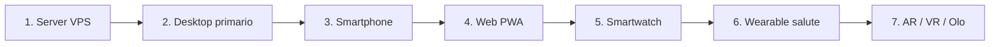
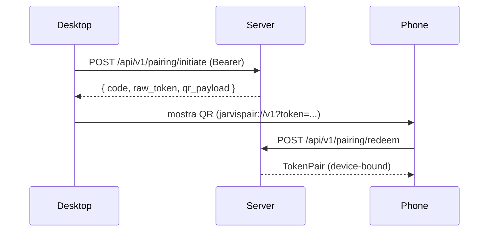

# Installare Jarvis su tutti i tuoi dispositivi

Open-Jarvis è una **rete distribuita di agenti**: il server centrale
gestisce identità, memoria e orchestrazione, mentre ogni dispositivo
esegue un agente leggero che si autentica via JWT e dialoga con il
server in WireGuard mesh.

Questa pagina è il punto di partenza unico: **dal server al wearable**,
ti guida nel deploy ordinato per priorità.

## Mappa dei dispositivi supportati

| Categoria | Dispositivi | Repository | Stato |
|-----------|-------------|------------|-------|
| **Server** | VPS Linux (x86_64 / ARM64), bare-metal, Raspberry Pi 5 | `server/` | 🟢 Done |
| **Desktop** | macOS, Windows, Linux | `agents/desktop/` (Tauri) | 🟡 In progress |
| **Web (PWA)** | Browser desktop & mobile | `frontend/` (Next.js 15) | 🟡 In progress |
| **Mobile** | iOS 17+, Android 12+ | `agents/mobile/` (Expo) | 🟡 In progress |
| **Smartwatch** | Apple Watch, Wear OS, Garmin, PineTime | `agents/watch/` | ⚪ Planned (M2) |
| **Occhiali AR** | Meta Ray-Ban, XREAL, Brilliant Frame, MentraOS | `agents/glasses/` | ⚪ Planned (M7) |
| **Visori VR** | Meta Quest, Valve Index, OpenXR generico | `agents/vr/` | ⚪ Planned (M7) |
| **Olografici** | Looking Glass, HYPERVSN, Voxon | `agents/holo/` | ⚪ Planned (M8) |
| **Medicali** | Oura, Whoop, Polar, Garmin, Withings, Dexcom | `agents/medical/` | ⚪ Planned (M4) |

## Ordine consigliato di installazione



Devi sempre cominciare dal **server**: senza di esso nessun client può
autenticarsi né recuperare la memoria.

## 1 · Server (VPS o bare metal)

Il server è il cuore: gira in Docker Compose, espone HTTPS via Caddy
con TLS automatico ed è l'unico dispositivo sempre online.

!!! tip "Vuoi farlo girare interamente sul tuo PC?"
    Se non hai un dominio e vuoi che tutto resti dentro il Wi-Fi di
    casa (PC host + smartphone + laptop sulla stessa rete), segui
    **[Installazione locale (PC + Wi-Fi, senza dominio)](install/local-lan.md)**.
    Tornerai qui per il pairing degli altri dispositivi.

```bash
git clone https://github.com/fedcal/open-jarvis.git
cd open-jarvis
cp .env.example .env
# Modifica .env: dominio, JARVIS_JWT_*, password DB
docker compose up -d

# Salute del server
curl https://jarvis.example.com/health
```

Guida completa: **[Installazione server VPS](install/server.md)**.
Dopo il deploy, registra il primo utente:

```bash
curl -X POST https://jarvis.example.com/api/v1/auth/register \
     -H "Content-Type: application/json" \
     -d '{"email":"tu@example.com","password":"<min-12-char>","display_name":"Tu"}'
```

## 2 · Desktop (macOS / Windows / Linux)

L'agente desktop è il dispositivo "primario": da qui generi i codici
di pairing per i dispositivi successivi.

=== "macOS"

    ```bash
    brew install --cask open-jarvis
    open -a "Open-Jarvis"
    ```

=== "Windows"

    ```powershell
    winget install --id OpenJarvis.Desktop -e
    ```

=== "Linux (AppImage)"

    ```bash
    curl -L https://github.com/fedcal/open-jarvis/releases/latest/download/open-jarvis.AppImage \
         -o ~/Applications/open-jarvis.AppImage
    chmod +x ~/Applications/open-jarvis.AppImage
    ```

=== "Linux (Flatpak)"

    ```bash
    flatpak install flathub dev.openjarvis.Desktop
    ```

Al primo avvio inserisci l'URL del server e fai login con email +
password. Guida: **[Desktop · Mac/Win/Linux](install/desktop.md)**.

## 3 · Smartphone (iOS / Android) via QR pairing

Sullo smartphone **non serve** rifare il login: puoi usare il flow di
**device pairing** (M1.6).

1. Sul desktop apri *Settings → Devices → Add device*. Compare un
   **QR code** + un codice numerico di 6 cifre.
2. Sullo smartphone:
   - **iOS**: scarica *Open-Jarvis* dall'App Store (o TestFlight beta).
   - **Android**: dal Play Store, F-Droid, o `apk` da GitHub Releases.
3. Premi *Pair this device* nell'app, scansiona il QR.
4. Il server crea un nuovo `Device` row, emette un `TokenPair`
   `device_bound` e l'app lo memorizza nello Keychain / Keystore.



Il codice scade dopo 5 minuti ed è **single-use**: alla redemption la
riga `pairing_codes` viene marcata `consumed_at`. Riprovare = errore
409 con cleanup automatico della famiglia di sessioni.

Guida dettagliata: **[Mobile · iOS/Android](install/mobile.md)**.

## 4 · Web PWA (qualunque browser)

Apri **`https://jarvis.example.com`** nel browser. La PWA Next.js 15:

- chiede l'**Add to Home Screen** su iOS/Android
- supporta voice + testo (Web Speech API + WebSocket)
- usa lo stesso flow di pairing (incolla il QR token o leggilo con la
  fotocamera, opzionale via WebAuthn passkey)

## 5 · Smartwatch (M2 — in roadmap)

Il watch agent farà push-to-talk + notifiche contestuali.

| Watch | Tecnologia | Nota |
|-------|-----------|------|
| Apple Watch | watchOS WatchKit + WidgetKit | richiede iPhone con app installata |
| Wear OS | Compose for Wear OS | Galaxy Watch, Pixel Watch |
| Garmin | Connect IQ SDK | dati biometrici → memory |
| PineTime | InfiniTime + companion BLE | open hardware |

Pairing: lo watch eredita il pairing dallo smartphone associato.
Quando arriverà M2 troverai la guida in **[Watch agents](../devices/watch.md)**.

## 6 · Wearable medicali (M4)

Per dispositivi senza chip applicativo (Oura, Whoop, …) Jarvis si
autentica come **OAuth client** verso il provider e tira i dati nel
modulo `health/`. Non c'è un agente "fisico": l'integrazione avviene
server-side.

Tabella connettori prevista:

| Dispositivo | OAuth provider | Frequenza sync |
|-------------|----------------|----------------|
| Oura Ring | Oura API | 5 min |
| Whoop | Whoop API | 5 min |
| Polar | Polar AccessLink | 15 min |
| Garmin | Connect Health API | 15 min |
| Withings | Withings Cloud | 15 min |
| Dexcom CGM | Dexcom Share | 1 min (real-time) |

## 7 · Realtà aumentata, virtuale, olografica (M7-M8)

Per gli occhiali AR, i visori VR e i display olografici Jarvis usa
**OpenXR** dove possibile (Meta Quest, Valve Index, Pico) e SDK
proprietari per i dispositivi a stack chiuso (Brilliant Frame,
MentraOS, Looking Glass). Tutti questi agent dipendono da uno
smartphone o desktop "host" già paired al server.

## Verifica installazione cross-device

Da qualsiasi dispositivo, dopo il login, esegui:

```bash
curl -H "Authorization: Bearer <access_token>" \
     https://jarvis.example.com/api/v1/auth/me
```

Risposta attesa: il tuo `UserPublic` con `role` e `permissions`
derivati. Se vedi `device_id` nel JWT (claim `did`), il pairing è
andato a buon fine.

## Troubleshooting universale

| Sintomo | Causa probabile | Fix |
|---------|-----------------|-----|
| `401 invalid bearer token` | Access token scaduto (15 min) | Chiama `/api/v1/auth/refresh` |
| `401 family revoked` | Refresh token rigiocato | Riloggati; il client ha rilevato un re-use suspect |
| `403 user_id mismatch` | ChatTurn `user_id` ≠ JWT subject | Bug del client: usa sempre l'ID dal token |
| `409 pairing already redeemed` | Codice usato due volte | Genera un nuovo codice da Settings → Devices |
| `400 pairing expired` | TTL 5 min superato | Genera un nuovo codice |
| WebSocket close 1008 | Token mancante o invalido | Aggiungi `Authorization: Bearer …` o `Sec-WebSocket-Protocol: bearer.<jwt>` |

## Disconnettere un dispositivo

Settings → *Devices* → ⓘ → *Revoke session* invoca:

```http
POST /api/v1/auth/logout
Authorization: Bearer <access_token>
```

L'intero `family_id` di quella sessione viene revocato; lo stesso
device potrà ri-paired in futuro con un nuovo codice.

## Vedi anche

- [Aggiornare Open-Jarvis](updates.md) — procedure di update
- [Installazione server VPS](install/server.md)
- [Pairing (sezione Sicurezza)](../security/identity-layer.md)
- [Runtime core](../architecture/core-runtime.md)
